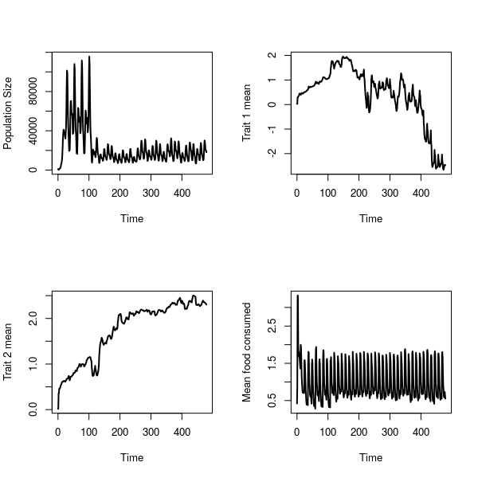

```{r, echo=FALSE}
library(shiny)
library(rhandsontable)
```


********************************************************************************

> **This notebook tracks progress on the development of [helicoverpa](https://bradduthie.github.io/helicoverpa/) R package, a BBSRC [FAPESP Newton Funded](http://www.fapesp.br/en/9552) Project to model how the spatial scale of heterogeneity in fungal isolate application and crop plant cultivation affects variation in the selection landscape for biopesticide resistance.**

********************************************************************************

<center>**[Go to comments](#comments)**</center>

********************************************************************************


<a name="contents">Contents:</a>
================================================================================

[Project updates](#updates)

 - **2022**
 
   - **JAN** [06](#u-06-JAN-2022)

 - **2021**
 
    - **AUG** [19](#u-19-AUG-2021), [26](#u-26-AUG-2021)
    - **JUL** [23](#u-23-JUL-2021)

 - **2020**
 
    - **JAN** [27](#u-27-JAN-2020)

 - **2019**

    - **MAY** [14](#u-14-MAY-2019)

 - **2018**

     - **SEP** [21](#u-21-SEP-2018)
     - **AUG** [13](#u-13-AUG-2018), [14](#u-14-AUG-2018), [27](#u-27-AUG-2018)
     - **JUL** [18](#u-18-JUL-2018), [23](#u-23-JUL-2018), [30](#u-30-JUL-2018)

[Project comments](#comments)

********************************************************************************

<a name="updates">Project updates:</a>
================================================================================


> <a name="u-06-JAN-2022">Update: 06 JAN 2022</a>

There had for some time been an annoying issue of [resevol CRAN checks](https://cran.r-project.org/web/checks/check_results_resevol.html) having ERRORs on Windows systems with ix86 architecture. As it turns out, this was caused by some errors in specifying the memory for arrays, which was fixed in [this commit](https://github.com/bradduthie/resevol/commit/b12918045402fa0a4443e4f7620d7d9d481cf3aa). Just to make sure that everything is clear and correct, I have made the cast much clearer in [a new commit](https://github.com/bradduthie/resevol/commit/223fda3cbadb79cd712b587e7153a5a7d27b71c0). Tests using the [rhub package](https://r-hub.github.io/rhub/) and on [Winbuilder](https://win-builder.r-project.org/) confirm that everything works as intended. Valgrind found no memory leaks; everything appears fine, so I have updated the version to v0.2.0.9 and submitted the fix to CRAN. 


> <a name="u-26-AUG-2021">Update: 26 AUG 2021</a>

I have now run the same analysis that I did on [19 AUG 2021](#u-19-AUG-2021), but with traits that evolve independently. This was done by setting a covariance matrix to be the identity matrix for four traits. Here is the `mine_gmatrix` output that was used for the simulations.

```{r, echo = FALSE}
mg_2021_AUG_26 <- readRDS("data/2021_AUG_26_data/mg_n1.rds");
print(mg_2021_AUG_26);
```

Note that the parameter values for mining the matrix were identical to those chosen in the simulations from [19 AUG 2021](#u-19-AUG-2021). The results are as expected; all traits evolve in response to selection to feed on both crop types and resist both pesticide types.

**Asexual, no rotation**
    


**Asexual, pesticide rotation**
    


**Asexual, both rotation**
    


**Selfing, no rotation**
    


**Selfing, pesticide rotation**
    


**Selfing, both rotation**
    


**Non-selfing, no rotation**
    


**Non-selfing, pesticide rotation**
    


**Non-selfing, both rotation**
    


**Biparental, no rotation**
    


**Biparental, pesticide rotation**
    


**Biparental, both rotation**
    


For full simulations, I think it will be important to have each replicate (and I'm including all of the above as one replicate) with its own mined gmatrix. 

> <a name="u-19-AUG-2021">Update: 19 AUG 2021</a>

The helicoverpa package will be submitted to [CRAN](https://cran.r-project.org/) sometime before early October What this will require is some appropriate testing functions and documentation, and maybe one or two vignettes that show how the package works. I'll also make a website similar to the [GMSE website](https://confoobio.github.io/gmse/). We will want to decide if the package name should actually be 'helicoverpa', or if we should switch to something else ([endorse](https://cran.r-project.org/package=endorse) is unfortunately taken; I'm not sure if 'ENDORSE' in all caps would work, but probably best to not try this and avoid confusion). I will update with more details about this later.

For now, I want to focus on some simulations that I have recently run with the idea of laying the foundations for a general paper on landscape heterogeneity and pesticide resistance (not so much focusing on the details of the *Helicoverpa* system). I've not yet checked to see how novel the general ideas are because this started more as a verification of the model (the code is working as intended, as far as I can tell).

The model focuses on the way that negative genetic correlations affect niche differentiation across different ploidy and mating types. The idea is that sex can act as a constraint to adaptation due to outbreeding depression in a way that cannot happen given asexual reproduction. Given a heterogeneous landscape, specifically in the context of the evolution of pesticide resistance and crop specialisation, asexually reproducing pests can get the upper hand by specialising on specific combinations of crop and pesticide and ensuring that their descendants will keep these specialised genotypes intact. In contrast, sexually reproducing organisms have a risk of outbreeding depression, breeding with a conspecific that is specialised to different conditions and having offspring that is not good at dealing with any environment. I have not seen this point in the literature, and I need to figure out the extent to which it has or has not been made and modelled to determine whether or not it is actually novel.

What follows is a lot of simulation results from four different types of species set by the `repro` argument in the R package:

- **asexual**: A haploid organism that reproduces asexually.
- **selfing**: A monoecious diploid organism that reproduces sexually and can self-fertilise.
- **non-selfing**: A monoecious diploid organism that reproduces sexually and cannot self-fertilise.
- **biparental**: A dioecious diploid organism that reproduces sexually.

For each of these different organism types, I included two different crop types and two pesticide types, and I ran three different pesticide and crop rotation procedures on a landscape with 24 farms for 480 time steps (maybe very loosely thinking of 12 time steps as a year):

- **no_rotation**: No rotation of either crop or pesticide. Farms randomly select a crop type and a pesticide to use at the start of the simulation and use it for the whole simulation.
- **pesticide_rotation**: Crop is not rotated, but pesticide is randomly selected every 12 time steps. Farms randomly select a crop type and pesticide to use at the start of the simulation, and farmers use the same crop each time step.
- **both**: Rotation of both crop and pesticide. Farms randomly select a crop and pesticide to use at the start of the simulation, and then randomly select a new crop and pesticide to use every 12 time steps.

```{r, echo = FALSE}
mg_2021_AUG_19 <- readRDS("data/2021_AUG_19_data/mg.rds");
```

I'm deliberately not having a crop rotation only simulation as it seems unrealistic and potentially a bit redundant, at least for now. The details of the simulation are as follows. The genome was created with the `mine_gmatrix` settings below.

```{r, eval = FALSE}
mg  <- mine_gmatrix(gmatrix = gmt, loci = 12, indivs = 2000, npsize = 12000, 
                    max_gen = 2400, sampleK = 1200, chooseK = 6, layers = 6,
                    mu_pr = 0.05, pr_cross = 0.05, mu_sd = 0.01, 
                    term_cri = -12);
```

The output of `mg` is below. Note that list element 2 shows the target variance covariance matrix of four traits. Element 6 below gives the mined matrix.

```{r, echo = FALSE}
print(mg_2021_AUG_19);
```

This output was used to run simulation with the following parameter values (asexual without rotation is shown below).

```{r, eval = FALSE}
sim <- run_farm_sim(mine_output              = mg,
                    N                        = 1000,
                    neutral_loci             = 1000,
                    xdim                     = 100,
                    ydim                     = 100,
                    repro                    = "asexual",
                    max_age                  = 6,
                    selfing                  = TRUE,
                    food_consume             = c("T1", "T2"),
                    pesticide_consume        = c("T3", "T4"),
                    food_needed_surv         = 1,
                    food_needed_repr         = 1,
                    reproduction_type        = "food_based",
                    pesticide_tolerated_surv = 0,
                    pesticide_rotation_type  = 2,
                    crop_rotation_type       = 2,
                    min_age_reproduce        = 4,
                    max_age_feed             = 3,
                    lambda_value             = 1.5,
                    farms                    = 24,
                    time_steps               = 480,
                    mutation_pr              = 0.001,
                    crossover_pr             = 0.1,
                    net_mu_layers            = 0,
                    crop_rotation_time       = 12,
                    pesticide_rotation_time  = 12,
                    crop_per_cell            = 8,
                    pesticide_per_cell       = 0.4,
                    crop_number              = 2,
                    pesticide_number         = 2,
                    K_on_birth               = 1000000,
                    min_age_move             = 4,
                    age_food_threshold       = 2,
                    min_age_feed             = 1,
                    pesticide_start          = 100,
                    print_last               = TRUE,
                    mating_distance          = 2,
);
```

I have left out some arguments that were set to their default options. Note that we have a 100 by 100 landscape. Two traits determine how much of crop an individual consumes at a time ("T1" and "T2"), and two separate traits determine how much of two types of pesticide an individual imbibes ("T3", "T4"). Individuals start feeding in their first time step and stop feeding after their third time step. On their four time step, individuals can move and reproduce, and they have a maximum age of 6 (though mortality happens at the end of a time step). Each cell has 8 units of crop that an individual can eat, and the crop is replaced each time the land is rotated (i.e., individuals can keep eating and feeding on it until there is either nothing left on a cell or the farmer plants a new crop after 12 time steps). Individuals must eat at least 1 unit to survive and reproduce, and can starve on or after their second time step. Individuals also cannot tolerate any pesticide (note, 'zero' is kind of arbitrary, but it's an easy number to use).

The following shows images of all of the different scenarios. For each scenario, I will show an image of the landscape on the last time step. Different coloured squares show different farms, and the points on top of them are pests. I will also show the dynamics of pest abundance and traits over time, and I will show scatterplots of the correlations between traits.

Note that the pesticide application *starts* on time step 100 to allow a period of burn-in.

**Asexual, no rotation**


**Asexual, pesticide rotation**


**Asexual, both rotation**


**Selfing, no rotation**


**Selfing, pesticide rotation**





**Selfing, both rotation**


**Non-selfing, no rotation**


**Non-selfing, pesticide rotation**


**Non-selfing, both rotation**


**Biparental, no rotation**


**Biparental, pesticide rotation**


**Biparental, both rotation**


It's worth mentioning that the reason for the oscillating population size is due to individuals sometimes consuming all of the food and starting to decrease in population density before the next crop is put down. To get a full picture on what is going on, I will need to run multiple replicate simulations with different mined genomes (i.e., same genetic correlations, but potentially achieved in a different way). I will also want to run the same simulations with an identity matrix (i.e., no genetic correlations) to act as a control so that we can understand the role of the negative genetic correlations in all of these results.

I have not really given all of these figures a hard look to try to think more clearly about what's going on yet -- at least not apart from the outbreeding depression idea. 

> <a name="u-23-JUL-2021">Update: 23 JUL 2021</a>

I just want to walk through some of the work and simulations that I have been running in the past two weeks. I am not going to get into the details, but I just want to show what the model can do and roughly what kind of output we might expect for a larger set of simulations. Everything here is reproducible using the [helicoverpa](https://github.com/bradduthie/helicoverpa) package, which can be downloaded from the R console using the code below. 


```{r, eval = FALSE}
install.packages("devtools"); # If you've not got devtools already installed
library(devtools);
install_github("bradduthie/helicoverpa");
```

There are no real safeguards or error messagese built into the package yet, so it's probably best to keep to a small simulations when experimenting. There are a few key points I want to make before presenting the model.

1. The code is written in a very modular way. We can take bits out and rearrange *most* things without too much effort, so please do make suggestions if you think something is important to change. Most changes will take very little time for me to implement now that the broad structure of the code is written.

2. The results that I present below are really just about getting a feel for what the model can do, and for developing an intuition about what kind of results we might expect when we set things up more formally. It's also another layer of checking to make sure that there are no major bugs in the code. Hence, the simulations that I have run reflect my own testing of what the model can do rather than the best test of any specific question.

3. I'm not going to explain all of the things that the software can do since I don't think this would be terribly productive. I just want to give a sense of what we're working with and what the possibilities are in relation to ENDORSE. There are some hidden hooks in here that were just too tempting not to code, which can be used for future papers. If I've done a good job, then it should be possible to use this one R package to address a range of potentially interesting questions. I don't need to take the lead in everything, and I would be delighted if folks were to use the software for individual-based modelling.

Here are the basics of how to run simulations. You really only need to know two R functions, each of which can take a long list of arguments. The heavy lifting of both functions is done in C rather than R. The first function is the [mine_gmatrix](https://github.com/bradduthie/helicoverpa/blob/master/R/mine_gmatrix.R#L21) function. The second function is the [run_farm_sim](https://github.com/bradduthie/helicoverpa/blob/master/R/sim_farming.R#L60) function. The role of [mine_gmatrix](https://github.com/bradduthie/helicoverpa/blob/master/R/mine_gmatrix.R#L21) is to generate a genome that produces an arbitrary number of phenotypic traits with an arbitrary covariance structure given a set of allele values with a standard normal distribution. The role of [run_farm_sim](https://github.com/bradduthie/helicoverpa/blob/master/R/sim_farming.R#L60) is to do everything else -- that is, to generate individuals with the mined genomes simulate the ecology and evolution of the system over time. The output of the simulation is the creation of one or more CSV files in the directory where the simulation is run (more on this later).

The `mine_gmatrix` function
-----------------------------------------

The goal of the `mine_gmatrix` function is to get from standard normal (mean = 0, stdev = 1) allele values at some number of loci (`loci`) through a network of some number of hidden layers (`layers`) to produce a set of traits that have some variance covariance structure (`gmatrix`, which is a square covariance matrix). 


The figure above shows an example with 18 loci and 9 traits, separated by 6 hidden layers. Each of the black arrows can be represented by a number indicating how much one locus (green) or node (blue) should contribute to the next (mathematically, arrows between two sets of nodes are represented by matrices that get [multiplied together](https://github.com/bradduthie/helicoverpa/blob/master/src/mine_gmatrix.c#L413)). These numbers become part of the genome for individuals, determining what a newly born individual's traits will be given their allele values at each locus. For now, an evolutionary algorithm is used to find a set of numbers that will produce traits with a desired covariance structure given random standard normal allele values. How long it takes to find these numbers depends on the number of loci, layers, and traits, and how much error we are willing to accept. Here's a very simple example of running the function with four loci, two layers, and two traits that have a variance of 1 and a covariance of -0.5.

```{r, eval = FALSE}
library(helicoverpa);
gmt       <- matrix(data = 0, nrow = 2, ncol = 2);
gmt[1, 1] <- 1;
gmt[2, 2] <- 1;
gmt[1, 2] <- -0.5;
gmt[2, 1] <- -0.5;
```

```{r, echo = FALSE}
library(helicoverpa);
gmt       <- matrix(data = 0, nrow = 2, ncol = 2);
gmt[1, 1] <- 1;
gmt[2, 2] <- 1;
gmt[1, 2] <- -0.5;
gmt[2, 1] <- -0.5;
```

The covariance matrix is shown below.

```{r, echo = FALSE}
print(gmt);
```

This matrix is set as the argument `gmatrix = gmt`. The number of loci is set with `loci = 4`, and the number of layers is set with `layers = 2` (there is no need to set trait number because the function figures this out from the `gmatrix`). The rest of the arguments specify how the evolutionary algorithm is to run:

| Argument     | What it does                                                 |
|--------------|--------------------------------------------------------------|
| npsize       | How big a population of networks evolve in the algorithm     |
| indivs       | How many random normals to test the fitness of each network  |
| max_gen      | The maximum number of generations allowed to evolve          |
| sampleK      | Number of randomly selected networks to compete              |
| chooseK      | Number of tournament winners (highest fitness)               |
| mu_pr        | Probability of a value in a network mutating                 |
| pr_cross     | Probability of crossing over between networks                |
| mu_sd        | Standard deviation of mutation effect size (mean is 0)       |
| term_cri     | Logged stress criteria for termination                       |

The details here are not terribly important, but the key concepts are explained in more detail in @Hamblin2013 and @Duthie2018 in one of the [GMSE R package vignettes](https://confoobio.github.io/gmse/articles/SI1.html). Basically, what we're doing is creating a random population of `npsize` networks like the one in the figure above with random arrow values. We're then letting this network evolve over time with selection for networks that do a better job of producing the `gmatrix` from a standard normal loci values. Evolution stops after `max_gen` generations have passed or the mean squared deviation of elements from the evolved variance covariance matrix and `gmatrix` is less than `exp(term_cri)`. Finding a genome is a bit of an art relying on trying different parameter combinations and seeing what works. Big `npsize` (higher than 10000) with low mutation rates and standard deviations (both below 0.01) are slow and steady, but usually necessary for a large `gmatrix`. For smaller `gmatrix`, smaller populations and higher mutation and crossover rates are fine and quite fast. For the matrix `gmt` above, we can probably get away with the following:

```{r, eval = FALSE}
mg  <- mine_gmatrix(gmatrix = gmt, loci = 4, layers = 2, npsize = 2000, 
                    indivs = 2000, max_gen = 800, sampleK = 1200, chooseK = 6,
                    mu_pr = 0.3, pr_cross = 0.3, mu_sd = 0.05, term_cri = -4);
```

I'm being extremely relaxed here with the `term_cri` and `max_gen`, but I just want to show a quick example. The function prints off each generation, the mean stress, and the minimum stress (best) genome found. This is mostly just to reassure you that it's doing the job and has not crashed. The output in `mg` is a list with seven elements:

1. The parameters input into `mine_gmatrix`.
2. The specified `gmatrix`.
3. The first set of arrows from loci to network (green to blue above) in matrix form.
4. An array made up of `layers` square matrices, representing all of the rest of the arrows in the figure above.
5. The summed effects that each loci has on each trait.
6. The end variance covariance matrix.
7. The whole network (figure above) as a genome to be inserted in individuals.
8. The stress of the final network (mean squared deviation from `gmatrix`).

Here is the output for `mg` above.

```{r, echo = FALSE}
mg <- readRDS(file = "data/2021_JUL_23_data/2021_JUL_23_mg.rds");
```

```{r}
print(mg);
```

Note that the variance covariance matrix in `[[6]]` is reasonable, but probably not good enough for real simulations. It took less than 3 minutes to get, but the time taken appears to scale exponentially with `gmatrix` size and `term_cri`. But if we accept this result, we have all that we need to move ahead with the next function for actual simulation.


The `run_farm_sim` function
------------------------------------------------

This function runs a single replicate simulation from start to finish. It generates a landscape divided into some arbitrary number of `farms` and places new individuals on them. A series of events then happen in pretty much any order that we want them to happen over the course of `time_steps` discrete time steps.

First, individuals are initialised with their genomes as found in `mine_gmatrix`. They are given random allele values for their loci. Other options for individuals include the following (this is not exhaustive):

- The reproduction type `repro` can be set as `asexual`, `sexual` (all individuals female and male with optional `selfing`), or `biparental` (females and males separate).
- A `max_age` that an individual can be before death.
- A minimum and maximum age at which the individual can move (`min_age_move` and `max_age_move`).
- A minimum and maximum age at which the individual can reproduce (`min_age_reproduce` and `max_age_reproduce`).
- A minimum and maximum age at which the individual can feed and imbibe pesticide (`min_age_feed`).
- The amount of food consumed during feeding on a cell (`food_consume`, which can be a vector of up to length 10 -- an element for each possible food type).
- The amount of pesticide consumed during feeding on a cell (`pesticide_consume`, which can be a vector of up to length 10 -- an element for each possible pesticide type).
- The distance in cells an individual can travel when moving (`move_distance`).
- The amount food that an individual needs to consume to survive (`food_need_surve`) and the age at which this threshold is assessed (`age_food_threshold`).
- The amount of pesticide imbibed that an individual can tolerate before death (`pesticide_tolerated_repr`) and the age at which this threshold is assessed (`age_pesticide_threshold`).
- The probability of mutation (`mutation_pr`) and crossover (`crossover_pr`). 
- How much of the genome can mutate (`net_mu_layers`).
- How many neutral loci individuals have (`neutral_loci`). 


When the simulation starts, the following happens:

- The `crop_number` crops (up to 10 possible) grown on `farms` unique farms are changed at `crop_rotation_time` intervals (rules for changing can be adjusted).
- The `pesticide_number` pesticides (up to 10 possible) applied on each farm is changed at `pesticide_rotation_time` intervals (here too, rules for changing can be adjusted).
- Individuals age by a time step (this is fixed; all individuals do it at the start of a time step, but individuals can be as old as we like)
- If individuals are at least `min_age_feed` and not over `max_age_feed`, then they eat on the landscape cell in which they are located. The amount of food that they consume on the cell can be set as `food_consume`, which can be a vector of up to 10 elements (one for each food type). Food consumption rates can also be specified as a trait (more on that later). Food consumption occurs in a random order of individuals.
- Similarly, if individuals at least`min_age_feed` and not over `max_age_feed` (same as feeding) imbibe biopesticde on the landscape cell in which they are located at a rate set by `pesticide_consume`, which can also be a vector of up to 10 elements (one for each pesticide type). Biopesticide consumption rates can also be specified as a trait. Biopesticide consumption occurs in a random order of individuals.
- Individuals move on the landscape if they are at least `min_age_move` (there are more complex rules available for feeding and moving; the simplest is just moving once in any direction).
- The number of offspring that an individual produces is calculated, potentially based on their food consumption, mate access, parameter values, or traits.
- New offspring are made, potentially with recombination in the case of sexual reproduction.
- Individuals die according to some criteria (food and biopesticide consumption, age).

The simulation ends after a fixed number of time steps (`time_steps`) have passed, or if the population goes extinct. I'll now show a very simplified example of a simulation being run, then a more complicated example.

A simple example of the simulation
=====================================

In this simulation, I will just consider a very simple scenario of two traits, which will model the rate at which food is consumed (Trait 1) and the rate at which pesticide is imbibed (Trait 2). Just to get started, let each of these traits have a variance of 1 and a covariance of about 0.5 to model the idea that the rate at which you consume pesticide increases with the rate at which you consume food.

```{r, echo = FALSE}
mg_simple <- readRDS(file = "data/2021_JUL_23_data/2021_JUL_23_mg_simple.rds");
print(mg_simple[[2]]);
```

Using the `mine_gmatrix` function with similar parameter values tried above, I got a genome that produces the following matrix given random standard normal allele values.

```{r, echo = FALSE}
mg_simple[[6]];
```


A convenient part of the code that I've not yet mentioned is that we can replace several numerical parameter arguments with evolving traits. This is possible for `move_distance`, `food_needed_surv`, `pesticide_tolerated_surv`, `food_needed_repr`, `pesticide_tolerated_repr`, `mating_distance`, `lambda_value` (raw reproduction value), `movement_bouts`, `food_consume`, and `pesticide_consume`. If, for example, we want movement distance in cells to be defined by trait one, we just set `move_distance = "T1"` (in this case, the value will be floored since cells are discrete). With that in mind, we can run the following simulation.

```{r, eval = FALSE}
sim <- run_farm_sim(mine_output              = mg,
                    N                        = 1000,
                    neutral_loci             = 1000,
                    xdim                     = 40,
                    ydim                     = 40,
                    repro                    = "sexual",
                    max_age                  = 5,
                    selfing                  = FALSE,
                    food_consume             = "T1",
                    pesticide_consume        = c("T2", 0),
                    food_needed_surv         = 1,
                    food_needed_repr         = 1,
                    reproduction_type        = "food_based",
                    pesticide_tolerated_surv = 0,
                    pesticide_rotation_type  = 2,
                    min_age_reproduce        = 3,
                    max_age_feed             = 2,
                    farms                    = 4,
                    time_steps               = 120,
                    mutation_pr              = 0.01,
                    crossover_pr             = 0.01,
                    net_mu_layers            = 0,
                    crop_rotation_time       = 4,
                    pesticide_rotation_time  = 4,
                    crop_per_cell            = 2,
                    pesticide_per_cell       = 0,
                    crop_number              = 1,
                    pesticide_number         = 2,
                    K_on_birth               = 1000000,
                    print_last               = TRUE
);
```

Note that the `mine_output` is just the whole vector output we got from the `mine_gmatrix` function. `N` is the initialsed number of individuals, `xdim` and `ydim` set the landscape dimensions (so we have a 40 by 40 square landscape). Individuals are sexual but cannot self. Note how `food_consume = "T1"`, so the amount of food consumed by each individual will be determined by its value in trait 1 (had we set `food_consume = 1`, then all individuals would consume 1 unit of food; note that individuals cannot consume negative food). The amount of pesticide 1 consumed by an individual will be determined by `"T2"`, while no individuals consume pesticide 2 (which can just be a trick for making some of the 4 `farms` not apply any pesticide -- since anything applied has no effect). Note that we indicate one crop by `crop_number = 1` and two pesticides by `pesticide_number = 2` (the second one being irrelevant), and each cell applies 0 pesticide (`pesticide_per_cell = 0`), so this is actually a null model in which no pesticide is applied at all.

The argument `K_on_birth` limits the number of eggs that can be made in the population; if the population goes over, then eggs are randomly removed (this prevents the time consuming process of some individuals being initialised unnecessarily -- if they were just going to die immediately anyway). The argument `print_last` indicates that we want to print all of the information (everything, genome and all) for each individual in the last generation. The resulting file is often in the 100s of MBs. 

After the simulation runs, we get a file `population_data.csv` that gives information for each generation on the time step, population size, mean age, mean food consumed, mean pesticide consumed, mortality rate, mean food consumed of each type, mean pesticide consumed of each type, mean trait values, and mean inbreeding coefficient. Here's a plot of population size, trait 1 value, trait 2 value, and mortality rate.

```{r, echo = FALSE}
dat <- read.csv("data/2021_JUL_23_data/2021_JUL_23_population_data_no_pesticide.csv");
par(mfrow = c(2, 2));
plot(x = dat$time_step, y = dat$population_size, 
     xlab = "Time", ylab = "Population Size", type = "l",
     lwd = 2);
plot(x = dat$time_step, y = dat$trait1_mean_value, 
     xlab = "Time", ylab = "Trait 1 mean", type = "l",
     lwd = 2);
plot(x = dat$time_step, y = dat$trait2_mean_value, 
     xlab = "Time", ylab = "Trait 2 mean", type = "l",
     lwd = 2);
plot(x = dat$time_step, y = dat$mortality_rate, 
     xlab = "Time", ylab = "Mortality rate", type = "l",
     lwd = 2);
```

This makes sense (ignore the small spikes caused by the age structure). The population size increases, the trait 1 mean increases as individuals evolve to consume more food (which gives higher reproductive output), and trait 2 gets dragged along due to the correlation with trait 1 (despite not having any effect). Now we can see what happens when some of the farms start to apply pesticide by running the same model with `pesticide_per_cell = 0`.

```{r, echo = FALSE}
dat <- read.csv("data/2021_JUL_23_data/2021_JUL_23_population_data_pesticide.csv");
par(mfrow = c(2, 2));
plot(x = dat$time_step, y = dat$population_size, 
     xlab = "Time", ylab = "Population Size", type = "l",
     lwd = 2);
plot(x = dat$time_step, y = dat$trait1_mean_value, 
     xlab = "Time", ylab = "Trait 1 mean", type = "l",
     lwd = 2);
plot(x = dat$time_step, y = dat$trait2_mean_value, 
     xlab = "Time", ylab = "Trait 2 mean", type = "l",
     lwd = 2);
plot(x = dat$time_step, y = dat$mortality_rate, 
     xlab = "Time", ylab = "Mortality rate", type = "l",
     lwd = 2);
```

Note that the population size grows more slowly now, and that while trait 1 underlying food consumption evolves to be positive, the value is not as high as it was without the pesticide. This is because trait 2 now evolves to be a negative value, and traits 1 and 2 are positively correlated.


The plot above shows traits 1 and 2 for all individuals in the population where no pesticide is applied. The correlation here is 0.3219144. We can compare this to a plot of the same traits for the simulation in which pesticide was applied.


Note the shifted position of the y-axis, in particular, as selection pushes pesticide consumption trait values down while pushing food consumption values up. Even though the network itself has not changed (i.e., standard random normals will still give individuals with traits of the original correlation structure), the correlation between trait 1 and 2 is now 0.0577854. This is interesting, to me at least. I'm also not entirely sure if I understand what is maintaining the variance in traits, nor did I expect the realised correlation to change so much just as a consequence of alleles being selected. Note that if you set `net_mu_layers = 4` so that the entire genome can evolve, you get a strong negative covariance in 400 generations.


We can have a look how each trait is correlated with fitness, just measured by offspring production. Here is offspring production against the food consumption trait.


And here is offspring production against pesticide consumption trait.


The correlations are 0.0636287 and 0.0300173 for food consumption (trait 1) and pesticide consumption (trait 2) with offspring produced, respectively. This would seem to suggest that selection is quite weak after 120 generations? We could dive deeper into the mechanics of this if we wanted to, looking at how much food each individual consumed, exactly, and how much pesticide each individual consumed (and when, even, if needed). I'm tempted to let these run for a while longer to see if the correlation between traits drops to negative, and wondering if there is some reason for us to see a pattern of a 'trade-on' despite a hard coded loci to trait genome that causes a trade-off. Maybe there's a reason to expect mutation of allele values alone to easily find a way to create this pattern, meaning that constraints are not as important as would be intuitive? I definitely need to think more about it.


A more complex simulation
=====================================

I have now also looked through the following simulation scenarios in which there are four crops and two traits.

```{r, eval = FALSE}
library(helicoverpa);
set.seed(Sys.time());
mg <- readRDS(file = "mg.rds");

sim <- run_farm_sim(mine_output              = mg,
                    N                        = 10000,
                    neutral_loci             = 1000,
                    xdim                     = 100,
                    ydim                     = 100,
                    repro                    = "biparental",
                    max_age                  = 10,
                    selfing                  = FALSE,
                    food_consume             = c("T1", "T2"),
                    pesticide_consume        = c("T3", "T4"),
                    food_needed_surv         = 1,
                    food_needed_repr         = 1,
                    reproduction_type        = "food_based",
                    pesticide_tolerated_surv = 0,
                    pesticide_rotation_type  = 2,
                    crop_rotation_type       = 2,
                    min_age_reproduce        = 8,
                    max_age_feed             = 6,
                    lambda_value             = 1.5,
                    farms                    = 16,
                    time_steps               = 600,
                    mutation_pr              = 0.01,
                    crossover_pr             = 0.01,
                    net_mu_layers            = 0,
                    crop_rotation_time       = 24,
                    pesticide_rotation_time  = 24,
                    crop_per_cell            = 2,
                    pesticide_per_cell       = 2,
                    crop_number              = 2,
                    pesticide_number         = 2,
                    K_on_birth               = 1000000,
                    min_age_move             = 8,
                    age_food_threshold       = 7,
                    min_age_feed             = 1,
                    pesticide_start          = 200,
                    );
```

These are a bit more high powered, but the general idea is that we now have four traits, two underlying crop consumption (one for each crop) and two underlying pesticide consumption (one for each pesticide). Here is what the covariance matrix was set to be.

```{r, echo = FALSE}
mg2 <- readRDS(file = "data/2021_JUL_23_data/2021_JUL_23_mg2.rds");
print(mg2[[2]]);
```

Here is what the mining process came up with at some reasonable constraints.

```{r, echo = FALSE}
print(mg2[[6]]);
```

The general idea is that if you are good at consuming one crop, then you are probably not so good at consuming another crop. If you are good at consuming either crop, then you probably also imbibe a lot of pesticide. And if you are good at avoiding pesticide consumption in one trait, then you probably are in the other. I've run simulations above for all combinations of the following:

- Reproductive type (`asexual`, `sexual`, and `biparental`)
- No rotation of crops or pesticide
- Only rotation of pesticide
- Rotation of both crops and pesticide

When rotated, each of 16 `farms` independently selects a crop and a pesticide at random. Below, I'm just going to show plots of population size, mortality rate, and each of the four trait values over time. I've run all of these simulations for 300 generations, and I'm considering the first 100 as a burn in before the pesticide is added. The pesticide is then added for the first time on time step 210. I've indicated these time steps with red vertical lines on the plots below. Note that these are just single runs -- we would need to run many replicates to make robust inferences.

**No rotation: Asexual population**

```{r, echo = FALSE}
sim1 <- read.csv("data/2021_JUL_23_data/A_no_rotation/population_data_asexual.csv");
par(mfrow = c(3, 2), mar = c(4, 4, 0.5, 1));
plot(x = sim1$time_step, y = sim1$population_size, 
     xlab = "Time", ylab = "Population Size", type = "l",
     lwd = 2);
abline(v = 100, col = "red", lty = "dotted", lwd = 0.8);
abline(v = 210, col = "red", lty = "dotted", lwd = 0.8);
plot(x = sim1$time_step, y = sim1$mortality_rate, 
     xlab = "Time", ylab = "Mortality rate", type = "l",
     lwd = 2);
abline(v = 100, col = "red", lty = "dotted", lwd = 0.8);
abline(v = 210, col = "red", lty = "dotted", lwd = 0.8);
plot(x = sim1$time_step, y = sim1$trait1_mean_value, 
     xlab = "Time", ylab = "Trait 1 mean", type = "l",
     lwd = 2);
abline(v = 100, col = "red", lty = "dotted", lwd = 0.8);
abline(v = 210, col = "red", lty = "dotted", lwd = 0.8);
plot(x = sim1$time_step, y = sim1$trait2_mean_value, 
     xlab = "Time", ylab = "Trait 2 mean", type = "l",
     lwd = 2);
abline(v = 100, col = "red", lty = "dotted", lwd = 0.8);
abline(v = 210, col = "red", lty = "dotted", lwd = 0.8);
plot(x = sim1$time_step, y = sim1$trait3_mean_value, 
     xlab = "Time", ylab = "Trait 3 mean", type = "l",
     lwd = 2);
abline(v = 100, col = "red", lty = "dotted", lwd = 0.8);
abline(v = 210, col = "red", lty = "dotted", lwd = 0.8);
plot(x = sim1$time_step, y = sim1$trait4_mean_value, 
     xlab = "Time", ylab = "Trait 4 mean", type = "l",
     lwd = 2);
abline(v = 100, col = "red", lty = "dotted", lwd = 0.8);
abline(v = 210, col = "red", lty = "dotted", lwd = 0.8);
```

**No rotation: Sexual population**

```{r, echo = FALSE}
sim2 <- read.csv("data/2021_JUL_23_data/A_no_rotation/population_data_sexual.csv");
par(mfrow = c(3, 2), mar = c(4, 4, 0.5, 1));
plot(x = sim2$time_step, y = sim2$population_size, 
     xlab = "Time", ylab = "Population Size", type = "l",
     lwd = 2);
abline(v = 100, col = "red", lty = "dotted", lwd = 0.8);
abline(v = 210, col = "red", lty = "dotted", lwd = 0.8);
plot(x = sim2$time_step, y = sim2$mortality_rate, 
     xlab = "Time", ylab = "Mortality rate", type = "l",
     lwd = 2);
abline(v = 100, col = "red", lty = "dotted", lwd = 0.8);
abline(v = 210, col = "red", lty = "dotted", lwd = 0.8);
plot(x = sim2$time_step, y = sim2$trait1_mean_value, 
     xlab = "Time", ylab = "Trait 1 mean", type = "l",
     lwd = 2);
abline(v = 100, col = "red", lty = "dotted", lwd = 0.8);
abline(v = 210, col = "red", lty = "dotted", lwd = 0.8);
plot(x = sim2$time_step, y = sim2$trait2_mean_value, 
     xlab = "Time", ylab = "Trait 2 mean", type = "l",
     lwd = 2);
abline(v = 100, col = "red", lty = "dotted", lwd = 0.8);
abline(v = 210, col = "red", lty = "dotted", lwd = 0.8);
plot(x = sim2$time_step, y = sim2$trait3_mean_value, 
     xlab = "Time", ylab = "Trait 3 mean", type = "l",
     lwd = 2);
abline(v = 100, col = "red", lty = "dotted", lwd = 0.8);
abline(v = 210, col = "red", lty = "dotted", lwd = 0.8);
plot(x = sim2$time_step, y = sim2$trait4_mean_value, 
     xlab = "Time", ylab = "Trait 4 mean", type = "l",
     lwd = 2);
abline(v = 100, col = "red", lty = "dotted", lwd = 0.8);
abline(v = 210, col = "red", lty = "dotted", lwd = 0.8);
```

**No rotation: Biparental population**

```{r, echo = FALSE}
sim3 <- read.csv("data/2021_JUL_23_data/A_no_rotation/population_data_sexual.csv");
par(mfrow = c(3, 2), mar = c(4, 4, 0.5, 1));
plot(x = sim3$time_step, y = sim3$population_size, 
     xlab = "Time", ylab = "Population Size", type = "l",
     lwd = 2);
abline(v = 100, col = "red", lty = "dotted", lwd = 0.8);
abline(v = 210, col = "red", lty = "dotted", lwd = 0.8);
plot(x = sim3$time_step, y = sim3$mortality_rate, 
     xlab = "Time", ylab = "Mortality rate", type = "l",
     lwd = 2);
abline(v = 100, col = "red", lty = "dotted", lwd = 0.8);
abline(v = 210, col = "red", lty = "dotted", lwd = 0.8);
plot(x = sim3$time_step, y = sim3$trait1_mean_value, 
     xlab = "Time", ylab = "Trait 1 mean", type = "l",
     lwd = 2);
abline(v = 100, col = "red", lty = "dotted", lwd = 0.8);
abline(v = 210, col = "red", lty = "dotted", lwd = 0.8);
plot(x = sim3$time_step, y = sim3$trait2_mean_value, 
     xlab = "Time", ylab = "Trait 2 mean", type = "l",
     lwd = 2);
abline(v = 100, col = "red", lty = "dotted", lwd = 0.8);
abline(v = 210, col = "red", lty = "dotted", lwd = 0.8);
plot(x = sim3$time_step, y = sim3$trait3_mean_value, 
     xlab = "Time", ylab = "Trait 3 mean", type = "l",
     lwd = 2);
abline(v = 100, col = "red", lty = "dotted", lwd = 0.8);
abline(v = 210, col = "red", lty = "dotted", lwd = 0.8);
plot(x = sim3$time_step, y = sim3$trait4_mean_value, 
     xlab = "Time", ylab = "Trait 4 mean", type = "l",
     lwd = 2);
abline(v = 100, col = "red", lty = "dotted", lwd = 0.8);
abline(v = 210, col = "red", lty = "dotted", lwd = 0.8);
```


**Pesticide rotation only: Asexual population**

```{r, echo = FALSE}
sim4 <- read.csv("data/2021_JUL_23_data/B_rot_pesticide/population_data_asexual.csv");
par(mfrow = c(3, 2), mar = c(4, 4, 0.5, 1));
plot(x = sim4$time_step, y = sim4$population_size, 
     xlab = "Time", ylab = "Population Size", type = "l",
     lwd = 2);
abline(v = 100, col = "red", lty = "dotted", lwd = 0.8);
abline(v = 210, col = "red", lty = "dotted", lwd = 0.8);
plot(x = sim4$time_step, y = sim4$mortality_rate, 
     xlab = "Time", ylab = "Mortality rate", type = "l",
     lwd = 2);
abline(v = 100, col = "red", lty = "dotted", lwd = 0.8);
abline(v = 210, col = "red", lty = "dotted", lwd = 0.8);
plot(x = sim4$time_step, y = sim4$trait1_mean_value, 
     xlab = "Time", ylab = "Trait 1 mean", type = "l",
     lwd = 2);
abline(v = 100, col = "red", lty = "dotted", lwd = 0.8);
abline(v = 210, col = "red", lty = "dotted", lwd = 0.8);
plot(x = sim4$time_step, y = sim4$trait2_mean_value, 
     xlab = "Time", ylab = "Trait 2 mean", type = "l",
     lwd = 2);
abline(v = 100, col = "red", lty = "dotted", lwd = 0.8);
abline(v = 210, col = "red", lty = "dotted", lwd = 0.8);
plot(x = sim4$time_step, y = sim4$trait3_mean_value, 
     xlab = "Time", ylab = "Trait 3 mean", type = "l",
     lwd = 2);
abline(v = 100, col = "red", lty = "dotted", lwd = 0.8);
abline(v = 210, col = "red", lty = "dotted", lwd = 0.8);
plot(x = sim4$time_step, y = sim4$trait4_mean_value, 
     xlab = "Time", ylab = "Trait 4 mean", type = "l",
     lwd = 2);
abline(v = 100, col = "red", lty = "dotted", lwd = 0.8);
abline(v = 210, col = "red", lty = "dotted", lwd = 0.8);
```


**Pesticide rotation only: Sexual population**

```{r, echo = FALSE}
sim5 <- read.csv("data/2021_JUL_23_data/B_rot_pesticide/population_data_sexual.csv");
par(mfrow = c(3, 2), mar = c(4, 4, 0.5, 1));
plot(x = sim5$time_step, y = sim5$population_size, 
     xlab = "Time", ylab = "Population Size", type = "l",
     lwd = 2);
abline(v = 100, col = "red", lty = "dotted", lwd = 0.8);
abline(v = 210, col = "red", lty = "dotted", lwd = 0.8);
plot(x = sim5$time_step, y = sim5$mortality_rate, 
     xlab = "Time", ylab = "Mortality rate", type = "l",
     lwd = 2);
abline(v = 100, col = "red", lty = "dotted", lwd = 0.8);
abline(v = 210, col = "red", lty = "dotted", lwd = 0.8);
plot(x = sim5$time_step, y = sim5$trait1_mean_value, 
     xlab = "Time", ylab = "Trait 1 mean", type = "l",
     lwd = 2);
abline(v = 100, col = "red", lty = "dotted", lwd = 0.8);
abline(v = 210, col = "red", lty = "dotted", lwd = 0.8);
plot(x = sim5$time_step, y = sim5$trait2_mean_value, 
     xlab = "Time", ylab = "Trait 2 mean", type = "l",
     lwd = 2);
abline(v = 100, col = "red", lty = "dotted", lwd = 0.8);
abline(v = 210, col = "red", lty = "dotted", lwd = 0.8);
plot(x = sim5$time_step, y = sim5$trait3_mean_value, 
     xlab = "Time", ylab = "Trait 3 mean", type = "l",
     lwd = 2);
abline(v = 100, col = "red", lty = "dotted", lwd = 0.8);
abline(v = 210, col = "red", lty = "dotted", lwd = 0.8);
plot(x = sim5$time_step, y = sim5$trait4_mean_value, 
     xlab = "Time", ylab = "Trait 4 mean", type = "l",
     lwd = 2);
abline(v = 100, col = "red", lty = "dotted", lwd = 0.8);
abline(v = 210, col = "red", lty = "dotted", lwd = 0.8);
```


**Pesticide rotation only: Biparental population**

```{r, echo = FALSE}
sim6 <- read.csv("data/2021_JUL_23_data/B_rot_pesticide/population_data_biparental.csv");
par(mfrow = c(3, 2), mar = c(4, 4, 0.5, 1));
plot(x = sim6$time_step, y = sim6$population_size, 
     xlab = "Time", ylab = "Population Size", type = "l",
     lwd = 2);
abline(v = 100, col = "red", lty = "dotted", lwd = 0.8);
abline(v = 210, col = "red", lty = "dotted", lwd = 0.8);
plot(x = sim6$time_step, y = sim6$mortality_rate, 
     xlab = "Time", ylab = "Mortality rate", type = "l",
     lwd = 2);
abline(v = 100, col = "red", lty = "dotted", lwd = 0.8);
abline(v = 210, col = "red", lty = "dotted", lwd = 0.8);
plot(x = sim6$time_step, y = sim6$trait1_mean_value, 
     xlab = "Time", ylab = "Trait 1 mean", type = "l",
     lwd = 2);
abline(v = 100, col = "red", lty = "dotted", lwd = 0.8);
abline(v = 210, col = "red", lty = "dotted", lwd = 0.8);
plot(x = sim6$time_step, y = sim6$trait2_mean_value, 
     xlab = "Time", ylab = "Trait 2 mean", type = "l",
     lwd = 2);
abline(v = 100, col = "red", lty = "dotted", lwd = 0.8);
abline(v = 210, col = "red", lty = "dotted", lwd = 0.8);
plot(x = sim6$time_step, y = sim6$trait3_mean_value, 
     xlab = "Time", ylab = "Trait 3 mean", type = "l",
     lwd = 2);
abline(v = 100, col = "red", lty = "dotted", lwd = 0.8);
abline(v = 210, col = "red", lty = "dotted", lwd = 0.8);
plot(x = sim6$time_step, y = sim6$trait4_mean_value, 
     xlab = "Time", ylab = "Trait 4 mean", type = "l",
     lwd = 2);
abline(v = 100, col = "red", lty = "dotted", lwd = 0.8);
abline(v = 210, col = "red", lty = "dotted", lwd = 0.8);
```


**Crop and pesticide rotation: Asexual population**

```{r, echo = FALSE}
sim7 <- read.csv("data/2021_JUL_23_data/C_rotate_all/population_data_asexual.csv");
par(mfrow = c(3, 2), mar = c(4, 4, 0.5, 1));
plot(x = sim7$time_step, y = sim7$population_size, 
     xlab = "Time", ylab = "Population Size", type = "l",
     lwd = 2);
abline(v = 100, col = "red", lty = "dotted", lwd = 0.8);
abline(v = 210, col = "red", lty = "dotted", lwd = 0.8);
plot(x = sim7$time_step, y = sim7$mortality_rate, 
     xlab = "Time", ylab = "Mortality rate", type = "l",
     lwd = 2);
abline(v = 100, col = "red", lty = "dotted", lwd = 0.8);
abline(v = 210, col = "red", lty = "dotted", lwd = 0.8);
plot(x = sim7$time_step, y = sim7$trait1_mean_value, 
     xlab = "Time", ylab = "Trait 1 mean", type = "l",
     lwd = 2);
abline(v = 100, col = "red", lty = "dotted", lwd = 0.8);
abline(v = 210, col = "red", lty = "dotted", lwd = 0.8);
plot(x = sim7$time_step, y = sim7$trait2_mean_value, 
     xlab = "Time", ylab = "Trait 2 mean", type = "l",
     lwd = 2);
abline(v = 100, col = "red", lty = "dotted", lwd = 0.8);
abline(v = 210, col = "red", lty = "dotted", lwd = 0.8);
plot(x = sim7$time_step, y = sim7$trait3_mean_value, 
     xlab = "Time", ylab = "Trait 3 mean", type = "l",
     lwd = 2);
abline(v = 100, col = "red", lty = "dotted", lwd = 0.8);
abline(v = 210, col = "red", lty = "dotted", lwd = 0.8);
plot(x = sim7$time_step, y = sim7$trait4_mean_value, 
     xlab = "Time", ylab = "Trait 4 mean", type = "l",
     lwd = 2);
abline(v = 100, col = "red", lty = "dotted", lwd = 0.8);
abline(v = 210, col = "red", lty = "dotted", lwd = 0.8);
```

**Crop and pesticide rotation: Sexual population**

```{r, echo = FALSE}
sim8 <- read.csv("data/2021_JUL_23_data/C_rotate_all/population_data_sexual.csv");
par(mfrow = c(3, 2), mar = c(4, 4, 0.5, 1));
plot(x = sim8$time_step, y = sim8$population_size, 
     xlab = "Time", ylab = "Population Size", type = "l",
     lwd = 2);
abline(v = 100, col = "red", lty = "dotted", lwd = 0.8);
abline(v = 210, col = "red", lty = "dotted", lwd = 0.8);
plot(x = sim8$time_step, y = sim8$mortality_rate, 
     xlab = "Time", ylab = "Mortality rate", type = "l",
     lwd = 2);
abline(v = 100, col = "red", lty = "dotted", lwd = 0.8);
abline(v = 210, col = "red", lty = "dotted", lwd = 0.8);
plot(x = sim8$time_step, y = sim8$trait1_mean_value, 
     xlab = "Time", ylab = "Trait 1 mean", type = "l",
     lwd = 2);
abline(v = 100, col = "red", lty = "dotted", lwd = 0.8);
abline(v = 210, col = "red", lty = "dotted", lwd = 0.8);
plot(x = sim8$time_step, y = sim8$trait2_mean_value, 
     xlab = "Time", ylab = "Trait 2 mean", type = "l",
     lwd = 2);
abline(v = 100, col = "red", lty = "dotted", lwd = 0.8);
abline(v = 210, col = "red", lty = "dotted", lwd = 0.8);
plot(x = sim8$time_step, y = sim8$trait3_mean_value, 
     xlab = "Time", ylab = "Trait 3 mean", type = "l",
     lwd = 2);
abline(v = 100, col = "red", lty = "dotted", lwd = 0.8);
abline(v = 210, col = "red", lty = "dotted", lwd = 0.8);
plot(x = sim8$time_step, y = sim8$trait4_mean_value, 
     xlab = "Time", ylab = "Trait 4 mean", type = "l",
     lwd = 2);
abline(v = 100, col = "red", lty = "dotted", lwd = 0.8);
abline(v = 210, col = "red", lty = "dotted", lwd = 0.8);
```

**Crop and pesticide rotation: Biparental population**

```{r, echo = FALSE}
sim9 <- read.csv("data/2021_JUL_23_data/C_rotate_all/population_data_biparental.csv");
par(mfrow = c(3, 2), mar = c(4, 4, 0.5, 1));
plot(x = sim9$time_step, y = sim9$population_size, 
     xlab = "Time", ylab = "Population Size", type = "l",
     lwd = 2);
abline(v = 100, col = "red", lty = "dotted", lwd = 0.8);
abline(v = 210, col = "red", lty = "dotted", lwd = 0.8);
plot(x = sim9$time_step, y = sim9$mortality_rate, 
     xlab = "Time", ylab = "Mortality rate", type = "l",
     lwd = 2);
abline(v = 100, col = "red", lty = "dotted", lwd = 0.8);
abline(v = 210, col = "red", lty = "dotted", lwd = 0.8);
plot(x = sim9$time_step, y = sim9$trait1_mean_value, 
     xlab = "Time", ylab = "Trait 1 mean", type = "l",
     lwd = 2);
abline(v = 100, col = "red", lty = "dotted", lwd = 0.8);
abline(v = 210, col = "red", lty = "dotted", lwd = 0.8);
plot(x = sim9$time_step, y = sim9$trait2_mean_value, 
     xlab = "Time", ylab = "Trait 2 mean", type = "l",
     lwd = 2);
abline(v = 100, col = "red", lty = "dotted", lwd = 0.8);
abline(v = 210, col = "red", lty = "dotted", lwd = 0.8);
plot(x = sim9$time_step, y = sim9$trait3_mean_value, 
     xlab = "Time", ylab = "Trait 3 mean", type = "l",
     lwd = 2);
abline(v = 100, col = "red", lty = "dotted", lwd = 0.8);
abline(v = 210, col = "red", lty = "dotted", lwd = 0.8);
plot(x = sim9$time_step, y = sim9$trait4_mean_value, 
     xlab = "Time", ylab = "Trait 4 mean", type = "l",
     lwd = 2);
abline(v = 100, col = "red", lty = "dotted", lwd = 0.8);
abline(v = 210, col = "red", lty = "dotted", lwd = 0.8);
```


Initial conclusions
=====================================

These simulations show some interesting dynamics, though we will need to think more carefully before running them at a larger scale. Despite having population sizes on the order of tens of thousands, these ran quite quickly, with most simulations finishing up within 10-20 minutes. It would not be difficult to run a huge number in 1-2 months if necessary. Annoyingly, when we increase by another order of magnitude, the pace is glacial, with me stopping after trying it after 72 hours and no more than 70 generations. We might be able to get a bit more power through some creative refactoring of the code, and a bit if I made a version entirely in C. The longest step by far is sexual reproduction and allocating new offspring with diploid genomes. Haploid genomes and asexual populations are much, much faster in comparison.

I am thinking that it might be worthwhile to monitor the allelic diversity in the population in some way. Individuals are initialised with unique alleles, which at first I feared my be a bit unrealistic, but the population size starts out small, so perhaps not so much. We can always allow more burn-in to be safe. 

It is nice to recover the sudden drop given the application of pesticide followed by the evolution of resistance and increase in population soon after. The strong selection is also reflected in the evolution of traits such that both pesticide traits are negative (indicating resistance). 

One thing that concerned me at first was that only one of the crop feeding traits is positive in each simulation. This means that the population is quickly specialising on one type of food resource. But this is, I think, exactly what we would predict from theory in an evolving population. Evolutionary branching should only happen under some specific circumstances, which we would need to parameterise explicitly if we wanted to recreate. Perhaps we need to have a bit weaker of a negative correlation for feeding, or model multiple specialist populations?

> <a name="u-27-JAN-2020">Update: 27 JAN 2020</a>

Work Package 1C develops an individual-based model to investigate how landscape diversity affects the maintenance of susceptibility alleles, and will focus especially on the scale at which diversifying biopesticide strain use and crop species production can overcome pest resistance in the long term. In our [prototype model](https://bradduthie.github.io/helicoverpa/notebook/helicoverpa_notes.html#u-21-SEP-2018) written in R, we did this with a very simple genetic architecture that used matching alleles at a single locus to determine pesticide resistance and feeding ability across crops. While this was useful as an initial model to get a general idea of the scale at which different biopesticide application and crop production will need to be applied, the matching alleles model forces a strong negative genetic correlation between biopesticide resistance and feeding ability across crops. This is unrealistic, and a large part of this work package will be to try to understand the scale at which diversity is needed when the genetic architecture of pests is more realistic. A major modelling goal is to develop a method for constructing a more realistic genetic architecture for simulating pest management *in silico*, such that arbitrary and potentially evolving genetic correlations between pest traits (resistance, feeding efficiency) can be constructed. This entry is an initial plan for this genetic architecture; what follows is just the starting point, all subject to further revision.

When modelling the evolution of pest resistance and crop feeding ability, we need to get from pest genome to pest traits. Everything in between is the challenging bit, but these two end points are actually fairly straightfoward.

- **Genome** can be modelled as a vector of real numbers. Each individual pest gets its own genome, which is essentially a very long vector in which each element is a single locus. There are relevant details to fill in later. For example, there are several ways to model how alleles work. One of the simplest ways is an infinite alleles model, in which each locus holds a real number of some arbitrary value. New mutations are then introduced by randomly selecting a new real number from some distribution. A slightly more challenging way (computationally) is to have some fixed number of discrete alleles that are possible for an individual to have (e.g., 100 alleles at each locus), but I do not think that this is the best way to go unless there is some compelling reason for it. Ploidy level can also be determined in advance; the simplest is haploid, but diploid organisms can be created simply by pairing vector elements (loci) and having rules for homozygosity and heterozygosity. In the end, however, we will have a long vector of numbers (1000s to 10000s of elements) with values that affect pest traits in some way, and are expected to change over the course of the simulation (evolution).

- **Traits** can be modelled, again, as some vector of real numbers. Each individual gets their own values for a fixed number of 'traits' (e.g., sex, location, dispersal ability, resistance to a particular biopesticide, ability to feed on a particular crop). Any number of traits are possible, making the model as complex as it needs to be, but the idea is that each pest has its own set of values that make it unique. Some traits will not be directly related to the genome (e.g., location on the landscape). But most trait values, and especially bipesticide resistance and feeding ability, will be some function of the underlying genome values.

**The challenge is to get from genome to traits in a way that allows traits to be quantitative and correlated in some realistic and potentially evolving way. Below is a starting point, though the details are likely to change. Feel free to leave [comments here](#comments)**

A diploid genome will be constructed with $N_{L}$ total loci, so that each pest genome will represented by a vector of length $2L$. Vector elements will be able to take any real number, thereby modelling potentially infinite alleles. Allele values (i.e., the numbers at the loci) will be used in a function that ultimately determines the values of up to $N_{T}$ pest traits. The simplest way to do this is to just have a single locus for a single trait with additive effects of alleles. For example, for a locus $L_{i}$ with alleles $A_{i1}$ and
$A_{i2}$, the value of $T_{i} = 1/2(A_{i1} + A_{i2})$. More generally, any different rules for making a trait (e.g., complete or partial dominance) could also be modelled by setting a function $T_{i} = f(A_{i1}, A_{i2})$. Similarly, we can also make traits polygenic by having them determined by multiple loci. For example, we might want five traits, each of which take values that are determined by 10 total loci in the genome (20 alleles). So, e.g., $T_{1} = \sum_{i=1}^{10}(A_{i1} + A_{i2})$, $T_{2} = \sum_{i=11}^{20}(A_{i1} + A_{i2})$, etc. This would give us five traits, each of which takes a value that is the sum of 20 individual real numbers within the genome. 

One way to allow for correlated traits would be to have two separate trait values (e.g., $T_{1}$ and $T_{2}$) be determined by some overlapping set of loci. Correlation between traits could be adjusted by adjusting the size of this overlap. For complete correlation, e.g., the two traits would be determined by the exact same loci. Negative correlations could be constructed by inverting the effects of loci such that $L_{i} \to T_{1}$ but $-L_{i} \to T_{2}$. Still, this means that the correlations must be set *a priori*, and sets some restrictions on the kinds of correlations that are possible (e.g., precision as a consequence of the total number of alleles that can be overlapping versus non-overlapping). Hence, I propose a slightly different construction, which will allow us to go from genome to traits in a way that allows us to **set** genetic correlations without needing to **fix** them *a priori* through some pre-specified mechanism. First, here is a simplified version of what I want to try. 

**The basic idea**

Assume a large population of individuals with only two haploid loci $L0$ and $L1$, and two traits $T0$ and $T1$. There are four possible links between $L_{i} \to T_{j}$, which we can call $X_{ij}$ describing the link between $L_{i}$ and $T_{j}$: $X_{00}$, $X_{01}$, $X_{10}$, and $X_{11}$. Assume that $X_{00} = 1$, $X_{01} = 0.3$, $X_{10} = 0$, and $X_{11} = \sqrt{1 - 0.3^{2}}$. That is,

$$T_{0} = X_{00},$$

while,

$$T_{1} = \sqrt{1 - 0.3^{2}} X_{11} + 0.3 X_{01}.$$

If we randomly sample $L0 \sim \mathcal{N}(0, 1)$ and $L1 \sim \mathcal{N}(0, 1)$, then trait variances equal $1$, while $cov(T_{0}, T_{1}) = 0.3$. We can confirm this by simulating a population of $N = 100000$ individuals.


```{r}
N    <- 100000;
inds <- matrix(data = 0, nrow = N, ncol = 9);
colnames(inds) <- c("ID", "L0", "L1", "X00", "X01", "X10", "X11", "T0", "T1");
inds[,1]  <- 1:N;
inds[,2]  <- rnorm(n = N, mean = 0, sd = 1);
inds[,3]  <- rnorm(n = N, mean = 0, sd = 1);
inds[,4]  <- 1;
inds[,5]  <- 0.3;
inds[,6]  <- 0;
inds[,7]  <- sqrt(1 - 0.3^2);
inds[,8]  <- (inds[,2] * inds[,4]) + (inds[,3] * inds[,6]);
inds[,9]  <- (inds[,2] * inds[,5]) + (inds[,3] * inds[,7]);
```

So the individuals are in rows, while their attributes (IDs, genomes, interactions, traits) are in columns.

```{r, echo = FALSE}
head(inds);
```

We can look at the covariance between traits $T0$ and $T1$ in columns 8 and 9 (which might then code for 'resistance ability' or 'feeding efficiency', or something like it).

```{r}
cov(inds[,8:9]);
```

This is roughly what we want as our variance covariance matrix. One really simple way to acheive this for five traits, for example, could be just to consider five loci (or blocks of some number of loci) $L_{i}$ and all of the interactions between locus $i$ and $j$, $X_{ij}$ to get to each trait. 


In the figure above, five loci $L_{i}$ are connected to each trait $T_{j}$ by arrows $X_{ij}$. Arrow values could be represented *within the genome*, as with the individual attributes `"X00"`, `"X01"`, `"X10"`, and `"X11"` in the toy example above. For a given desired covariance matrix of trait values, calculations of $X_{ij}$ become longer as trait number increases, but I should be able to write the code to get this for an arbitrary number of traits. 

This is a simple way of doing things, but I think that it still leaves something to be desired. If we want the genetic covariances themselves to evolve (rather than just the traits via changing allele frequences in $L_{i}$), then we are forced to do it in a simplified way in which genetic covariances will almost inevitably evolve to become positive so that a 'good' value of $T0$ and $T1$ can be assured by a joint change with a change in $L0$ by modifying $X_{01}$ accordingly. In other words, any variation stuck into the genome that modifies $X_{ij}$ values can be done so that there is directional selection increasing the fitness of $T_{j}$ via change in $L_{i}$, I think. What we really want is to tangle things so that changes along the path from alleles to traits is more complex. Below is my initial plan for increasing the complexity in such a way as to make the genetic architecture itself evolve a bit more realistically. 

**Adding some complexity**

I propose the addition of multiple hidden layers beween loci and traits, effectively building something resembling a [neural network](https://en.wikipedia.org/wiki/Artificial_neural_network) ([see here for video]([https://www.youtube.com/watch?v=aircAruvnKk)), but perhaps loosely interpreting these layers as steps along biochemical or developmental pathways from alleles to traits affecting fitness. 


These hidden layers (blue) can now make each trait value a linear combination of all of the paths from each locus to each trait. For example, the value of $L0$ can now get to $T0$ in up to 100 different ways. Each link between nodes has its own value to modify the effect of a locus' value on the end value of each trait. For example if the link from $L0 \to H0 = 0.5$, $H0 \to H0 = 0.5$, and $H0 \to T0 = -1$, then this one complete path causes $L0$ to decrease $T0$ by $L0(0.5 \times 0.5 \times -1) = -0.25L0$. This effect would then be **added to the effects** of all 99 other possible paths from $L0$ to $T0$ (I think it would probably make sense in the end to restrict values of edges to $0 \leq e_{i} \leq 1$; we could also fix some edge values to be zero, perhaps giving a more realistic network structure).

This looks like a mess, but that's kind of the point. Having many paths from loci to traits should give us the freedom to allow genetic covariance to evolve *with some restrictions*. As with the example above, we can have values for the 250 edges that form the paths from loci to traits, but the hidden layers give us more flexibility in setting evolutionary constraints. 


We could, for example, allow e1 to e250 above to be represented by potentially changing values in an individual's genome (through mutation, selection, and drift). Given this, selection across all L0-L9 and e1-e250 would almost certainly rapidly increase fitness of all traits. But we could also, e.g., block mutation from happening at any of the hidden layers after initialising, e.g., e1-e200 to random values (i.e., alleles would have polygenic effects that potentially lead to fitness tradeoffs, but only parts or proportions of the genetic architecture that we want to evolve actually could). Or we could change the initial genetic variation or mutation rates of edges relative to loci (e.g., make the genetic architecture itself evolve more or less rapidly). We could then ask several potentially interesting questions by controlling the extent to which genetic covariances can evolve and how processes such as drift might affect loci that underly traits versus loci that underly covariance among traits. 

To initialise a desired genetic covariance matrix, an evolutionary algorithm could be used. Basically, this would iteratively tweak the hidden layer edge values and check for a better or worse fit to the desired trait covariance matrix. The advantage of this would be that we could tell a function to build a genetic architecture that confroms to a covariance matrix without forcing it to specify *how*  (i.e., the genetic architecture would be 'found' rather than imposed *a priori*, reducing the number of assumptions that we need to make). 

Alternatively, I think it might be reasonable to introduce selection on traits by modelling a process of sequential invasion. That is, initialise all traits at some random value, but don't immediately impose selection. Hence, the traits and the genetic architecture underlying them could be random and selectively neutral for a burn-in period before introducing some sort of selective pressure (e.g., after 100 generations of burn-in, feeding efficiency gets turned on such that there is selection on feeding efficiency for one crop, $T0$). One by one, new selection pressures could arise. This could avoid having to make the assumption that the genetic architecture evolves as a consequence of early simultaneous selection for multiple traits -- it's more realistic to assume that some traits arise and evolve first (e.g., the ability to feed on one crop), then a new selective pressure arise after an evolved genome and genetic architecture already exists.


<!---

2A) First, we will use simulations (parameterised with real measures of genetic associations from Phase I and estimates of H. armigera dispersal) to model how the spatial scale of heterogeneity in fungal isolate application and crop plant cultivation affects variation in the selection landscape for biopesticide resistance; this will determine the correct deployment scales to achieve long-term, sustainable, evolution-proof pest control. 
2B) The modelling in 2A will inform experiments addressing the second objective in Phase II: to obtain on-farm estimates of how selection for biopesticide resistance is influenced by crop species and fungal isolate heterogeneity in the field; this will quantify the benefits of our system in a Brazilian context, relative to standard monocultures with homogenous biopesticide application. 

1A) To quantify how combining multiple fungal biopesticide isolates with a landscape of different crop species can make resistance-selection inconsistent, and thereby block resistance evolution. This experiment will demonstrate that genetic associations across habitats degrade with environmental distance, and quantify the magnitude of this decline for the range of habitats in our experiment.


To demonstrate how rotating biopesticide strains and crop species at the local scale can ultimately overcome pest resistance in the long-term at the landscape scale, we will simulate the full social-ecological system using an individual-based model (IBM). IBMs allow for interactions among discrete individuals (*H. armigera* pests) on a spatially-explicit landscape where key landscape properties (biopesticide application, crop species) vary locally [@Bocedi2014a; @Duthie2018]. Individuals can have complex genetic architectures that underly relevant quantitative traits such as bipesticide resistance, feeding efficiency, and dispersal behaviour [@Grimm2005; @DeAngelis2005; @Duthie2015]. Landscapes can be equally complex, allowing individual traits to interact with the unique set of landscape properties that occur on an landscape cell [@Duthie2013; @Peer2013; @Aben2014]. By parameterising pest genetic architecture with real estimates of dispersal and measures of genetic associations from Phase I/1a, then simulating different biopesticide application and crop choice regimes on landscape cells, we can use IBMs to model the evolution of bipesticide resistance *in silico* [@Stratonovitch2014].

A prototype model of the evolution of *H. armigera* biopesticide resistance has already been developed using a simplified genetic achitecture and landscape. Simulations from this prototype demonstrate that biopesticide and crop rotatation can overcome biopesticide resistance in principle (see http://r.rosemckeon.co.uk/helicoverpa/), but these results have yet to be demonstrated with a suitably realistic genetic architecture and landscape properties. This work package will include the required realism in an expanded model to simulate the long-term evolution of *H. armigera* resistance. The model will be built as an open-source R package, written in R and C, and made accessible to all on GitHub. The R package will be externally evaluated by the rOpenSci community, which will include review by two independent experts who will comment on code usability and quality.


A key question concerns the scale at which diversified biopesticide strain and crop species use
can overcome pest resistance in the long-term. We have already developed a prototype model
using a simplified genetic architecture and landscape (see progress report), and verified using
preliminary simulations that biopesticide and crop heterogeneity can in principle overcome
biopesticide resistance 65 , but these results have yet to be demonstrated with a suitably realistic
genetic architecture (i.e., involving many genes) and landscape properties. We will implement this
critical realism in an expanded model to simulate the long-term evolution of H. armigera resistance.
We will simulate the genetics of real pests on a spatially explicit landscape system using an
individual-based model (IBM). This IBM will allow for interactions among discrete individuals where key landscape properties (biopesticide application, crop species), and therefore the fitness of
pesticide and crop specific alleles, vary locally 66 . The in-silico individuals have complex genetic
architectures that underlie relevant quantitative traits such as biopesticide resistance, feeding
efficiency, and dispersal behaviour 6769 . Landscapes are equally complex, allowing individual traits
to interact with the unique set of landscape properties on each landscape cell 25,70,71 (cells are the
minimum scale at which land-use is homogenous). We will parameterise this general model with
real estimates of H. armigera dispersal 4 and measures of genetic associations from Challenge 1a,
then simulate different biopesticide application and crop choice regimes on landscape cells. We
will model the evolution of biopesticide resistance as a function of the scale at which heterogeneity
is applied (i.e., the number of adjacent cells that share identical crop and biopesticide properties) 7

--->


> <a name="u-14-MAY-2019">Update: 14 MAY 2019</a>

**Plans for the full helicoverpa R package**

Given successful funding of the ENDORSE project, these notes will now continue in development of work package C1c of the project. The following very rough timeline is suggested.

- [ ] General software planning (language use, file organisation): SEP 2019 
- [ ] Model planning (data structures, flow chart): AUG 2019 
- [ ] Discussions with colleagues, revision, final planning: OCT 2019 
- [ ] Ethical approval for software development: NOV 2019 
- [ ] Coding and R package development: JAN-JUN 2020 
- [ ] Code testing and simulations: JUL-SEP 2020 
- [ ] Submission to rOpenSci: OCT 2020 
- [ ] Publish R package on CRAN and GitHub: NOV 2020 
- [ ] Final simulations and write-up: JAN-MAR 2021

This timeline is subject to revision, but the initial steps are more detailed planning for the software and model, with input from colleagues across all work packages.

> <a name="u-21-SEP-2018">Update: 21 SEP 2018</a>

**Success with the graphical display**

While I did not update this journal during its development very much, the [graphical display](http://r.rosemckeon.co.uk/helicoverpa/) looks really good, and received positive feedback from colleagues in Brazil.

**Simulations for Phase II**

```{r, echo = FALSE}
toy_initialise_land <- function(xdim = 2, ydim = 2, pathogens = 1, crops = 1){
    LAND      <- array(data = 0, dim = c(xdim, ydim, 3));
    p_values  <- sample(x = 1:pathogens, size = xdim * ydim, replace = TRUE);
    p_layer   <- matrix(data = p_values, ncol = xdim, nrow = ydim);
    c_values  <- sample(x = 1:crops, size = xdim * ydim, replace = TRUE);
    c_layer   <- matrix(data = c_values, ncol = xdim, nrow = ydim);
    LAND[,,2] <- p_layer; # Just occurred to me that we might want a layer for
    LAND[,,3] <- c_layer; # carrying capacity of the cell in LAND later
    return(LAND);
}

toy_initialise_pest <- function(LAND, N = 10, p_al = 1, c_al = 1){
    xdim     <- dim(LAND)[1]; # This is needed to put the pests on some
    ydim     <- dim(LAND)[2]; # landscape cell
    PEST     <- matrix(data = 0, nrow = N, ncol = 8);
    PEST[,1] <- 1:N;                                           # ID
    PEST[,2] <- sample(x = c(0, 1), size = N, replace = TRUE); # Sex
    PEST[,3] <- sample(x = 1:xdim,  size = N, replace = TRUE); # x-location
    PEST[,4] <- sample(x = 1:ydim,  size = N, replace = TRUE); # y-location
    PEST[,5] <- sample(x = 1:p_al,  size = N, replace = TRUE); # p allele 1
    PEST[,6] <- sample(x = 1:p_al,  size = N, replace = TRUE); # p allele 2
    PEST[,7] <- sample(x = 1:c_al,  size = N, replace = TRUE); # c allele 1
    PEST[,8] <- sample(x = 1:c_al,  size = N, replace = TRUE); # c allele 2
    return(PEST);
}
```

While the toy model of the [graphical display](http://r.rosemckeon.co.uk/helicoverpa/) demonstrated the key points, a couple more functions are needed to do some initial simulations to get results to put in Phase II. First, new movement rules are needed for more realistic dispersal of *Helicoverpa* among cells. This is done now with the `toy_pois_move_pest` function. In the function below, for each pest, movement in a time step proceeds by (1) selecting how many jumps that the pest gets by sampling from a poisson distribution with mean `dist`, then moving up to `dist` cells away in any direction during each jump (uniform probability of all cells within `dist` of the original cell).

```{r}
# Simulate Poisson movement of toys -- a nasty loop here -- faster in C
toy_pois_move_pest <- function(PEST, LAND, dist = 1){
    pest_n   <- dim(PEST)[1];
    xlim     <- dim(LAND)[2];
    ylim     <- dim(LAND)[1];
    distance <- rpois(n = pest_n, lambda = dist);
    for(pest in 1:pest_n){
        move <- distance[pest];
        while(move > 0){
            move_x  <- sample(x = -move:move, size = 1); 
            move_y  <- sample(x = -move:move, size = 1);
            PEST[pest, 3] <- PEST[pest, 3] + move_x;
            PEST[pest, 4] <- PEST[pest, 4] + move_y;
            move    <- move - 1;
        }
        while(PEST[pest, 3] < 1){
            PEST[pest, 3] <- PEST[pest, 3] + xlim;
        }
        while(PEST[pest, 3] > xlim){
            PEST[pest, 3] <- PEST[pest, 3] - xlim;
        }
        while(PEST[pest, 4] < 1){
            PEST[pest, 4] <- PEST[pest, 4] + ylim;
        }
        while(PEST[pest, 4] > ylim){
            PEST[pest, 4] <- PEST[pest, 4] - ylim;
        }
    }
    return(PEST);
}
```

We can check out the distribution of distance away from the original cell when the above function is implemented.

```{r}
LAND     <- toy_initialise_land(xdim = 50, ydim = 50, pathogens = 1, crops = 1);
PEST_1   <- toy_initialise_pest(LAND, N = 10000);
PEST_2   <- toy_pois_move_pest(PEST_1, LAND, dist = 5);
diffx_1  <- (PEST_1[,3] - PEST_2[,3])^2;
diffx_2  <- (PEST_1[,3] - PEST_2[,3] + 50)^2; # Account for the torus
diffx_3  <- (PEST_1[,3] - PEST_2[,3] - 50)^2;
diffy_1  <- (PEST_1[,4] - PEST_2[,4])^2;
diffy_2  <- (PEST_1[,4] - PEST_2[,4] + 50)^2; # Account for the torus
diffy_3  <- (PEST_1[,4] - PEST_2[,4] - 50)^2;
diffx    <- rep(x = 0, times = 10000);
diffy    <- rep(x = 0, times = 10000); 
for(i in 1:10000){ # Assuming no one goes too far
    diffx[i] <- min(c(diffx_1[i], diffx_2[i], diffx_3[i]));
    diffy[i] <- min(c(diffy_1[i], diffy_2[i], diffy_3[i]));
}
dist_mv1 <- sqrt(diffx + diffy);
par(mar = c(5, 5, 2, 1));
hist(dist_mv1, main = "", col = "grey", cex.lab = 1.5, cex.axis = 1.5, 
     xlab = "Total distance travelled (km)", ylab = "Count", 
     ylim = c(0, 2500), xlim = c(0, 50));
```

The next part is to initialise the land in blocks so that we can control how big of an area is deadicated toward a paricular fungal biopesticide and crop area. We want to be able to control how many blocks are put down over the landscape. The code below does this, albeit in not the most efficient way.

```{r}
toy_block_land <- function(xdim, ydim, pathogens, crops, block_len){
    cells     <- xdim * ydim;
    cell_left <- cells %% (block_len * block_len);
    if(cell_left > 0){
        stop("Landscape cannot be divided into squares of size 'block_len'");
    }
    LAND      <- array(data = 0, dim = c(xdim, ydim, 3));
    tx0       <- 1;
    tx1       <- block_len;
    ty0       <- 1;
    ty1       <- block_len;
    block_num <- 1;
    while(tx0 <= xdim & ty0 <= ydim){
        LAND[tx0:tx1, ty0:ty1, 1] <- block_num;
        tx0                       <- tx1 + 1;
        tx1                       <- tx1 + block_len;
        if(tx0 > xdim){
            tx0 <- 0;
            tx1 <- block_len;
            ty0 <- ty1 + 1;
            ty1 <- ty1 + block_len;
        }
        block_num <- block_num + 1;
    }
    block_num  <- block_num - 1;
    for(block in 1:block_num){
        rand_path <- sample(x = 1:pathogens, size = 1);
        rand_crop <- sample(x = 1:crops, size = 1);
        for(xx in 1:xdim){
            for(yy in 1:ydim){
                if(LAND[xx, yy, 1] == block){
                    LAND[xx, yy, 2] <- rand_path;
                    LAND[xx, yy, 3] <- rand_crop;
                }
            }
        }
    }
    return(LAND);
}
```

One reason I don't mind all of the loops in the toy model is that they will need to be used when this is translated to C -- there's not really a way around it (I don't think), so there's no reason to worry too much about making everything elegant and avoiding R loops. It does take a while for landscapes to be initialised in the toy model, but not nearly as long as it takes most generations to run (at least, not ones with lots of pests). Here are some ways of using `toy_block_land` to make landscapes. I'll show fungal biopesticide blocks being put down randomly below

**Block length 1**: Each cell is its own block, corresponding to applying fungal biopesticides in each 1 km by 1 km square on the landscape.

```{r}
LAND1 <- toy_block_land(xdim = 100, ydim = 100, pathogens = 3, crops = 3,
                        block_len = 1);
par(mar = c(1, 1, 1, 1));
image(LAND1[,,2], xaxt = "n", yaxt = "n");
```

**Block length 5**: Each cell is its own block, corresponding to applying fungal biopesticides in each 2 km by 2 km square on the landscape.

```{r}
LAND5 <- toy_block_land(xdim = 100, ydim = 100, pathogens = 3, crops = 3,
                        block_len = 5);
par(mar = c(1, 1, 1, 1));
image(LAND5[,,2], xaxt = "n", yaxt = "n");
```

**Block length 10**: Each cell is its own block, corresponding to applying fungal biopesticides in each 10 km by 10 km square on the landscape.

```{r}
LAND10 <- toy_block_land(xdim = 100, ydim = 100, pathogens = 3, crops = 3,
                        block_len = 10);
par(mar = c(1, 1, 1, 1));
image(LAND10[,,2], xaxt = "n", yaxt = "n");
```


**Block length 25**: Each cell is its own block, corresponding to applying fungal biopesticides in each 2 km by 2 km square on the landscape.

```{r}
LAND25 <- toy_block_land(xdim = 100, ydim = 100, pathogens = 3, crops = 3,
                        block_len = 25);
par(mar = c(1, 1, 1, 1));
image(LAND25[,,2], xaxt = "n", yaxt = "n");
```

Of course, for even the Phase II toy simulations, we'll want a bigger landscape. I'll try to do this for 1000 km by 1000 km and see how it goes. 


> <a name="u-27-AUG-2018">Update: 27 AUG 2018</a>

**Update to transferring to JSON**

```{r, echo = FALSE}
# ==============================================================================
# This is just a toy version of the model, for the presentation
# ==============================================================================
# Note that I'm adding 'toy' at the start of each function; this is just in case
# we actually want to keep some of these functions in the eventual R package, 
# but also don't want to worry about not being able to name functions like
# "initialise_land" the same here as elsewhere in the eventual bigger model.
# ==============================================================================
toy_simulate_resistance <- function(generations = 20,       # Generations to sim
                                    xdim = 2,               # Land dimension 1
                                    ydim = 2,               # Land dimension 2
                                    pathogens = 1,          # Pathogen strains
                                    crops = 1,              # Crop species
                                    path_alleles = 3,       # Pathogen alleles
                                    crop_alleles = 3,       # Crop alleles
                                    pest_init = 2000,       # Initial pests 
                                    crop_rotate = "static", # Crops rotated
                                    path_rotate = "static", # Pathogens rotated
                                    pest_move_pr = 0.1,     # Pest movement
                                    pest_move_dist = 1,     # Pest move distance
                                    fecundity = 8,          # Offspring per fem
                                    cell_K = 2000           # K per cell
                                    ){
    
    if(pest_move_dist > xdim & pest_move_dist > ydim){
        pest_move_dist <- max(c(xdim, ydim)); # Avoids error
    }
    # Start initialising the landscape and pests
    LAND <- toy_initialise_land(xdim  = xdim, ydim = ydim, 
                                pathogens = pathogens, crops = crops);
    PEST <- toy_initialise_pest(LAND, N = pest_init, p_al = path_alleles, 
                                c_al = crop_alleles);
    # Start the generations
    PEST_DATA   <- NULL;
    LAND_DATA   <- NULL;
    gen         <- 1;
    while(gen < generations){
        LAND <- toy_set_crops(LAND, crops, crop_rotate);                        
        LAND <- toy_set_paths(LAND, pathogens, path_rotate);                    
        PEST <- toy_move_pest(PEST, LAND, pest_move_pr, pest_move_dist);        
        PEST <- toy_feed_pest(PEST, LAND);                                      
        if(toy_check_extinction(PEST, gen) == TRUE){ # Hate these if breaks here
            break;
        }
        PEST <- toy_kill_pest(PEST, LAND);
        if(toy_check_extinction(PEST, gen) == TRUE){
            break;
        }
        PEST <- toy_reproduce_pest(PEST, LAND, path_alleles, crop_alleles, 
                                   fecundity, cell_K);
        if(toy_check_extinction(PEST, gen) == TRUE){
            break;
        }
        PEST_DATA[[gen]] <- PEST;
        LAND_DATA[[gen]] <- LAND;
        gen <- gen + 1;
    }
    return(list(PEST_DATA = PEST_DATA, LAND_DATA = LAND_DATA));
}

results_to_json <- function(pest, land, printit = TRUE, filename = "sim.json"){
    if("package:jsonlite" %in% search() == FALSE){
        stop("Error: Need to load the R package 'jsonlite'")
    }
    inds   <- dim(pest)[1];
    p_geno <- rep(x = 0, times = inds);
    c_geno <- rep(x = 0, times = inds);
    path   <- rep(x = 0, times = inds);
    crop   <- rep(x = 0, times = inds);
    r_path <- rep(x = 0, times = inds);
    r_crop <- rep(x = 0, times = inds);
    for(i in 1:inds){ # Doing this a bit lazily, without refactoring the rest
        p_geno[i] <- as.numeric( paste(pest[i,5], pest[i,6], sep = ""));
        c_geno[i] <- as.numeric( paste(pest[i,7], pest[i,8], sep = ""));
        xloc      <- pest[i, 3];
        yloc      <- pest[i, 4];
        path[i]   <- land[xloc, yloc, 2];
        crop[i]   <- land[xloc, yloc, 3];
        if(pest[i,5] == path[i] | pest[i,5] == path[i]){
            r_path <- 1;
        }
        if(pest[i,7] == crop[i] | pest[i,8] == crop[i]){
            r_crop <- 1;
        }
    }
    data      <- matrix(data = 0, nrow = inds, ncol = 10);
    data[,1]  <- pest[,1];
    data[,2]  <- pest[,2];
    data[,3]  <- pest[,3];
    data[,4]  <- pest[,4];
    data[,5]  <- path;
    data[,6]  <- crop;
    data[,7]  <- p_geno;
    data[,8]  <- c_geno;
    data[,9]  <- r_path;
    data[,10] <- r_crop;
    colnames(data) <- c("ID", "sex", "xloc", "yloc", "path", "crop", 
                        "p_geno", "c_geno", "resist_path", "eat_crop");
    modsim <- list( traits = colnames(data), 
                    values = unname(apply(data, 1, 
                                          function(x) as.data.frame(t(x))))
    );
    sim_json <- toJSON(list(traits = names(modsim), values = modsim), 
                       pretty = TRUE);
    if(printit == TRUE){
        write(sim_json, filename);
    }
    return(sim_json);
}

summarise_pest_data <- function(PEST_DATA){
    # Density estimates
    den_list  <- unlist(lapply(PEST_DATA, dim));
    den_vect  <- den_list[c(TRUE, FALSE)];
    gens      <- length(PEST_DATA);
    p_alleles <- max(c(PEST_DATA[[1]][,5], PEST_DATA[[1]][,6]));
    c_alleles <- max(c(PEST_DATA[[1]][,7], PEST_DATA[[1]][,8])); 
    p_tabl    <- matrix(data = 0, nrow = gens, ncol = p_alleles);
    c_tabl    <- matrix(data = 0, nrow = gens, ncol = c_alleles);
    # Allele frequencies
    for(gen in 1:length(PEST_DATA)){
        total_p_alleles <- length(PEST_DATA[[gen]][,5:6]);
        total_c_alleles <- length(PEST_DATA[[gen]][,7:8]);
        for(allele in 1:p_alleles){
            allele_count         <- sum(PEST_DATA[[gen]][,5:6] == allele);
            p_tabl[gen, allele]  <- allele_count / total_p_alleles
        }
        for(allele in 1:c_alleles){
            allele_count         <- sum(PEST_DATA[[gen]][,7:8] == allele);
            c_tabl[gen, allele]  <- allele_count / total_c_alleles
        }
    }
    return(list(densities = den_vect, pathogen_fr = p_tabl, crop_fr = c_tabl));
}

toy_check_extinction <- function(PEST, gen){
    if(is.vector(PEST) == TRUE){
        print(paste("Extinction occurred in generation", gen));
        return(TRUE);
    }
    if(dim(PEST)[1] < 4){
        print(paste("Extinction occurred in generation", gen));
        return(TRUE);
    }
    if(sum(PEST[,2] == 0) < 1 | sum(PEST[,2] == 1) < 1){
        print(paste("Extinction occurred in generation", gen));
        return(TRUE);
    }
    return(FALSE);
}

# Initialise the landscape
toy_initialise_land <- function(xdim = 2, ydim = 2, pathogens = 1, crops = 1){
    LAND      <- array(data = 0, dim = c(xdim, ydim, 3));
    p_values  <- sample(x = 1:pathogens, size = xdim * ydim, replace = TRUE);
    p_layer   <- matrix(data = p_values, ncol = xdim, nrow = ydim);
    c_values  <- sample(x = 1:crops, size = xdim * ydim, replace = TRUE);
    c_layer   <- matrix(data = c_values, ncol = xdim, nrow = ydim);
    LAND[,,2] <- p_layer; # Just occurred to me that we might want a layer for
    LAND[,,3] <- c_layer; # carrying capacity of the cell in LAND later
    return(LAND);
}

# Initialise some *very* simple pests. Each allele is just going to map one to
# one for whether a crop can be attacked or a pathogen resisted. I am not even
# going to add traits affecting dispersal in the toy version -- this can be
# uniform for all individuals
toy_initialise_pest <- function(LAND, N = 10, p_al = 1, c_al = 1){
    xdim     <- dim(LAND)[1]; # This is needed to put the pests on some
    ydim     <- dim(LAND)[2]; # landscape cell
    PEST     <- matrix(data = 0, nrow = N, ncol = 8);
    PEST[,1] <- 1:N;                                           # ID
    PEST[,2] <- sample(x = c(0, 1), size = N, replace = TRUE); # Sex
    PEST[,3] <- sample(x = 1:xdim,  size = N, replace = TRUE); # x-location
    PEST[,4] <- sample(x = 1:ydim,  size = N, replace = TRUE); # y-location
    PEST[,5] <- sample(x = 1:p_al,  size = N, replace = TRUE); # p allele 1
    PEST[,6] <- sample(x = 1:p_al,  size = N, replace = TRUE); # p allele 2
    PEST[,7] <- sample(x = 1:c_al,  size = N, replace = TRUE); # c allele 1
    PEST[,8] <- sample(x = 1:c_al,  size = N, replace = TRUE); # c allele 2
    return(PEST);
}

# Just going to make this a simple function at first, randomly changing crops
toy_set_crops <- function(LAND, crops = 1, type = "static"){
    if(crops == 1 | type == "static"){
        return(LAND);
    }
    if(type == "rotate"){
        old_crop                   <- LAND[,,3];
        new_crop                   <- old_crop + 1;
        new_crop[new_crop > crops] <- 1;
        LAND[,,3]                  <- new_crop;
    }else{ # Else it just randomises -- can think about fancier ways later
        xdim      <- dim(LAND)[1];
        ydim      <- dim(LAND)[2];
        new_cval  <- sample(x = 1:crops, size = xdim * ydim, replace = TRUE);
        new_crop  <- matrix(data = new_cval, nrow = xdim, ncol = ydim);
        LAND[,,3] <- new_crop;
    }
    return(LAND);
}

# Ditto here -- just a simple function changing pathogens
toy_set_paths <- function(LAND, paths = 1, type = "static"){
    if(paths == 1 | type == "static"){
        return(LAND);
    }
    if(type == "rotate"){
        old_path                   <- LAND[,,3];
        new_path                   <- old_path + 1;
        new_path[new_path > paths] <- 1;
        LAND[,,2]                  <- new_path;
    }else{ # Else it just randomises -- can think about fancier ways later
        xdim      <- dim(LAND)[1];
        ydim      <- dim(LAND)[2];
        new_pval  <- sample(x = 1:paths, size = xdim * ydim, replace = TRUE);
        new_path  <- matrix(data = new_pval, nrow = xdim, ncol = ydim);
        LAND[,,2] <- new_path;
    }
    return(LAND);
}

# Just a function to move pests at a given value, randomly on the landscape. The
# `prob` is just probability of moving in a time step, while `dist` is just the
# maximum distance moved in cells, in any direction.
toy_move_pest <- function(PEST, LAND, prob = 0.1, dist = 1){
    xdim                     <- dim(LAND)[1];
    ydim                     <- dim(LAND)[2];
    pests                    <- dim(PEST)[1];
    to_move                  <- rbinom(n = pests, size = 1, pr = prob);
    move_x                   <- sample(x = -dist:dist, size = pests, 
                                       replace = TRUE);
    move_y                   <- sample(x = -dist:dist, size = pests, 
                                       replace = TRUE);
    PEST[to_move == 1, 3]    <- PEST[to_move == 1, 3] + move_x[to_move == 1];
    PEST[to_move == 1, 4]    <- PEST[to_move == 1, 4] + move_y[to_move == 1];
    # The ifs below make a torus landscape so that pests don't move off of it
    # In C, this will be done with a loop that looks cleaner; the below is just
    # avoiding using a loop in R, though it would probably be fine.
    if(length(PEST[PEST[,3] < 1, 3]) > 0){ 
        PEST[PEST[,3] < 1, 3] <- PEST[PEST[,3] < 1, 3] + xdim;
    }
    if(length(PEST[PEST[,3] > xdim, 3]) > 0){
        PEST[PEST[,3] > xdim, 3] <- PEST[PEST[,3] > xdim, 3] - xdim;
    }
    if(length(PEST[PEST[,4] < 1, 4]) > 0){
        PEST[PEST[,4] < 1, 4] <- PEST[PEST[,4] < 1, 4] + ydim;
    }
    if(length(PEST[PEST[,4] > ydim, 4]) > 0){
        PEST[PEST[,4] > ydim, 4] <- PEST[PEST[,4] > ydim, 4] - ydim;
    }
    return(PEST);
}

# Need to now feed the pests and remove those that don't feed (crop unavailable)
toy_feed_pest <- function(PEST, LAND){
    # I'm just going to use a loop here, else matching to LAND cells is rough
    pests <- dim(PEST)[1];
    eaten <- rep(x = 0, times = pests); 
    for(i in 1:pests){
        x_loc <- PEST[i, 3];
        y_loc <- PEST[i, 4];
        food  <- LAND[x_loc, y_loc, 3];
        if(PEST[i, 7] == food | PEST[i, 8] == food){
            eaten[i] <- 1;
        }
    }
    PEST <- PEST[eaten == 1,]; # You don't eat, you don't live
    return(PEST);
}

# Then need to have pests resist pathogens, kill those that cannot
toy_kill_pest <- function(PEST, LAND){
    # I'm just going to use a loop here, else matching to LAND cells is rough
    pests    <- dim(PEST)[1];
    survived <- rep(x = 0, times = pests);
    for(i in 1:pests){
        x_loc <- PEST[i, 3];
        y_loc <- PEST[i, 4];
        patho <- LAND[x_loc, y_loc, 2];
        if(PEST[i, 5] == patho | PEST[i, 6] == patho){
            survived[i] <- 1;
        }
    }
    PEST <- PEST[survived == 1,]; # You don't eat, you don't live
    return(PEST);
}

# Then, reproduce pests that are left
toy_reproduce_pest <- function(PEST, LAND, pa, cr, births = 2, K = 100){
    x_dim           <- dim(LAND)[1];
    y_dim           <- dim(LAND)[2];
    offspring       <- NULL;
    total_offspring <- 0; # This and the below are just to avoid an rbind(),
    cell            <- 1; # which is a massive memory sink
    lst_ID          <- max(PEST[,1]);
    for(xloc in 1:x_dim){ # Double loop is just much cleaner here
        for(yloc in 1:y_dim){
            locals     <- which(PEST[,3] == xloc & PEST[,4] == yloc);
            local_offs <- NULL;
            if( length(locals) > 1 ){
                local_offs <- toy_breed_locals(PEST, locals, births, K, lst_ID);
            }
            if(length(local_offs) > 0){
                lst_ID            <- lst_ID + dim(local_offs)[1];
                total_offspring   <- total_offspring + dim(local_offs)[1];
                offspring[[cell]] <- local_offs;
            }else{
                offspring[[cell]] <- NULL;
            }
            cell              <- cell + 1;
        }
    }
    offspring <- build_new_pest(offspring, total_offspring, pa, cr);
    return(offspring);
}

# Need to recombine the genomes correctly in the offspring
toy_breed_locals <- function(PEST, locals, births, K, last_ID){
    loc_PEST <- PEST[locals,]; # Need two of each sex (allee effect)
    if(sum(loc_PEST[,2] == 0) < 2 | sum(loc_PEST[,2] == 1) < 2){
        return(NULL);
    }
    females       <- loc_PEST[loc_PEST[,2] == 0,];
    males         <- loc_PEST[loc_PEST[,2] == 1,];
    new_offs      <- dim(females)[1] * floor(births);  
    offspring     <- matrix(data = 0, nrow = new_offs, ncol = 8);     
    offspring[,1] <- (last_ID + 1):(last_ID + new_offs);
    offspring[,2] <- sample(x = c(0, 1), size = new_offs, replace = TRUE);
    offspring[,3] <- loc_PEST[1, 3];
    offspring[,4] <- loc_PEST[1, 4];
    # Below grabs all of the alleles from females and males
    p_fem_alleles <- c(females[,5], females[,6]);
    p_mal_alleles <- c(males[,5], males[,6]);
    c_fem_alleles <- c(females[,7], females[,8]);
    c_mal_alleles <- c(males[,7], males[,8]);
    # Now add them to the offspring randomly, one from female and one from male
    for(i in 1:new_offs){
        if(runif(n = 1) < 0.5){
            offspring[i, 5] <- sample(x = p_fem_alleles, size = 1);
            offspring[i, 6] <- sample(x = p_mal_alleles, size = 1);
        }else{
            offspring[i, 5] <- sample(x = p_mal_alleles, size = 1);
            offspring[i, 6] <- sample(x = p_fem_alleles, size = 1);            
        }
        if(runif(n = 1) < 0.5){
            offspring[i, 7] <- sample(x = c_fem_alleles, size = 1);
            offspring[i, 8] <- sample(x = c_mal_alleles, size = 1);
        }else{
            offspring[i, 7] <- sample(x = c_mal_alleles, size = 1);
            offspring[i, 8] <- sample(x = c_fem_alleles, size = 1);            
        }
    }
    if(dim(offspring)[1] > K){
        offspring <- offspring[1:K,];
    }
    return(offspring);
}

# Merge the different layers into a new pest array
build_new_pest <- function(offspring, total_offspring, pa, cr, mutation = 0.01){
    new_PEST   <- matrix(data = 0, nrow = total_offspring, ncol = 8);
    start_row  <- 1; # Again, avoids an rbind memory issue
    for(cell in 1:length(offspring)){
        if(length(offspring[[cell]]) > 0){
            cell_offs       <- dim(offspring[[cell]])[1];
            rows            <- start_row:(start_row + cell_offs - 1);
            new_PEST[rows,] <- offspring[[cell]];
            start_row       <- start_row + cell_offs;
        }
    }
    mu5 <- which(rbinom(n = total_offspring, size = 1, pr = mutation) == 1);
    mu6 <- which(rbinom(n = total_offspring, size = 1, pr = mutation) == 1);
    mu7 <- which(rbinom(n = total_offspring, size = 1, pr = mutation) == 1);
    mu8 <- which(rbinom(n = total_offspring, size = 1, pr = mutation) == 1);
    new_PEST[mu5, 5] <- sample(x = 1:cr, size = length(mu5), replace = TRUE);
    new_PEST[mu6, 6] <- sample(x = 1:cr, size = length(mu6), replace = TRUE);
    new_PEST[mu7, 7] <- sample(x = 1:pa, size = length(mu7), replace = TRUE);
    new_PEST[mu8, 8] <- sample(x = 1:pa, size = length(mu8), replace = TRUE);
    return(new_PEST);
}
```

The function below has now been modified, along with the outer function for simulating resistance.

```{r}
toy_simulate_resistance <- function(generations = 20,       # Generations to sim
                                    xdim = 2,               # Land dimension 1
                                    ydim = 2,               # Land dimension 2
                                    pathogens = 1,          # Pathogen strains
                                    crops = 1,              # Crop species
                                    path_alleles = 3,       # Pathogen alleles
                                    crop_alleles = 3,       # Crop alleles
                                    pest_init = 2000,       # Initial pests 
                                    crop_rotate = "static", # Crops rotated
                                    path_rotate = "static", # Pathogens rotated
                                    pest_move_pr = 0.1,     # Pest movement
                                    pest_move_dist = 1,     # Pest move distance
                                    fecundity = 8,          # Offspring per fem
                                    cell_K = 2000           # K per cell
                                    ){
    
    if(pest_move_dist > xdim & pest_move_dist > ydim){
        pest_move_dist <- max(c(xdim, ydim)); # Avoids error
    }
    # Start initialising the landscape and pests
    LAND <- toy_initialise_land(xdim  = xdim, ydim = ydim, 
                                pathogens = pathogens, crops = crops);
    PEST <- toy_initialise_pest(LAND, N = pest_init, p_al = path_alleles, 
                                c_al = crop_alleles);
    # Start the generations
    PEST_DATA   <- NULL;
    LAND_DATA   <- NULL;
    gen         <- 1;
    while(gen < generations){
        LAND <- toy_set_crops(LAND, crops, crop_rotate);                        
        LAND <- toy_set_paths(LAND, pathogens, path_rotate);                    
        PEST <- toy_move_pest(PEST, LAND, pest_move_pr, pest_move_dist);        
        PEST <- toy_feed_pest(PEST, LAND);                                      
        if(toy_check_extinction(PEST, gen) == TRUE){ # Hate these if breaks here
            break;
        }
        PEST <- toy_kill_pest(PEST, LAND);
        if(toy_check_extinction(PEST, gen) == TRUE){
            break;
        }
        PEST <- toy_reproduce_pest(PEST, LAND, path_alleles, crop_alleles, 
                                   fecundity, cell_K);
        if(toy_check_extinction(PEST, gen) == TRUE){
            break;
        }
        PEST_DATA[[gen]] <- PEST;
        LAND_DATA[[gen]] <- LAND;
        gen <- gen + 1;
    }
    return(list(PEST_DATA = PEST_DATA, LAND_DATA = LAND_DATA));
}

results_to_json <- function(pest, land, printit = TRUE, filename = "sim.json"){
    if("package:jsonlite" %in% search() == FALSE){
        stop("Error: Need to load the R package 'jsonlite'")
    }
    inds   <- dim(pest)[1];
    p_geno <- rep(x = 0, times = inds);
    c_geno <- rep(x = 0, times = inds);
    path   <- rep(x = 0, times = inds);
    crop   <- rep(x = 0, times = inds);
    r_path <- rep(x = 0, times = inds);
    r_crop <- rep(x = 0, times = inds);
    for(i in 1:inds){ # Doing this a bit lazily, without refactoring the rest
        p_geno[i] <- as.numeric( paste(pest[i,5], pest[i,6], sep = ""));
        c_geno[i] <- as.numeric( paste(pest[i,7], pest[i,8], sep = ""));
        xloc      <- pest[i, 3];
        yloc      <- pest[i, 4];
        path[i]   <- land[xloc, yloc, 2];
        crop[i]   <- land[xloc, yloc, 3];
        if(pest[i,5] == path[i] | pest[i,5] == path[i]){
            r_path <- 1;
        }
        if(pest[i,7] == crop[i] | pest[i,8] == crop[i]){
            r_crop <- 1;
        }
    }
    data      <- matrix(data = 0, nrow = inds, ncol = 10);
    data[,1]  <- pest[,1];
    data[,2]  <- pest[,2];
    data[,3]  <- pest[,3];
    data[,4]  <- pest[,4];
    data[,5]  <- path;
    data[,6]  <- crop;
    data[,7]  <- p_geno;
    data[,8]  <- c_geno;
    data[,9]  <- r_path;
    data[,10] <- r_crop;
    colnames(data) <- c("ID", "sex", "xloc", "yloc", "path", "crop", 
                        "p_geno", "c_geno", "resist_path", "eat_crop");
    modsim <- list( traits = colnames(data), 
                    values = unname(apply(data, 1, 
                                          function(x) as.data.frame(t(x))))
    );
    sim_json <- toJSON(list(traits = names(modsim), values = modsim), 
                       pretty = TRUE);
    if(printit == TRUE){
        write(sim_json, filename);
    }
    return(sim_json);
}
```

We can run things the same way to generate the output. Note that the output from `toy_simulate_resistance` has changed, so now we need to read the list into `results_to_json`. The list contains the elements `PEST_DATA` and `LAND_DATA`.

```{r}
library(jsonlite);
sim  <- toy_simulate_resistance(pathogens = 3, crops = 3);
json <- results_to_json(pest = sim$PEST_DATA[[19]], land = sim$LAND_DATA[[19]],
                        filename = "toy_model/data/sample_sim.json");
```

 The output is [here]([sample_sim.json](https://github.com/bradduthie/helicoverpa/blob/dev/data/sample_sim.json)).

```{r, echo = FALSE}
# ==============================================================================
# This is just a toy version of the model, for the presentation
# ==============================================================================
# Note that I'm adding 'toy' at the start of each function; this is just in case
# we actually want to keep some of these functions in the eventual R package, 
# but also don't want to worry about not being able to name functions like
# "initialise_land" the same here as elsewhere in the eventual bigger model.
# ==============================================================================
toy_simulate_resistance <- function(generations = 20,       # Generations to sim
                                    xdim = 2,               # Land dimension 1
                                    ydim = 2,               # Land dimension 2
                                    pathogens = 1,          # Pathogen strains
                                    crops = 1,              # Crop species
                                    path_alleles = 3,       # Pathogen alleles
                                    crop_alleles = 3,       # Crop alleles
                                    pest_init = 2000,       # Initial pests 
                                    crop_rotate = "static", # Crops rotated
                                    path_rotate = "static", # Pathogens rotated
                                    pest_move_pr = 0.1,     # Pest movement
                                    pest_move_dist = 1,     # Pest move distance
                                    fecundity = 8,          # Offspring per fem
                                    cell_K = 2000           # K per cell
                                    ){
    
    if(pest_move_dist > xdim & pest_move_dist > ydim){
        pest_move_dist <- max(c(xdim, ydim)); # Avoids error
    }
    # Start initialising the landscape and pests
    LAND <- toy_initialise_land(xdim  = xdim, ydim = ydim, 
                                pathogens = pathogens, crops = crops);
    PEST <- toy_initialise_pest(LAND, N = pest_init, p_al = path_alleles, 
                                c_al = crop_alleles);
    # Start the generations
    PEST_DATA   <- NULL;
    gen         <- 1;
    while(gen < generations){
        LAND <- toy_set_crops(LAND, crops, crop_rotate);                        
        LAND <- toy_set_paths(LAND, pathogens, path_rotate);                    
        PEST <- toy_move_pest(PEST, LAND, pest_move_pr, pest_move_dist);        
        PEST <- toy_feed_pest(PEST, LAND);                                      
        if(toy_check_extinction(PEST, gen) == TRUE){ # Hate these if breaks here
            break;
        }
        PEST <- toy_kill_pest(PEST, LAND);
        if(toy_check_extinction(PEST, gen) == TRUE){
            break;
        }
        PEST <- toy_reproduce_pest(PEST, LAND, path_alleles, crop_alleles, 
                                   fecundity, cell_K);
        if(toy_check_extinction(PEST, gen) == TRUE){
            break;
        }
        PEST_DATA[[gen]] <- PEST;
        gen <- gen + 1;
    }
    return(PEST_DATA);
}

results_to_json <- function(sim, filename = "sim.json"){
    if("package:jsonlite" %in% search() == FALSE){
        stop("Error: Need to load the R package 'jsonlite'")
    }
    colnames(sim) <- c("ID", "sex", "xloc", "yloc", "p_al_1", "p_al_2", 
                       "c_al_1", "c_al_2");
    modsim <- list( traits = colnames(sim), 
                    values = unname(apply(sim, 1, 
                                          function(x) as.data.frame(t(x))))
              );
    sim_json <- toJSON(list(traits = names(modsim), values = modsim), 
                   pretty = TRUE);                   
    write(sim_json, filename);
    return(sim_json);
}

summarise_pest_data <- function(PEST_DATA){
    # Density estimates
    den_list  <- unlist(lapply(PEST_DATA, dim));
    den_vect  <- den_list[c(TRUE, FALSE)];
    gens      <- length(PEST_DATA);
    p_alleles <- max(c(PEST_DATA[[1]][,5], PEST_DATA[[1]][,6]));
    c_alleles <- max(c(PEST_DATA[[1]][,7], PEST_DATA[[1]][,8])); 
    p_tabl    <- matrix(data = 0, nrow = gens, ncol = p_alleles);
    c_tabl    <- matrix(data = 0, nrow = gens, ncol = c_alleles);
    # Allele frequencies
    for(gen in 1:length(PEST_DATA)){
        total_p_alleles <- length(PEST_DATA[[gen]][,5:6]);
        total_c_alleles <- length(PEST_DATA[[gen]][,7:8]);
        for(allele in 1:p_alleles){
            allele_count         <- sum(PEST_DATA[[gen]][,5:6] == allele);
            p_tabl[gen, allele]  <- allele_count / total_p_alleles
        }
        for(allele in 1:c_alleles){
            allele_count         <- sum(PEST_DATA[[gen]][,7:8] == allele);
            c_tabl[gen, allele]  <- allele_count / total_c_alleles
        }
    }
    return(list(densities = den_vect, pathogen_fr = p_tabl, crop_fr = c_tabl));
}

toy_check_extinction <- function(PEST, gen){
    if(is.vector(PEST) == TRUE){
        print(paste("Extinction occurred in generation", gen));
        return(TRUE);
    }
    if(dim(PEST)[1] < 4){
        print(paste("Extinction occurred in generation", gen));
        return(TRUE);
    }
    if(sum(PEST[,2] == 0) < 1 | sum(PEST[,2] == 1) < 1){
        print(paste("Extinction occurred in generation", gen));
        return(TRUE);
    }
    return(FALSE);
}

# Initialise the landscape
toy_initialise_land <- function(xdim = 2, ydim = 2, pathogens = 1, crops = 1){
    LAND      <- array(data = 0, dim = c(xdim, ydim, 3));
    p_values  <- sample(x = 1:pathogens, size = xdim * ydim, replace = TRUE);
    p_layer   <- matrix(data = p_values, ncol = xdim, nrow = ydim);
    c_values  <- sample(x = 1:crops, size = xdim * ydim, replace = TRUE);
    c_layer   <- matrix(data = c_values, ncol = xdim, nrow = ydim);
    LAND[,,2] <- p_layer; # Just occurred to me that we might want a layer for
    LAND[,,3] <- c_layer; # carrying capacity of the cell in LAND later
    return(LAND);
}

# Initialise some *very* simple pests. Each allele is just going to map one to
# one for whether a crop can be attacked or a pathogen resisted. I am not even
# going to add traits affecting dispersal in the toy version -- this can be
# uniform for all individuals
toy_initialise_pest <- function(LAND, N = 10, p_al = 1, c_al = 1){
    xdim     <- dim(LAND)[1]; # This is needed to put the pests on some
    ydim     <- dim(LAND)[2]; # landscape cell
    PEST     <- matrix(data = 0, nrow = N, ncol = 8);
    PEST[,1] <- 1:N;                                           # ID
    PEST[,2] <- sample(x = c(0, 1), size = N, replace = TRUE); # Sex
    PEST[,3] <- sample(x = 1:xdim,  size = N, replace = TRUE); # x-location
    PEST[,4] <- sample(x = 1:ydim,  size = N, replace = TRUE); # y-location
    PEST[,5] <- sample(x = 1:p_al,  size = N, replace = TRUE); # p allele 1
    PEST[,6] <- sample(x = 1:p_al,  size = N, replace = TRUE); # p allele 2
    PEST[,7] <- sample(x = 1:c_al,  size = N, replace = TRUE); # c allele 1
    PEST[,8] <- sample(x = 1:c_al,  size = N, replace = TRUE); # c allele 2
    return(PEST);
}

# Just going to make this a simple function at first, randomly changing crops
toy_set_crops <- function(LAND, crops = 1, type = "static"){
    if(crops == 1 | type == "static"){
        return(LAND);
    }
    if(type == "rotate"){
        old_crop                   <- LAND[,,3];
        new_crop                   <- old_crop + 1;
        new_crop[new_crop > crops] <- 1;
        LAND[,,3]                  <- new_crop;
    }else{ # Else it just randomises -- can think about fancier ways later
        xdim      <- dim(LAND)[1];
        ydim      <- dim(LAND)[2];
        new_cval  <- sample(x = 1:crops, size = xdim * ydim, replace = TRUE);
        new_crop  <- matrix(data = new_cval, nrow = xdim, ncol = ydim);
        LAND[,,3] <- new_crop;
    }
    return(LAND);
}

# Ditto here -- just a simple function changing pathogens
toy_set_paths <- function(LAND, paths = 1, type = "static"){
    if(paths == 1 | type == "static"){
        return(LAND);
    }
    if(type == "rotate"){
        old_path                   <- LAND[,,3];
        new_path                   <- old_path + 1;
        new_path[new_path > paths] <- 1;
        LAND[,,2]                  <- new_path;
    }else{ # Else it just randomises -- can think about fancier ways later
        xdim      <- dim(LAND)[1];
        ydim      <- dim(LAND)[2];
        new_pval  <- sample(x = 1:paths, size = xdim * ydim, replace = TRUE);
        new_path  <- matrix(data = new_pval, nrow = xdim, ncol = ydim);
        LAND[,,2] <- new_path;
    }
    return(LAND);
}

# Just a function to move pests at a given value, randomly on the landscape. The
# `prob` is just probability of moving in a time step, while `dist` is just the
# maximum distance moved in cells, in any direction.
toy_move_pest <- function(PEST, LAND, prob = 0.1, dist = 1){
    xdim                     <- dim(LAND)[1];
    ydim                     <- dim(LAND)[2];
    pests                    <- dim(PEST)[1];
    to_move                  <- rbinom(n = pests, size = 1, pr = prob);
    move_x                   <- sample(x = -dist:dist, size = pests, 
                                       replace = TRUE);
    move_y                   <- sample(x = -dist:dist, size = pests, 
                                       replace = TRUE);
    PEST[to_move == 1, 3]    <- PEST[to_move == 1, 3] + move_x[to_move == 1];
    PEST[to_move == 1, 4]    <- PEST[to_move == 1, 4] + move_y[to_move == 1];
    # The ifs below make a torus landscape so that pests don't move off of it
    # In C, this will be done with a loop that looks cleaner; the below is just
    # avoiding using a loop in R, though it would probably be fine.
    if(length(PEST[PEST[,3] < 1, 3]) > 0){ 
        PEST[PEST[,3] < 1, 3] <- PEST[PEST[,3] < 1, 3] + xdim;
    }
    if(length(PEST[PEST[,3] > xdim, 3]) > 0){
        PEST[PEST[,3] > xdim, 3] <- PEST[PEST[,3] > xdim, 3] - xdim;
    }
    if(length(PEST[PEST[,4] < 1, 4]) > 0){
        PEST[PEST[,4] < 1, 4] <- PEST[PEST[,4] < 1, 4] + ydim;
    }
    if(length(PEST[PEST[,4] > ydim, 4]) > 0){
        PEST[PEST[,4] > ydim, 4] <- PEST[PEST[,4] > ydim, 4] - ydim;
    }
    return(PEST);
}

# Need to now feed the pests and remove those that don't feed (crop unavailable)
toy_feed_pest <- function(PEST, LAND){
    # I'm just going to use a loop here, else matching to LAND cells is rough
    pests <- dim(PEST)[1];
    eaten <- rep(x = 0, times = pests); 
    for(i in 1:pests){
        x_loc <- PEST[i, 3];
        y_loc <- PEST[i, 4];
        food  <- LAND[x_loc, y_loc, 3];
        if(PEST[i, 7] == food | PEST[i, 8] == food){
            eaten[i] <- 1;
        }
    }
    PEST <- PEST[eaten == 1,]; # You don't eat, you don't live
    return(PEST);
}

# Then need to have pests resist pathogens, kill those that cannot
toy_kill_pest <- function(PEST, LAND){
    # I'm just going to use a loop here, else matching to LAND cells is rough
    pests    <- dim(PEST)[1];
    survived <- rep(x = 0, times = pests);
    for(i in 1:pests){
        x_loc <- PEST[i, 3];
        y_loc <- PEST[i, 4];
        patho <- LAND[x_loc, y_loc, 2];
        if(PEST[i, 5] == patho | PEST[i, 6] == patho){
            survived[i] <- 1;
        }
    }
    PEST <- PEST[survived == 1,]; # You don't eat, you don't live
    return(PEST);
}

# Then, reproduce pests that are left
toy_reproduce_pest <- function(PEST, LAND, pa, cr, births = 2, K = 100){
    x_dim           <- dim(LAND)[1];
    y_dim           <- dim(LAND)[2];
    offspring       <- NULL;
    total_offspring <- 0; # This and the below are just to avoid an rbind(),
    cell            <- 1; # which is a massive memory sink
    lst_ID          <- max(PEST[,1]);
    for(xloc in 1:x_dim){ # Double loop is just much cleaner here
        for(yloc in 1:y_dim){
            locals     <- which(PEST[,3] == xloc & PEST[,4] == yloc);
            local_offs <- NULL;
            if( length(locals) > 1 ){
                local_offs <- toy_breed_locals(PEST, locals, births, K, lst_ID);
            }
            if(length(local_offs) > 0){
                lst_ID            <- lst_ID + dim(local_offs)[1];
                total_offspring   <- total_offspring + dim(local_offs)[1];
                offspring[[cell]] <- local_offs;
            }else{
                offspring[[cell]] <- NULL;
            }
            cell              <- cell + 1;
        }
    }
    offspring <- build_new_pest(offspring, total_offspring, pa, cr);
    return(offspring);
}

# Need to recombine the genomes correctly in the offspring
toy_breed_locals <- function(PEST, locals, births, K, last_ID){
    loc_PEST <- PEST[locals,]; # Need two of each sex (allee effect)
    if(sum(loc_PEST[,2] == 0) < 2 | sum(loc_PEST[,2] == 1) < 2){
        return(NULL);
    }
    females       <- loc_PEST[loc_PEST[,2] == 0,];
    males         <- loc_PEST[loc_PEST[,2] == 1,];
    new_offs      <- dim(females)[1] * floor(births);  
    offspring     <- matrix(data = 0, nrow = new_offs, ncol = 8);     
    offspring[,1] <- (last_ID + 1):(last_ID + new_offs);
    offspring[,2] <- sample(x = c(0, 1), size = new_offs, replace = TRUE);
    offspring[,3] <- loc_PEST[1, 3];
    offspring[,4] <- loc_PEST[1, 4];
    # Below grabs all of the alleles from females and males
    p_fem_alleles <- c(females[,5], females[,6]);
    p_mal_alleles <- c(males[,5], males[,6]);
    c_fem_alleles <- c(females[,7], females[,8]);
    c_mal_alleles <- c(males[,7], males[,8]);
    # Now add them to the offspring randomly, one from female and one from male
    for(i in 1:new_offs){
        if(runif(n = 1) < 0.5){
            offspring[i, 5] <- sample(x = p_fem_alleles, size = 1);
            offspring[i, 6] <- sample(x = p_mal_alleles, size = 1);
        }else{
            offspring[i, 5] <- sample(x = p_mal_alleles, size = 1);
            offspring[i, 6] <- sample(x = p_fem_alleles, size = 1);            
        }
        if(runif(n = 1) < 0.5){
            offspring[i, 7] <- sample(x = c_fem_alleles, size = 1);
            offspring[i, 8] <- sample(x = c_mal_alleles, size = 1);
        }else{
            offspring[i, 7] <- sample(x = c_mal_alleles, size = 1);
            offspring[i, 8] <- sample(x = c_fem_alleles, size = 1);            
        }
    }
    if(dim(offspring)[1] > K){
        offspring <- offspring[1:K,];
    }
    return(offspring);
}

# Merge the different layers into a new pest array
build_new_pest <- function(offspring, total_offspring, pa, cr, mutation = 0.01){
    new_PEST   <- matrix(data = 0, nrow = total_offspring, ncol = 8);
    start_row  <- 1; # Again, avoids an rbind memory issue
    for(cell in 1:length(offspring)){
        if(length(offspring[[cell]]) > 0){
            cell_offs       <- dim(offspring[[cell]])[1];
            rows            <- start_row:(start_row + cell_offs - 1);
            new_PEST[rows,] <- offspring[[cell]];
            start_row       <- start_row + cell_offs;
        }
    }
    mu5 <- which(rbinom(n = total_offspring, size = 1, pr = mutation) == 1);
    mu6 <- which(rbinom(n = total_offspring, size = 1, pr = mutation) == 1);
    mu7 <- which(rbinom(n = total_offspring, size = 1, pr = mutation) == 1);
    mu8 <- which(rbinom(n = total_offspring, size = 1, pr = mutation) == 1);
    new_PEST[mu5, 5] <- sample(x = 1:cr, size = length(mu5), replace = TRUE);
    new_PEST[mu6, 6] <- sample(x = 1:cr, size = length(mu6), replace = TRUE);
    new_PEST[mu7, 7] <- sample(x = 1:pa, size = length(mu7), replace = TRUE);
    new_PEST[mu8, 8] <- sample(x = 1:pa, size = length(mu8), replace = TRUE);
    return(new_PEST);
}
```

**Transferring simulation results to json**

I've written a short bit of code to link the simulation results to the code. The input for this is a single *generation* of the model (this could be easily changed). So if we run the `toy_simulate_resistance` function [as before](#u-14-AUG-2018), we get a list with elements being each generation.

```{r}
sim <- toy_simulate_resistance(crops = 3, pathogens = 3);
```

We can look at just the last generation below.

```{r}
head(sim[[19]]);
```

The code below sticks all of this into the json format (for the one generation), prints the json output to a file if `printit == TRUE`, and returns the json output.

```{r}
results_to_json <- function(sim, printit = TRUE, filename = "sim.json"){
    if("package:jsonlite" %in% search() == FALSE){
        stop("Error: Need to load the R package 'jsonlite'")
    }
    colnames(sim) <- c("ID", "sex", "xloc", "yloc", "p_al_1", "p_al_2", 
                       "c_al_1", "c_al_2");
    modsim <- list( traits = colnames(sim), 
                    values = unname(apply(sim, 1, 
                                          function(x) as.data.frame(t(x))))
              );
    sim_json <- toJSON(list(traits = names(modsim), values = modsim), 
                   pretty = TRUE);
    if(printit == TRUE){
        write(sim_json, filename);
    }
    return(sim_json);
}
```

Using the function below to print and return the json. This relies on the `jsonlite` package, which must be installed and loaded.

```{r}
library(jsonlite);
sim_json <- results_to_json(sim = sim[[19]], 
                            filename = "toy_model/data/sample_sim.json");
```

The `sim_json` output should be easy to modify as necessary. I've not added it here because it's much too large for the notebook, but it can be accessed on the dev branch in the file [sample_sim.json](https://github.com/bradduthie/helicoverpa/blob/dev/data/sample_sim.json).

> <a name="u-14-AUG-2018">Update: 14 AUG 2018</a>

```{r, echo = FALSE}
toy_simulate_resistance <- function(generations = 20,       # Generations to sim
                                    xdim = 2,               # Land dimension 1
                                    ydim = 2,               # Land dimension 2
                                    pathogens = 1,          # Pathogen strains
                                    crops = 1,              # Crop species
                                    path_alleles = 3,       # Pathogen alleles
                                    crop_alleles = 3,       # Crop alleles
                                    pest_init = 2000,       # Initial pests 
                                    crop_rotate = "static", # Crops rotated
                                    path_rotate = "static", # Pathogens rotated
                                    pest_move_pr = 0.1,     # Pest movement
                                    pest_move_dist = 1,     # Pest move distance
                                    fecundity = 8,          # Offspring per fem
                                    cell_K = 2000           # K per cell
                                    ){
    
    if(pest_move_dist > xdim & pest_move_dist > ydim){
        pest_move_dist <- max(c(xdim, ydim)); # Avoids error
    }
    # Start initialising the landscape and pests
    LAND <- toy_initialise_land(xdim  = xdim, ydim = ydim, 
                                pathogens = pathogens, crops = crops);
    PEST <- toy_initialise_pest(LAND, N = pest_init, p_al = path_alleles, 
                                c_al = crop_alleles);
    # Start the generations
    PEST_DATA   <- NULL;
    gen         <- 1;
    while(gen < generations){
        LAND <- toy_set_crops(LAND, crops, crop_rotate);                        
        LAND <- toy_set_paths(LAND, pathogens, path_rotate);                    
        PEST <- toy_move_pest(PEST, LAND, pest_move_pr, pest_move_dist);        
        PEST <- toy_feed_pest(PEST, LAND);                                      
        if(toy_check_extinction(PEST, gen) == TRUE){ # Hate these if breaks here
            break;
        }
        PEST <- toy_kill_pest(PEST, LAND);
        if(toy_check_extinction(PEST, gen) == TRUE){
            break;
        }
        PEST <- toy_reproduce_pest(PEST, LAND, path_alleles, crop_alleles, 
                                   fecundity, cell_K);
        if(toy_check_extinction(PEST, gen) == TRUE){
            break;
        }
        PEST_DATA[[gen]] <- PEST;
        gen <- gen + 1;
    }
    return(PEST_DATA);
}

summarise_pest_data <- function(PEST_DATA){
    # Density estimates
    den_list  <- unlist(lapply(PEST_DATA, dim));
    den_vect  <- den_list[c(TRUE, FALSE)];
    gens      <- length(PEST_DATA);
    p_alleles <- max(c(PEST_DATA[[1]][,5], PEST_DATA[[1]][,6]));
    c_alleles <- max(c(PEST_DATA[[1]][,7], PEST_DATA[[1]][,8])); 
    p_tabl    <- matrix(data = 0, nrow = gens, ncol = p_alleles);
    c_tabl    <- matrix(data = 0, nrow = gens, ncol = c_alleles);
    # Allele frequencies
    for(gen in 1:length(PEST_DATA)){
        total_p_alleles <- length(PEST_DATA[[gen]][,5:6]);
        total_c_alleles <- length(PEST_DATA[[gen]][,7:8]);
        for(allele in 1:p_alleles){
            allele_count         <- sum(PEST_DATA[[gen]][,5:6] == allele);
            p_tabl[gen, allele]  <- allele_count / total_p_alleles
        }
        for(allele in 1:c_alleles){
            allele_count         <- sum(PEST_DATA[[gen]][,7:8] == allele);
            c_tabl[gen, allele]  <- allele_count / total_c_alleles
        }
    }
    return(list(densities = den_vect, pathogen_fr = p_tabl, crop_fr = c_tabl));
}

toy_check_extinction <- function(PEST, gen){
    if(is.vector(PEST) == TRUE){
        print(paste("Extinction occurred in generation", gen));
        return(TRUE);
    }
    if(dim(PEST)[1] < 4){
        print(paste("Extinction occurred in generation", gen));
        return(TRUE);
    }
    if(sum(PEST[,2] == 0) < 1 | sum(PEST[,2] == 1) < 1){
        print(paste("Extinction occurred in generation", gen));
        return(TRUE);
    }
    return(FALSE);
}

# Initialise the landscape
toy_initialise_land <- function(xdim = 2, ydim = 2, pathogens = 1, crops = 1){
    LAND      <- array(data = 0, dim = c(xdim, ydim, 3));
    p_values  <- sample(x = 1:pathogens, size = xdim * ydim, replace = TRUE);
    p_layer   <- matrix(data = p_values, ncol = xdim, nrow = ydim);
    c_values  <- sample(x = 1:crops, size = xdim * ydim, replace = TRUE);
    c_layer   <- matrix(data = c_values, ncol = xdim, nrow = ydim);
    LAND[,,2] <- p_layer; # Just occurred to me that we might want a layer for
    LAND[,,3] <- c_layer; # carrying capacity of the cell in LAND later
    return(LAND);
}

# Initialise some *very* simple pests. Each allele is just going to map one to
# one for whether a crop can be attacked or a pathogen resisted. I am not even
# going to add traits affecting dispersal in the toy version -- this can be
# uniform for all individuals
toy_initialise_pest <- function(LAND, N = 10, p_al = 1, c_al = 1){
    xdim     <- dim(LAND)[1]; # This is needed to put the pests on some
    ydim     <- dim(LAND)[2]; # landscape cell
    PEST     <- matrix(data = 0, nrow = N, ncol = 8);
    PEST[,1] <- 1:N;                                           # ID
    PEST[,2] <- sample(x = c(0, 1), size = N, replace = TRUE); # Sex
    PEST[,3] <- sample(x = 1:xdim,  size = N, replace = TRUE); # x-location
    PEST[,4] <- sample(x = 1:ydim,  size = N, replace = TRUE); # y-location
    PEST[,5] <- sample(x = 1:p_al,  size = N, replace = TRUE); # p allele 1
    PEST[,6] <- sample(x = 1:p_al,  size = N, replace = TRUE); # p allele 2
    PEST[,7] <- sample(x = 1:c_al,  size = N, replace = TRUE); # c allele 1
    PEST[,8] <- sample(x = 1:c_al,  size = N, replace = TRUE); # c allele 2
    return(PEST);
}

# Just going to make this a simple function at first, randomly changing crops
toy_set_crops <- function(LAND, crops = 1, type = "static"){
    if(crops == 1 | type == "static"){
        return(LAND);
    }
    if(type == "rotate"){
        old_crop                   <- LAND[,,3];
        new_crop                   <- old_crop + 1;
        new_crop[new_crop > crops] <- 1;
        LAND[,,3]                  <- new_crop;
    }else{ # Else it just randomises -- can think about fancier ways later
        xdim      <- dim(LAND)[1];
        ydim      <- dim(LAND)[2];
        new_cval  <- sample(x = 1:crops, size = xdim * ydim, replace = TRUE);
        new_crop  <- matrix(data = new_cval, nrow = xdim, ncol = ydim);
        LAND[,,3] <- new_crop;
    }
    return(LAND);
}

# Ditto here -- just a simple function changing pathogens
toy_set_paths <- function(LAND, paths = 1, type = "static"){
    if(paths == 1 | type == "static"){
        return(LAND);
    }
    if(type == "rotate"){
        old_path                   <- LAND[,,3];
        new_path                   <- old_path + 1;
        new_path[new_path > paths] <- 1;
        LAND[,,2]                  <- new_path;
    }else{ # Else it just randomises -- can think about fancier ways later
        xdim      <- dim(LAND)[1];
        ydim      <- dim(LAND)[2];
        new_pval  <- sample(x = 1:paths, size = xdim * ydim, replace = TRUE);
        new_path  <- matrix(data = new_pval, nrow = xdim, ncol = ydim);
        LAND[,,2] <- new_path;
    }
    return(LAND);
}

# Just a function to move pests at a given value, randomly on the landscape. The
# `prob` is just probability of moving in a time step, while `dist` is just the
# maximum distance moved in cells, in any direction.
toy_move_pest <- function(PEST, LAND, prob = 0.1, dist = 1){
    xdim                     <- dim(LAND)[1];
    ydim                     <- dim(LAND)[2];
    pests                    <- dim(PEST)[1];
    to_move                  <- rbinom(n = pests, size = 1, pr = prob);
    move_x                   <- sample(x = -dist:dist, size = pests, 
                                       replace = TRUE);
    move_y                   <- sample(x = -dist:dist, size = pests, 
                                       replace = TRUE);
    PEST[to_move == 1, 3]    <- PEST[to_move == 1, 3] + move_x[to_move == 1];
    PEST[to_move == 1, 4]    <- PEST[to_move == 1, 4] + move_y[to_move == 1];
    # The ifs below make a torus landscape so that pests don't move off of it
    # In C, this will be done with a loop that looks cleaner; the below is just
    # avoiding using a loop in R, though it would probably be fine.
    if(length(PEST[PEST[,3] < 1, 3]) > 0){ 
        PEST[PEST[,3] < 1, 3] <- PEST[PEST[,3] < 1, 3] + xdim;
    }
    if(length(PEST[PEST[,3] > xdim, 3]) > 0){
        PEST[PEST[,3] > xdim, 3] <- PEST[PEST[,3] > xdim, 3] - xdim;
    }
    if(length(PEST[PEST[,4] < 1, 4]) > 0){
        PEST[PEST[,4] < 1, 4] <- PEST[PEST[,4] < 1, 4] + ydim;
    }
    if(length(PEST[PEST[,4] > ydim, 4]) > 0){
        PEST[PEST[,4] > ydim, 4] <- PEST[PEST[,4] > ydim, 4] - ydim;
    }
    return(PEST);
}

# Need to now feed the pests and remove those that don't feed (crop unavailable)
toy_feed_pest <- function(PEST, LAND){
    # I'm just going to use a loop here, else matching to LAND cells is rough
    pests <- dim(PEST)[1];
    eaten <- rep(x = 0, times = pests); 
    for(i in 1:pests){
        x_loc <- PEST[i, 3];
        y_loc <- PEST[i, 4];
        food  <- LAND[x_loc, y_loc, 3];
        if(PEST[i, 7] == food | PEST[i, 8] == food){
            eaten[i] <- 1;
        }
    }
    PEST <- PEST[eaten == 1,]; # You don't eat, you don't live
    return(PEST);
}

# Then need to have pests resist pathogens, kill those that cannot
toy_kill_pest <- function(PEST, LAND){
    # I'm just going to use a loop here, else matching to LAND cells is rough
    pests    <- dim(PEST)[1];
    survived <- rep(x = 0, times = pests);
    for(i in 1:pests){
        x_loc <- PEST[i, 3];
        y_loc <- PEST[i, 4];
        patho <- LAND[x_loc, y_loc, 2];
        if(PEST[i, 5] == patho | PEST[i, 6] == patho){
            survived[i] <- 1;
        }
    }
    PEST <- PEST[survived == 1,]; # You don't eat, you don't live
    return(PEST);
}

# Then, reproduce pests that are left
toy_reproduce_pest <- function(PEST, LAND, pa, cr, births = 2, K = 100){
    x_dim           <- dim(LAND)[1];
    y_dim           <- dim(LAND)[2];
    offspring       <- NULL;
    total_offspring <- 0; # This and the below are just to avoid an rbind(),
    cell            <- 1; # which is a massive memory sink
    lst_ID          <- max(PEST[,1]);
    for(xloc in 1:x_dim){ # Double loop is just much cleaner here
        for(yloc in 1:y_dim){
            locals     <- which(PEST[,3] == xloc & PEST[,4] == yloc);
            local_offs <- NULL;
            if( length(locals) > 1 ){
                local_offs <- toy_breed_locals(PEST, locals, births, K, lst_ID);
            }
            if(length(local_offs) > 0){
                lst_ID            <- lst_ID + dim(local_offs)[1];
                total_offspring   <- total_offspring + dim(local_offs)[1];
                offspring[[cell]] <- local_offs;
            }else{
                offspring[[cell]] <- NULL;
            }
            cell              <- cell + 1;
        }
    }
    offspring <- build_new_pest(offspring, total_offspring, pa, cr);
    return(offspring);
}

# Need to recombine the genomes correctly in the offspring
toy_breed_locals <- function(PEST, locals, births, K, last_ID){
    loc_PEST <- PEST[locals,]; # Need two of each sex (allee effect)
    if(sum(loc_PEST[,2] == 0) < 2 | sum(loc_PEST[,2] == 1) < 2){
        return(NULL);
    }
    females       <- loc_PEST[loc_PEST[,2] == 0,];
    males         <- loc_PEST[loc_PEST[,2] == 1,];
    new_offs      <- dim(females)[1] * floor(births);  
    offspring     <- matrix(data = 0, nrow = new_offs, ncol = 8);     
    offspring[,1] <- (last_ID + 1):(last_ID + new_offs);
    offspring[,2] <- sample(x = c(0, 1), size = new_offs, replace = TRUE);
    offspring[,3] <- loc_PEST[1, 3];
    offspring[,4] <- loc_PEST[1, 4];
    # Below grabs all of the alleles from females and males
    p_fem_alleles <- c(females[,5], females[,6]);
    p_mal_alleles <- c(males[,5], males[,6]);
    c_fem_alleles <- c(females[,7], females[,8]);
    c_mal_alleles <- c(males[,7], males[,8]);
    # Now add them to the offspring randomly, one from female and one from male
    for(i in 1:new_offs){
        if(runif(n = 1) < 0.5){
            offspring[i, 5] <- sample(x = p_fem_alleles, size = 1);
            offspring[i, 6] <- sample(x = p_mal_alleles, size = 1);
        }else{
            offspring[i, 5] <- sample(x = p_mal_alleles, size = 1);
            offspring[i, 6] <- sample(x = p_fem_alleles, size = 1);            
        }
        if(runif(n = 1) < 0.5){
            offspring[i, 7] <- sample(x = c_fem_alleles, size = 1);
            offspring[i, 8] <- sample(x = c_mal_alleles, size = 1);
        }else{
            offspring[i, 7] <- sample(x = c_mal_alleles, size = 1);
            offspring[i, 8] <- sample(x = c_fem_alleles, size = 1);            
        }
    }
    if(dim(offspring)[1] > K){
        offspring <- offspring[1:K,];
    }
    return(offspring);
}

# Merge the different layers into a new pest array
build_new_pest <- function(offspring, total_offspring, pa, cr, mutation = 0.01){
    new_PEST   <- matrix(data = 0, nrow = total_offspring, ncol = 8);
    start_row  <- 1; # Again, avoids an rbind memory issue
    for(cell in 1:length(offspring)){
        if(length(offspring[[cell]]) > 0){
            cell_offs       <- dim(offspring[[cell]])[1];
            rows            <- start_row:(start_row + cell_offs - 1);
            new_PEST[rows,] <- offspring[[cell]];
            start_row       <- start_row + cell_offs;
        }
    }
    mu5 <- which(rbinom(n = total_offspring, size = 1, pr = mutation) == 1);
    mu6 <- which(rbinom(n = total_offspring, size = 1, pr = mutation) == 1);
    mu7 <- which(rbinom(n = total_offspring, size = 1, pr = mutation) == 1);
    mu8 <- which(rbinom(n = total_offspring, size = 1, pr = mutation) == 1);
    new_PEST[mu5, 5] <- sample(x = 1:cr, size = length(mu5), replace = TRUE);
    new_PEST[mu6, 6] <- sample(x = 1:cr, size = length(mu6), replace = TRUE);
    new_PEST[mu7, 7] <- sample(x = 1:pa, size = length(mu7), replace = TRUE);
    new_PEST[mu8, 8] <- sample(x = 1:pa, size = length(mu8), replace = TRUE);
    return(new_PEST);
}
```

**More playing around with the toy model**

Following up on [yesterday](#skip_AUG_code), I have tweaked two functions to allow us to manipulate the number of alleles underlying pathogen resistance and crop feeding. In effect, this allows us to see how selection can sweep through to nearly fix an allele for resistance to a particular pathogen or for feeding on a particular crop (since only one allele is needed, other neutral alleles can hide in the heterozygotes). But, when crops are rotated, or pathogens are rotated, we have higher genetic diversity -- note that we are making an implicit assumption of a strong negative genetic correlation; pests can only have two alleles for resistance, e.g., and if there are three pathogens, then all pests must necessarily be susceptible to 1-2 pathogens.

```{r}
# ==============================================================================
# This is just a toy version of the model, for the presentation
# ==============================================================================
# Note that I'm adding 'toy' at the start of each function; this is just in case
# we actually want to keep some of these functions in the eventual R package, 
# but also don't want to worry about not being able to name functions like
# "initialise_land" the same here as elsewhere in the eventual bigger model.
# ==============================================================================
toy_simulate_resistance <- function(generations = 20,       # Generations to sim
                                    xdim = 2,               # Land dimension 1
                                    ydim = 2,               # Land dimension 2
                                    pathogens = 1,          # Pathogen strains
                                    crops = 1,              # Crop species
                                    path_alleles = 3,       # Pathogen alleles
                                    crop_alleles = 3,       # Crop alleles
                                    pest_init = 2000,       # Initial pests 
                                    crop_rotate = "static", # Crops rotated
                                    path_rotate = "static", # Pathogens rotated
                                    pest_move_pr = 0.1,     # Pest movement
                                    pest_move_dist = 1,     # Pest move distance
                                    fecundity = 8,          # Offspring per fem
                                    cell_K = 2000           # K per cell
                                    ){
    
    if(pest_move_dist > xdim & pest_move_dist > ydim){
        pest_move_dist <- max(c(xdim, ydim)); # Avoids error
    }
    # Start initialising the landscape and pests
    LAND <- toy_initialise_land(xdim  = xdim, ydim = ydim, 
                                pathogens = pathogens, crops = crops);
    PEST <- toy_initialise_pest(LAND, N = pest_init, p_al = path_alleles, 
                                c_al = crop_alleles);
    # Start the generations
    PEST_DATA   <- NULL;
    gen         <- 1;
    while(gen < generations){
        LAND <- toy_set_crops(LAND, crops, crop_rotate);                        
        LAND <- toy_set_paths(LAND, pathogens, path_rotate);                    
        PEST <- toy_move_pest(PEST, LAND, pest_move_pr, pest_move_dist);        
        PEST <- toy_feed_pest(PEST, LAND);                                      
        if(toy_check_extinction(PEST, gen) == TRUE){ # Hate these if breaks here
            break;
        }
        PEST <- toy_kill_pest(PEST, LAND);
        if(toy_check_extinction(PEST, gen) == TRUE){
            break;
        }
        PEST <- toy_reproduce_pest(PEST, LAND, path_alleles, crop_alleles, 
                                   fecundity, cell_K);
        if(toy_check_extinction(PEST, gen) == TRUE){
            break;
        }
        PEST_DATA[[gen]] <- PEST;
        gen <- gen + 1;
    }
    return(PEST_DATA);
}

summarise_pest_data <- function(PEST_DATA){
    # Density estimates
    den_list  <- unlist(lapply(PEST_DATA, dim));
    den_vect  <- den_list[c(TRUE, FALSE)];
    gens      <- length(PEST_DATA);
    p_alleles <- max(c(PEST_DATA[[1]][,5], PEST_DATA[[1]][,6]));
    c_alleles <- max(c(PEST_DATA[[1]][,7], PEST_DATA[[1]][,8])); 
    p_tabl    <- matrix(data = 0, nrow = gens, ncol = p_alleles);
    c_tabl    <- matrix(data = 0, nrow = gens, ncol = c_alleles);
    # Allele frequencies
    for(gen in 1:length(PEST_DATA)){
        total_p_alleles <- length(PEST_DATA[[gen]][,5:6]);
        total_c_alleles <- length(PEST_DATA[[gen]][,7:8]);
        for(allele in 1:p_alleles){
            allele_count         <- sum(PEST_DATA[[gen]][,5:6] == allele);
            p_tabl[gen, allele]  <- allele_count / total_p_alleles
        }
        for(allele in 1:c_alleles){
            allele_count         <- sum(PEST_DATA[[gen]][,7:8] == allele);
            c_tabl[gen, allele]  <- allele_count / total_c_alleles
        }
    }
    return(list(densities = den_vect, pathogen_fr = p_tabl, crop_fr = c_tabl));
}
```


I'm going to run the same analysis as [yesterday](#skip_AUG_code), but now show how allele frequencies change over generations. I've not broken this down by landscape cell yet, but this will be easy to do (just let me know the format the data would be best presented in). In each case, now there will be 3 alleles underlying pathogen resistance, and 3 alleles underlying crop feeding.

```{r}
sim1 <- toy_simulate_resistance(pathogens = 1, crops = 1, cell_K = 2000, 
                                pest_init = 2000, fecundity = 8, 
                                generations = 20, pest_move_pr = 0.1, 
                                crop_rotate = "static", path_rotate = "static");
dat1 <- summarise_pest_data(sim1);
plot(x = 1:length(dat1$densities), y = dat1$densities, type = "b", pch = 20, 
     lwd = 2, cex.lab = 1.5, cex.axis = 1.5, ylim = c(0, 8000), xlim = c(1, 19),
     xlab = "Generation", ylab = "Pest density");
plot(x = 1:length(dat1$pathogen_fr[,1]), y = dat1$pathogen_fr[,1], type = "b", 
     pch = 20, lwd = 2, cex.lab = 1.5, cex.axis = 1.5, ylim = c(0, 1), 
     xlim = c(1, 19), xlab = "Generation", ylab = "Allele frequency");
points(x = 1:length(dat1$pathogen_fr[,2]), y = dat1$pathogen_fr[,2], type = "b", 
     pch = 20, lwd = 2, col = "red");
points(x = 1:length(dat1$pathogen_fr[,3]), y = dat1$pathogen_fr[,3], type = "b", 
     pch = 20, lwd = 2, col = "blue");
```

Next, we can see what happens when we instead have 3 pathogens under otherwise identical conditions. In each generation, one of three pathogens is randomly applied to each landscape cell.

```{r}
sim2 <- toy_simulate_resistance(pathogens = 3, crops = 1, cell_K = 2000, 
                                pest_init = 2000, fecundity = 8, 
                                generations = 20, pest_move_pr = 0.1, 
                                crop_rotate = "static", path_rotate = "random");
dat2 <- summarise_pest_data(sim2);
plot(x = 1:length(dat2$densities), y = dat2$densities, type = "b", pch = 20, 
     lwd = 2, cex.lab = 1.5, cex.axis = 1.5, ylim = c(0, 8000), xlim = c(1, 19),
     xlab = "Generation", ylab = "Pest density");
plot(x = 1:length(dat2$pathogen_fr[,1]), y = dat2$pathogen_fr[,1], type = "b", 
     pch = 20, lwd = 2, cex.lab = 1.5, cex.axis = 1.5, ylim = c(0, 1), 
     xlim = c(1, 19), xlab = "Generation", ylab = "Allele frequency");
points(x = 1:length(dat2$pathogen_fr[,2]), y = dat2$pathogen_fr[,2], type = "b", 
     pch = 20, lwd = 2, col = "red");
points(x = 1:length(dat2$pathogen_fr[,3]), y = dat2$pathogen_fr[,3], type = "b", 
     pch = 20, lwd = 2, col = "blue");
```

Next, we can see what happens when we instead have 3 pathogens *and* 3 crops under otherwise identical conditions. In each generation, one of three pathogens and one of three crops are randomly applied to each landscape cell.

```{r}
sim3 <- toy_simulate_resistance(pathogens = 3, crops = 3, cell_K = 2000, 
                                pest_init = 2000, fecundity = 8, 
                                generations = 20, pest_move_pr = 0.1, 
                                crop_rotate = "random", path_rotate = "random");
dat3 <- summarise_pest_data(sim3);
plot(x = 1:length(dat3$densities), y = dat3$densities, type = "b", pch = 20, 
     lwd = 2, cex.lab = 1.5, cex.axis = 1.5, ylim = c(0, 8000), xlim = c(1, 19),
     xlab = "Generation", ylab = "Pest density");
plot(x = 1:length(dat3$pathogen_fr[,1]), y = dat3$pathogen_fr[,1], type = "b", 
     pch = 20, lwd = 2, cex.lab = 1.5, cex.axis = 1.5, ylim = c(0, 1), 
     xlim = c(1, 19), xlab = "Generation", ylab = "Allele frequency");
points(x = 1:length(dat3$pathogen_fr[,2]), y = dat3$pathogen_fr[,2], type = "b", 
     pch = 20, lwd = 2, col = "red");
points(x = 1:length(dat3$pathogen_fr[,3]), y = dat3$pathogen_fr[,3], type = "b", 
     pch = 20, lwd = 2, col = "blue");
```

As is evident, pathogen and crop rotation decreases pest density and increases the diversity of alleles underlying pathogen resistance and crop feeding. 


> <a name="u-13-AUG-2018">Update: 13 AUG 2018</a>

**Visual stuff looks good!**

Rose has created a very nice [visual display](http://r.rosemckeon.co.uk/helicoverpa/) of the landscape, with sliders allowing for multiple crop species and pathogen strains.

**Toy model prototype**

I have managed to complete a toy model today, which should be sufficient to produce the simulated data needed to get the key ideas across. I'm going to dump the code below, which is located in the [toy_model.R](https://github.com/bradduthie/helicoverpa/blob/dev/R/toy_model.R) data file, not yet pushed on to master. We'll need to merge the interface branch with the dev branch soon, which should be easy enough. The whole thing is in R, and includes all of the basic steps from the code structure mentioned on [30 JUL 2018](#u-30-JUL-2018), including mutation, recombination, dispersal, and pathogen and crop rotation (random or sequential). The output isn't in that helpful of a form yet, but it will get there soon. To skip the many lines of code from the [toy_model.R](https://github.com/bradduthie/helicoverpa/blob/dev/R/toy_model.R) file, [go here](#skip_AUG_code). 

To quickly summarise, there are 12 parameters we can play with in the toy simulation model:

1. Number of generations to simulate (`generations`)
2. X dimension (longitude), i.e., cell number, on the landscape (`xdim`)
3. Y dimension (latitude), i.e., cell number, on the landscape (`ydim`)
4. Total number of pathogen strains that can be applied (`pathogens`)
5. Total number of crops that can be planted (`crops`)
6. Initial number of pests (`pest_init`)
7. How to rotate crops on the landscape (`crop_rotate`: where `crop_rotate = "static"` means don't rotate between generations, `crop_rotate = "rotate"` means sequence through each crop one at a time over generations, and `crop_rotate = "random"` means apply a random crop in each generation -- all done independently for each landscape cell)
8. How to rotate pathogen application on the landscape (`path_rotate`: where `path_rotate = "static"` means don't rotate between generations, `path_rotate = "rotate"` means sequence through each pathogen one at a time over generations, and `path_rotate = "random"` means apply a random pathogen in each generation -- all done independently for each landscape cell)
9. Probability that a pest will move to a new cell in the generation (`pest_move_pr`)
10. Distance a pest will move up to in any direction from its natal cell (`pest_move_dist`; note, the landscape is a torus, and there is therefore no edge -- pests that move off of one side end up on the other)
11. Number of offspring each *female* pest produces (`fecundity`)
12. Carrying capacity of pests *per cell* (`cell_K`)

Default parameter values are shown below. Note that the model is an individual-based simulation with an *extremely* simple diploid genetic architecture with two loci (one for pathogens, and one for crops). If there are $N$ pathogens, then there are $N$ alleles for pathogen resistance, and pests must have at least one allele to resist (else they die). Similarly, if there are $N$ crops, then there are $N$ alleles for being able to eat crops, and pests must have at least one to eat (else they die). 


```{r}
toy_simulate_resistance <- function(generations = 20,       # Generations to sim
                                    xdim = 2,               # Land dimension 1
                                    ydim = 2,               # Land dimension 2
                                    pathogens = 1,          # Pathogen strains
                                    crops = 1,              # Crop species
                                    pest_init = 2000,       # Initial pests 
                                    crop_rotate = "static", # Crops rotated
                                    path_rotate = "static", # Pathogens rotated
                                    pest_move_pr = 0.1,     # Pest movement
                                    pest_move_dist = 1,     # Pest move distance
                                    fecundity = 8,          # Offspring per fem
                                    cell_K = 2000           # K per cell
                                    ){
    
    if(pest_move_dist > xdim & pest_move_dist > ydim){
        pest_move_dist <- max(c(xdim, ydim)); # Avoids error
    }
    # Start initialising the landscape and pests
    LAND <- toy_initialise_land(xdim  = xdim, ydim = ydim, 
                                pathogens = pathogens, crops = crops);
    PEST <- toy_initialise_pest(LAND, N = pest_init, p_al = pathogens, 
                                c_al = crops);
    # Start the generations
    PEST_DATA   <- NULL;
    gen         <- 1;
    while(gen < generations){
        LAND <- toy_set_crops(LAND, crops, crop_rotate);                        
        LAND <- toy_set_paths(LAND, pathogens, path_rotate);                    
        PEST <- toy_move_pest(PEST, LAND, pest_move_pr, pest_move_dist);        
        PEST <- toy_feed_pest(PEST, LAND);                                      
        if(toy_check_extinction(PEST, gen) == TRUE){ # Hate these if breaks here
            break;
        }
        PEST <- toy_kill_pest(PEST, LAND);
        if(toy_check_extinction(PEST, gen) == TRUE){
            break;
        }
        PEST <- toy_reproduce_pest(PEST, LAND, pathogens, crops, fecundity, 
                                   cell_K);
        if(toy_check_extinction(PEST, gen) == TRUE){
            break;
        }
        PEST_DATA[[gen]] <- PEST;
        gen <- gen + 1;
    }
    return(PEST_DATA);
}

summarise_pest_data <- function(PEST_DATA){
    # Density estimates
    den_list <- unlist(lapply(PEST_DATA, dim));
    den_list <- den_list[c(TRUE, FALSE)];
    return(den_list);
}

toy_check_extinction <- function(PEST, gen){
    if(is.vector(PEST) == TRUE){
        print(paste("Extinction occurred in generation", gen));
        return(TRUE);
    }
    if(dim(PEST)[1] < 4){
        print(paste("Extinction occurred in generation", gen));
        return(TRUE);
    }
    if(sum(PEST[,2] == 0) < 1 | sum(PEST[,2] == 1) < 1){
        print(paste("Extinction occurred in generation", gen));
        return(TRUE);
    }
    return(FALSE);
}

# Initialise the landscape
toy_initialise_land <- function(xdim = 2, ydim = 2, pathogens = 1, crops = 1){
    LAND      <- array(data = 0, dim = c(xdim, ydim, 3));
    p_values  <- sample(x = 1:pathogens, size = xdim * ydim, replace = TRUE);
    p_layer   <- matrix(data = p_values, ncol = xdim, nrow = ydim);
    c_values  <- sample(x = 1:crops, size = xdim * ydim, replace = TRUE);
    c_layer   <- matrix(data = c_values, ncol = xdim, nrow = ydim);
    LAND[,,2] <- p_layer; # Just occurred to me that we might want a layer for
    LAND[,,3] <- c_layer; # carrying capacity of the cell in LAND later
    return(LAND);
}

# Initialise some *very* simple pests. Each allele is just going to map one to
# one for whether a crop can be attacked or a pathogen resisted. I am not even
# going to add traits affecting dispersal in the toy version -- this can be
# uniform for all individuals
toy_initialise_pest <- function(LAND, N = 10, p_al = 1, c_al = 1){
    xdim     <- dim(LAND)[1]; # This is needed to put the pests on some
    ydim     <- dim(LAND)[2]; # landscape cell
    PEST     <- matrix(data = 0, nrow = N, ncol = 8);
    PEST[,1] <- 1:N;                                           # ID
    PEST[,2] <- sample(x = c(0, 1), size = N, replace = TRUE); # Sex
    PEST[,3] <- sample(x = 1:xdim,  size = N, replace = TRUE); # x-location
    PEST[,4] <- sample(x = 1:ydim,  size = N, replace = TRUE); # y-location
    PEST[,5] <- sample(x = 1:p_al,  size = N, replace = TRUE); # p allele 1
    PEST[,6] <- sample(x = 1:p_al,  size = N, replace = TRUE); # p allele 2
    PEST[,7] <- sample(x = 1:c_al,  size = N, replace = TRUE); # c allele 1
    PEST[,8] <- sample(x = 1:c_al,  size = N, replace = TRUE); # c allele 2
    return(PEST);
}

# Just going to make this a simple function at first, randomly changing crops
toy_set_crops <- function(LAND, crops = 1, type = "static"){
    if(crops == 1 | type == "static"){
        return(LAND);
    }
    if(type == "rotate"){
        old_crop                   <- LAND[,,3];
        new_crop                   <- old_crop + 1;
        new_crop[new_crop > crops] <- 1;
        LAND[,,3]                  <- new_crop;
    }else{ # Else it just randomises -- can think about fancier ways later
        xdim      <- dim(LAND)[1];
        ydim      <- dim(LAND)[2];
        new_cval  <- sample(x = 1:crops, size = xdim * ydim, replace = TRUE);
        new_crop  <- matrix(data = new_cval, nrow = xdim, ncol = ydim);
        LAND[,,3] <- new_crop;
    }
    return(LAND);
}

# Ditto here -- just a simple function changing pathogens
toy_set_paths <- function(LAND, paths = 1, type = "static"){
    if(paths == 1 | type == "static"){
        return(LAND);
    }
    if(type == "rotate"){
        old_path                   <- LAND[,,3];
        new_path                   <- old_path + 1;
        new_path[new_path > paths] <- 1;
        LAND[,,2]                  <- new_path;
    }else{ # Else it just randomises -- can think about fancier ways later
        xdim      <- dim(LAND)[1];
        ydim      <- dim(LAND)[2];
        new_pval  <- sample(x = 1:paths, size = xdim * ydim, replace = TRUE);
        new_path  <- matrix(data = new_pval, nrow = xdim, ncol = ydim);
        LAND[,,2] <- new_path;
    }
    return(LAND);
}

# Just a function to move pests at a given value, randomly on the landscape. The
# `prob` is just probability of moving in a time step, while `dist` is just the
# maximum distance moved in cells, in any direction.
toy_move_pest <- function(PEST, LAND, prob = 0.1, dist = 1){
    xdim                     <- dim(LAND)[1];
    ydim                     <- dim(LAND)[2];
    pests                    <- dim(PEST)[1];
    to_move                  <- rbinom(n = pests, size = 1, pr = prob);
    move_x                   <- sample(x = -dist:dist, size = pests, 
                                       replace = TRUE);
    move_y                   <- sample(x = -dist:dist, size = pests, 
                                       replace = TRUE);
    PEST[to_move == 1, 3]    <- PEST[to_move == 1, 3] + move_x[to_move == 1];
    PEST[to_move == 1, 4]    <- PEST[to_move == 1, 4] + move_y[to_move == 1];
    # The ifs below make a torus landscape so that pests don't move off of it
    # In C, this will be done with a loop that looks cleaner; the below is just
    # avoiding using a loop in R, though it would probably be fine.
    if(length(PEST[PEST[,3] < 1, 3]) > 0){ 
        PEST[PEST[,3] < 1, 3] <- PEST[PEST[,3] < 1, 3] + xdim;
    }
    if(length(PEST[PEST[,3] > xdim, 3]) > 0){
        PEST[PEST[,3] > xdim, 3] <- PEST[PEST[,3] > xdim, 3] - xdim;
    }
    if(length(PEST[PEST[,4] < 1, 4]) > 0){
        PEST[PEST[,4] < 1, 4] <- PEST[PEST[,4] < 1, 4] + ydim;
    }
    if(length(PEST[PEST[,4] > ydim, 4]) > 0){
        PEST[PEST[,4] > ydim, 4] <- PEST[PEST[,4] > ydim, 4] - ydim;
    }
    return(PEST);
}

# Need to now feed the pests and remove those that don't feed (crop unavailable)
toy_feed_pest <- function(PEST, LAND){
    # I'm just going to use a loop here, else matching to LAND cells is rough
    pests <- dim(PEST)[1];
    eaten <- rep(x = 0, times = pests); 
    for(i in 1:pests){
        x_loc <- PEST[i, 3];
        y_loc <- PEST[i, 4];
        food  <- LAND[x_loc, y_loc, 3];
        if(PEST[i, 7] == food | PEST[i, 8] == food){
            eaten[i] <- 1;
        }
    }
    PEST <- PEST[eaten == 1,]; # You don't eat, you don't live
    return(PEST);
}

# Then need to have pests resist pathogens, kill those that cannot
toy_kill_pest <- function(PEST, LAND){
    # I'm just going to use a loop here, else matching to LAND cells is rough
    pests    <- dim(PEST)[1];
    survived <- rep(x = 0, times = pests);
    for(i in 1:pests){
        x_loc <- PEST[i, 3];
        y_loc <- PEST[i, 4];
        patho <- LAND[x_loc, y_loc, 2];
        if(PEST[i, 5] == patho | PEST[i, 6] == patho){
            survived[i] <- 1;
        }
    }
    PEST <- PEST[survived == 1,]; # You don't eat, you don't live
    return(PEST);
}

# Then, reproduce pests that are left
toy_reproduce_pest <- function(PEST, LAND, pa, cr, births = 2, K = 100){
    x_dim           <- dim(LAND)[1];
    y_dim           <- dim(LAND)[2];
    offspring       <- NULL;
    total_offspring <- 0; # This and the below are just to avoid an rbind(),
    cell            <- 1; # which is a massive memory sink
    lst_ID          <- max(PEST[,1]);
    for(xloc in 1:x_dim){ # Double loop is just much cleaner here
        for(yloc in 1:y_dim){
            locals     <- which(PEST[,3] == xloc & PEST[,4] == yloc);
            local_offs <- NULL;
            if( length(locals) > 1 ){
                local_offs <- toy_breed_locals(PEST, locals, births, K, lst_ID);
            }
            if(length(local_offs) > 0){
                lst_ID            <- lst_ID + dim(local_offs)[1];
                total_offspring   <- total_offspring + dim(local_offs)[1];
                offspring[[cell]] <- local_offs;
            }else{
                offspring[[cell]] <- NULL;
            }
            cell              <- cell + 1;
        }
    }
    offspring <- build_new_pest(offspring, total_offspring, pa, cr);
    return(offspring);
}

# Need to recombine the genomes correctly in the offspring
toy_breed_locals <- function(PEST, locals, births, K, last_ID){
    loc_PEST <- PEST[locals,]; # Need two of each sex (allee effect)
    if(sum(loc_PEST[,2] == 0) < 2 | sum(loc_PEST[,2] == 1) < 2){
        return(NULL);
    }
    females       <- loc_PEST[loc_PEST[,2] == 0,];
    males         <- loc_PEST[loc_PEST[,2] == 1,];
    new_offs      <- dim(females)[1] * floor(births);  
    offspring     <- matrix(data = 0, nrow = new_offs, ncol = 8);     
    offspring[,1] <- (last_ID + 1):(last_ID + new_offs);
    offspring[,2] <- sample(x = c(0, 1), size = new_offs, replace = TRUE);
    offspring[,3] <- loc_PEST[1, 3];
    offspring[,4] <- loc_PEST[1, 4];
    # Below grabs all of the alleles from females and males
    p_fem_alleles <- c(females[,5], females[,6]);
    p_mal_alleles <- c(males[,5], males[,6]);
    c_fem_alleles <- c(females[,7], females[,8]);
    c_mal_alleles <- c(males[,7], males[,8]);
    # Now add them to the offspring randomly, one from female and one from male
    for(i in 1:new_offs){
        if(runif(n = 1) < 0.5){
            offspring[i, 5] <- sample(x = p_fem_alleles, size = 1);
            offspring[i, 6] <- sample(x = p_mal_alleles, size = 1);
        }else{
            offspring[i, 5] <- sample(x = p_mal_alleles, size = 1);
            offspring[i, 6] <- sample(x = p_fem_alleles, size = 1);            
        }
        if(runif(n = 1) < 0.5){
            offspring[i, 7] <- sample(x = c_fem_alleles, size = 1);
            offspring[i, 8] <- sample(x = c_mal_alleles, size = 1);
        }else{
            offspring[i, 7] <- sample(x = c_mal_alleles, size = 1);
            offspring[i, 8] <- sample(x = c_fem_alleles, size = 1);            
        }
    }
    if(dim(offspring)[1] > K){
        offspring <- offspring[1:K,];
    }
    return(offspring);
}

# Merge the different layers into a new pest array
build_new_pest <- function(offspring, total_offspring, pa, cr, mutation = 0.01){
    new_PEST   <- matrix(data = 0, nrow = total_offspring, ncol = 8);
    start_row  <- 1; # Again, avoids an rbind memory issue
    for(cell in 1:length(offspring)){
        if(length(offspring[[cell]]) > 0){
            cell_offs       <- dim(offspring[[cell]])[1];
            rows            <- start_row:(start_row + cell_offs - 1);
            new_PEST[rows,] <- offspring[[cell]];
            start_row       <- start_row + cell_offs;
        }
    }
    mu5 <- which(rbinom(n = total_offspring, size = 1, pr = mutation) == 1);
    mu6 <- which(rbinom(n = total_offspring, size = 1, pr = mutation) == 1);
    mu7 <- which(rbinom(n = total_offspring, size = 1, pr = mutation) == 1);
    mu8 <- which(rbinom(n = total_offspring, size = 1, pr = mutation) == 1);
    new_PEST[mu5, 5] <- sample(x = 1:cr, size = length(mu5), replace = TRUE);
    new_PEST[mu6, 6] <- sample(x = 1:cr, size = length(mu6), replace = TRUE);
    new_PEST[mu7, 7] <- sample(x = 1:pa, size = length(mu7), replace = TRUE);
    new_PEST[mu8, 8] <- sample(x = 1:pa, size = length(mu8), replace = TRUE);
    return(new_PEST);
}
```


<a name="skip_AUG_code">Okay</a>, so what can the above code do? I'll get some fancy results later, but for now, let's just look at many simulations across different `pathogens` and `crops` to see how it affects pest global density. Below I run and plot the situation with just one pathogen and one crop. Note that when there is only 1 pathogen or crop, set rotation to `static`.

```{r}
sim1 <- toy_simulate_resistance(pathogens = 1, crops = 1, cell_K = 2000, 
                                pest_init = 2000, fecundity = 8, 
                                generations = 20, pest_move_pr = 0.1, 
                                crop_rotate = "static", path_rotate = "static");
dat1 <- summarise_pest_data(sim1);
plot(x = 1:length(dat1), y = dat1, type = "b", pch = 20, lwd = 2, cex.lab = 1.5,
     cex.axis = 1.5, ylim = c(0, 8000), xlim = c(1, 19), xlab = "Generation",
     ylab = "Pest density");
```

Next, we can see what happens when we instead have 3 pathogens under otherwise identical conditions. In each generation, one of three pathogens is randomly applied to each landscape cell.

```{r}
sim2 <- toy_simulate_resistance(pathogens = 3, crops = 1, cell_K = 2000, 
                                pest_init = 2000, fecundity = 8, 
                                generations = 20, pest_move_pr = 0.1, 
                                crop_rotate = "static", path_rotate = "random");
dat2 <- summarise_pest_data(sim2);
plot(x = 1:length(dat2), y = dat2, type = "b", pch = 20, lwd = 2, cex.lab = 1.5,
     cex.axis = 1.5, ylim = c(0, 8000), xlim = c(1, 19), xlab = "Generation",
     ylab = "Pest density");
```

Next, we can see what happens when we instead have 3 pathogens *and* 3 crops under otherwise identical conditions. In each generation, one of three pathogens and one of three crops are randomly applied to each landscape cell.

```{r}
sim3 <- toy_simulate_resistance(pathogens = 3, crops = 3, cell_K = 2000, 
                                pest_init = 2000, fecundity = 8, 
                                generations = 20, pest_move_pr = 0.1, 
                                crop_rotate = "random", path_rotate = "random");
dat3 <- summarise_pest_data(sim3);
plot(x = 1:length(dat3), y = dat3, type = "b", pch = 20, lwd = 2, cex.lab = 1.5,
     cex.axis = 1.5, ylim = c(0, 8000), xlim = c(1, 19), xlab = "Generation",
     ylab = "Pest density");
```

As is evident, pathogen and crop rotation decreases pest density. More on this later, including diversity results, but this demonstrates a working toy model. As the heterogeneity of pathogens and crops increases, pest resistance seems to go down.

> <a name="u-30-JUL-2018">Update: 30 JUL 2018</a>

**Some general thoughts about code structure**

There are some high-level functions that will be useful to think about before coding; that is, functions that need to do something in sequence during simulation initialisation and then during each time step of the simulation. These functions will call subfunctions that run key routines -- I think that all of these function, and the outer function (e.g., `simulate_resistance`, which runs through multiple time steps to test a particular set of parameter combinations), should be written in C for efficiency. An R function can call `simulate_resistance` and return the results to R, or an outer C function can also call it and print results to a text file (faster and easier with the computing cluster). The point is to have a single funtion that everything feeds to that does the work by calling multiple subfunctions -- this workhorse function `simulate_resistance` will contain the main loop over $N$ `time_steps`.

Prior to the loop, there will be some initialisation of the landscape `LAND` and the pests `PEST`. This will include all of the values in each layer `LAND` based on parameter initialisation. The functions `initialise_land` and `initialise_pest` are therefore called once at the start of the simulation; they will need to decide the distribution of landscape values and pests, and the sizes of each. It will not be necessary to initialise the `PEST` traits, only their genomes (based on allele and loci parameters, dominance, etc.) and non-genetic attributes such as location and ID (sex might or might not be based on genome). Before starting the big loop, the key structures of `PEST` and `LAND` need to otherwise be built. Any other key data structures will need to be initialised -- I am thinking that the `simulate_resistance` function, or maybe some small other function, should send a vector of information so that everything can be stored handily, then individual parameter values can be set in the small outer function then compiled into the vector for ease of use.

After initialisation, one big loop will run the simulation over multiple time steps (some pseudocode below).

```
simulate_resistance(parameter_values){
    error_checks(parameter_values);
    initialise_land(LAND);
    initialise_pest(PEST);
    for(time_step = 0; time_step < time_max; time_step++){
        build_pest_traits(PEST, build_type);
        set_crops(LAND, crop_parameters);
        set_biopesticide(LAND, biopesticide_parameters);
        move_pest(PEST, move_parameters);
        feed_pest(PEST, LAND, feeding_parameters);
        kill_pest(PEST, LAND, death_parameters);
        reproduce_pest(PEST, evolution_parameters);
        collect_PEST_data(PEST);
        collect_LAND_data(LAND);
        summarise_time_step(PEST, LAND);
        status_check(PEST, LAND);
    }
    summarise_simulation();
}
```

Multiple events will occur in each time step, including (but not limited to) the following: The `build_pest_traits()` function will simply read in and out the `PEST` array, building the traits from the pest genome according to some `build_type` in each generation.  The `set_crops` function will assign `LAND` cel layer values basedon on the crop parameter values underlying, e.g., spatial heterogeneity; similarly, `set_biopesticide` will affect `LAND` cell layer values. Then the `move_pest` function will cause the pests to move according to some sort of disperal rules set in `parameter_values`. Note that the landscape and the pests have not interacted in the time step yet (though we can imagine the landscape affecting pest movement rules), and will now do so in `feed_pest`, where they will affect crops, followed by `kill_pest` and `reproduce_pest`, where they will suffer mortality and reproduce as a consequence of their interactions. **We might want to think about the order of these operations.** After pest reproduction (which will include sex and genetic -- but not trait -- transmission), then summary data on the pests and landscape need to be collected (could even have an option to print everything out at this point, but it might be a lot of information) -- followed by a sort of grand summary of the time step. When the whole simulation has finished, then the results can be printed.

Note also that some error checks and status checks will be useful, since we'll want to make this function able to run from R. The error checks will just make sure nothing will crash the simulation (some of this might be better programmed in R instead of C), while the `status_check` might look to see, e.g., if pests have gone extinct, or have some sort of rule for termination of the simulation if something happens.

I suspect that the above structure will need rearranging and rethinking, but it's a starting point. Subfunctions will be the difficult part, coding efficient ways of building traits from the genome, movement rules, reproduction, etc.

> <a name="u-23-JUL-2018">Update: 23 JUL 2018</a>

I have attempted to set this notebook up with [Disqus](https://disqus.com/) commenting enabled with [the universal code options](https://helicoverpa.disqus.com/admin/install/platforms/universalcode/) (embedded HTML), which will ideally allow everyone on the project to make comments on the notes.

Data structures
--------------------------------------------------------------------------------

There are two data structures that we need to think about in particular, and these include the **pests**, which will be represented individually, and the **landscape**, which will be a large 3D array. The biopesticide will not be modelled discretely, but through a change in landscape values.

**Pests** 

Pests will need to be represented by some sort of data structure. We could create a custom structure in C, but this would get messy if and when we decide to convert the model into an R package so that users can simulate by calling an R function. I really don't see why pests cannot be represented by a large table, which is how I have always represented individuals in the past, and I already [have the code](https://github.com/bradduthie/gmse/blob/master/src/resource.c#L344) for reading R tables into C. The way that this will work then is to have each individual represented by a different row in the table, with columns corresponding to individual traits. Some traits that will be important include:

- Individual ID
- Sex (female or male)
- Traits 1-T: This includes traits such as dispersal ability, location (x and y), fecundity, and resistance to different biopesticides
- Loci 1-L: This will be a diploid system with allele values ($A^{v}_{i}$) and dominance coefficients $A^{h}_{v}$, the notation of which will likely change, but three `double` values will be used for each haploid loci: 1. allele number ($i$), value ($v$), and dominance ($h$). Since alleles are diploid, we will need $6L$ `double` columns in total, which will be the last columns of the table (this is just easier)

The idea of each individual having its own ID and sex is fairly straightforward, but what I'm thinking we can do with the traits will be a bit different. We want the evolving genome to affect resistance through a evolving traits, such that the genome affects traits underlying resistance, which then affect the evolution of the genetic architecture itself. The idea then is that each trait will be modelled as a `double` real number that is 'visible' to selection -- in most cases we will want the value of each trait will be a function of the genome, but this wouldn't necessarily be a requirement (e.g., if we just wanted to fix dispersal ability to some value, we could set it to whatever we desire in the relevant row and column -- this will also be useful for location on the landscape, which will be represented by two values x and y). We could then write a specific modular function `build_traits`, which loops through each individual and derives a single number from the individual's genome, which is then placed in the relevant trait column (1-T). Trait columns can by dynamic -- we can have anywhere from 1 to T of them, and the value of T will need to be stored somewhere -- better, if in the code we define ID and Sex as traits, we can just have loci start at T (or T + 1 in R). 

By having a modular `build_traits` function, we can keep the code flexible enough to have different ways of deriving single trait values for any given genome. The genome itself is probably easiest to model by breaking it down into L blocks of six, taking up 6L total columns of the 2D **pest** array. The first three values of a block will be the number (1), value (2), and dominance (3) for an allele, while the next three values will be the same for a homologous allele at the locus. The dominance values could be compared to calculate which allele has a stronger effect, similar to @Duthie2016a [[code](https://github.com/bradduthie/Inbreeding)], and this could be pre-set or randomised in some way for different allele types. The values could mean whatever we want them to, but a good starting point would be to think of them as additively effecting one or more trait as in @Duthie2017 [[code](https://github.com/bradduthie/pre_post_cop)]. We could of course just have the allele numbers in the genome, with a separate lookup table to match them with values and dominance coefficients, but I actually think this would be slower and more difficult to code. The `build_traits` function will loop through all of the loci, gathering in the relevant values to build each trait -- a sub-function (e.g., `calc_trait`) could do this for an individual trait, identifying where and what in the genome should be used to make a single trait such as resistance to a particular biopesticide. So, for example, the pest data structure for one (non ID or Sex) trait and one locus would look like this:

```{r}
simple_pests <- matrix(data = 0, nrow = 4, ncol = 9);
colnames(simple_pests) <- c("ID", "Sex", "Trait_1", "L1A1_i", "L1A1_v", 
                            "L1A1_h", "L1A2_i", "L1A2_v", "L1A2_h");
simple_pests[,1] <- 1:4;
simple_pests[,2] <- c(0, 1, 0, 1);
simple_pests[,3] <- runif(n = 4);
simple_pests[,4] <- sample(x = 1:2, size = 4, replace = TRUE);
simple_pests[,7] <- sample(x = 1:2, size = 4, replace = TRUE);
print(simple_pests);
```

I've not included the allele values or dominance coefficients for alleles 1 and 2. Note that in the columns 'L1' refers to locus 1, and 'A1' and 'A2' refer to alleles 1 and 2, respectively. As mentioned earlier, these will need to be represented by doubles in C, and the table could get quite big (well over 1000 columns, and potentially tens of thousands of rows). The benefit of doing all this is that we can potentially use multiple different types of infection models, as desired (e.g., gene for gene, quantative, threshold).

**Landscape**

The landscape will be modelled using a three dimensional array. We want space to be explicit, and the easiest way to do this is to have the first two dimensions of the array correspond to the x and y locations on a region of landscape. Interactions can happen at the scale of landscape cells (array elements), and distance between cells in any location can allow for explicit spatial processes (typically, count the number of cells in any of 8 directions, including diagonally, but other neighbour distances could be used, or cells could be hexagonal if there is good reason to do it). Having different cells with different values allows for landscape level heterogeneity (could also make values autocorrelated as desired as in @Duthie2013). Perhaps each cell starts with having some ID for the farm, as in the case of the 8 by 8 landscape below (actually x and y dimensions will be a variable in the model -- I usually use 100 by 100, with a torus landscape that wraps around itself to avoid edge effects).

```{r}
land_IDs <- matrix(data = 0, nrow = 8, ncol = 8);
land_IDs[1:2, 1:8] <- 1;
land_IDs[3:6, 1:5] <- 2;
land_IDs[3:8, 6:8] <- 3;
land_IDs[7:8, 1:3] <- 4;
land_IDs[7:8, 4:5] <- 5;
print(land_IDs);
```

So each of five farms or types of farms (or something else) are represented in the landscape. But we need lots of pieces of information for each cell, including what is planted on the cell, local environmental variables, and biopesticide applied. To get this, we can then add multiple layers on the z axis of a 3D array. So the landscape layer above is just the 'top', with multiple layers beneath coding critical information in a `land` array. Assume, for now that we need three layers (we'll actually need a lot more): (1) `land_IDs`, (2) crop used, (3) biopesticide 1 applied.

```{r}
land      <- array(data = 0, dim = c(8, 8, 3));
land[,,1] <- land_IDs;
land[,,2] <- sample(x = 1:3, size = 64, replace = TRUE);
land[,,3] <- round(x = runif(n = 64, min = 0, max = 1), digits = 3);
print(land);
```

The details aren't so important for now; what matters is the idea that we can represent information about landscape cells dynamically using array layers, which can therefore correspond to any number of things that we want to affect pests. The above structures can be initialised in R and diverted to a toy model that could help accomplish the short-term goals of the project, but also diverted to C to do the more intense simulatoin involving complex genetic architecture (we'll want a standalone C version too for speed and high-performance cluster computing). The toy model is probably the fist step -- to have something loop over time steps showing that something (e.g., allelic diversity) is maintained under variable landscapes, but is not when landscapes are homogenous (or when dispersal is infinite). Probably best to simplify the genetics as much as possible (e.g., 1 locus, fewer than 5 alleles) for this, then return some numbers that can be extracted from these data structures to build a graphic.

I see these two structures (**PEST** and **LAND**) as being the two most important ones to get right early on because these are the ones that will be used in almost every part of the model. The code will otherwise be written modularly, meaning that if we don't like the way that we're, e.g., deriving pest traits from their genetic architecture, or setting dispersal rules, or modelling sex, then we can simply rewrite the specific function that does these things and plug it back into the model. With this, some list or vector is also needed to hold parameter values (**PARA**), at lesat from the transition from R to C.


> <a name="u-18-JUL-2018">Update: 18 JUL 2018</a>

I have now initialised this lab notebook for the helicoverpa R package and model.

Comments {#comments}
--------------------------------------------------------------------------------

<div id="disqus_thread"></div>
<script>

/**
*  RECOMMENDED CONFIGURATION VARIABLES: EDIT AND UNCOMMENT THE SECTION BELOW TO INSERT DYNAMIC VALUES FROM YOUR PLATFORM OR CMS.
*  LEARN WHY DEFINING THESE VARIABLES IS IMPORTANT: https://disqus.com/admin/universalcode/#configuration-variables*/
/*
var disqus_config = function () {
this.page.url = PAGE_URL; https://bradduthie.github.io/helicoverpa/notebook/helicoverpa_notes.html
this.page.identifier = PAGE_IDENTIFIER; // Replace PAGE_IDENTIFIER with your page's unique identifier variable
};
*/
(function() { // DON'T EDIT BELOW THIS LINE
var d = document, s = d.createElement('script');
s.src = 'https://helicoverpa.disqus.com/embed.js';
s.setAttribute('data-timestamp', +new Date());
(d.head || d.body).appendChild(s);
})();
</script>
<noscript>Please enable JavaScript to view the <a href="https://disqus.com/?ref_noscript">comments powered by Disqus.</a></noscript>
                            

References
--------------------------------------------------------------------------------