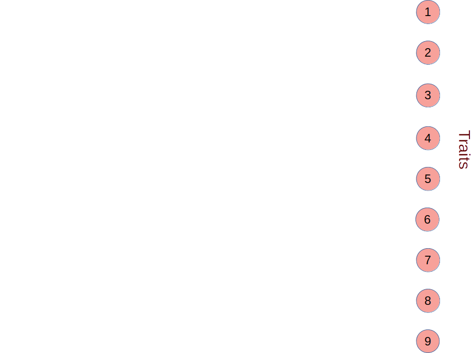

## Objectives of Work Package 1C

```{r, echo = FALSE}
load("initial_output.Rdata");
GEI <- read.csv("GEI.csv");
vcv <- mg2[[2]];
rownames(vcv) <- colnames(vcv);
```

- Determine how the scale of landscape diversity affects the maintenance of susceptibility alleles \pause

- Use individual-based modelling (i.e., agent-based modelling) to simulate genetic architecture and landscapes \pause

- Simulate dynamic application of biopesticide application and crop rotation *in silico* \pause

- Parameterise with data from *Helicoverpa armigera* and data from Work Package 1A


## Simulate genetic architecture

```{r, echo = FALSE}
print(GEI[1:16,]);
```

## Simulate genetic architecture

Correlation matrix derived from Work Package 1A

\vspace{3mm}

\footnotesize

```{r, echo = FALSE}
print(round(vcv,3));
```

\vspace{3mm}

\normalsize

Need to create a quantitative genetic architecture that produces these trait correlations from allele values


##




##


##


##


##


##


## Getting from loci to traits

Use an evolutionary algorithm to find arrow values

1. Initialise a population of N random networks \pause
2. Crossover between networks (swap values) \pause
3. Mutation of network values \pause
4. Get network fitnesses (how close to empirical matrix?) \pause
5. Tournament to select highest fitness networks \pause
6. High fitness networks reproduce \pause
7. N offspring networks replace parents \pause
8. Repeat 2-7 until termination criteria satisfied

End result is a set of network values that gets close the empirical matrix when loci have standard random normal values


## The helicoverpa package

An R function `mine_gmatrix` can find network values given:

- A square empirical matrix
- Arbitrary loci number
- Arbitrary number of hidden layers
- Various algorithm input options

\vspace{3mm}

```{r, eval = FALSE}
eg_net <- mine_gmatrix(gmatrix = gmt, loci = 18, 
                       layers = 6, mu_rate = 0.1, 
                       mu_sd = 0.04, net_N = 8000, 
                       test_N = 1000);
```


## The helicoverpa package

```
===============================================
Initialising gmatrix mining...                 
===============================================
Gen: 0	 Stress: -1.300040	 Min: -1.300051
Gen: 1	 Stress: -1.300052	 Min: -1.300150
Gen: 2	 Stress: -1.300119	 Min: -1.300985
Gen: 3	 Stress: -1.300434	 Min: -1.303620
Gen: 4	 Stress: -1.301580	 Min: -1.311596
Gen: 5	 Stress: -1.305397	 Min: -1.332303
Gen: 6	 Stress: -1.316018	 Min: -1.388752
Gen: 7	 Stress: -1.342745	 Min: -1.537480
Gen: 8	 Stress: -1.400662	 Min: -1.643793
Gen: 9	 Stress: -1.483798	 Min: -1.720355
Gen: 10	 Stress: -1.552275	 Min: -1.832071
Gen: 11	 Stress: -1.580273	 Min: -1.863808
```


## Building the empirical matrix from random normal loci

\scriptsize

```{r, echo = FALSE}
round(cor(mg2[[6]]), 3);
```

\vspace{2mm} \pause

\hrule

```{r, echo = FALSE}
round(mg2[[2]], 3);
```


## Next steps

- Further improve the evolutionary algorithm
- Model *Helicoverpa* with random initial alleles
- Simulate *Helicoverpa* on a landscape
- Observe evolution given changing pesticide and crop scenarios
- Complete R package and publications

```{r}
mg2[[8]];
```