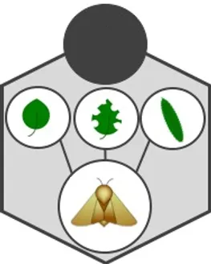
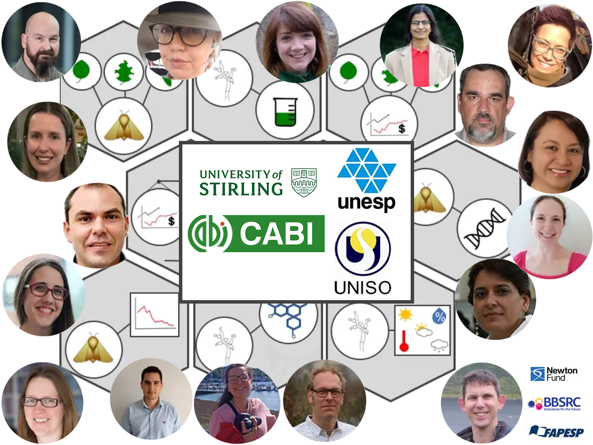
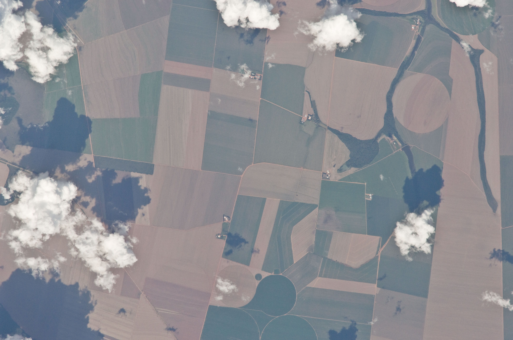
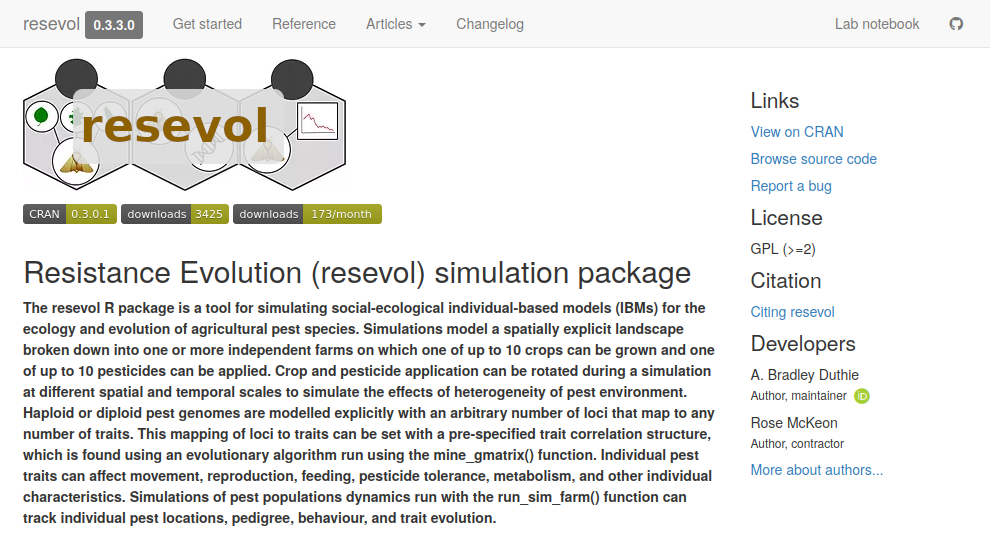
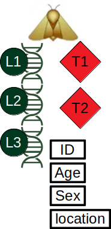

##

<!---

ioslides should save these as a pdf. To make it easy for students, use pdfjam

$ sudo apt install texlive-extra-utils
$ pdfjam --batch --nup 2x3 --suffix 1up --outfile . filename.pdf

NOTE: Need to alternate slides with lines for note-taking

--->


## Pesticide resistance evolution

\Large

\begin{columns}
\begin{column}{0.3\textwidth} 

```{r, out.width = "100%", echo = FALSE}
library("knitr");
;
```

\end{column}

\begin{column}{0.7\textwidth}

\textbf{Impact on agriculture}

\begin{itemize}
\item Resistance wicked \& widespread$^{1}$
\item Obstacle to food security$^{2}$
\end{itemize}

\vspace{2mm} 

\textbf{Manage resistance evolution}

\begin{itemize}
\item Vary biopesticide application$^{3,4}$
\item Polygenic resistance traits$^{5}$
\item Negative cross-resistance$^{6}$
\end{itemize}


\end{column}
\end{columns}

\footnotetext[1]{Gould et al. 2018. \textit{Ecol. Appl.} 13:1791-1805.}
\footnotetext[2]{Bradshaw et al. 2016. \textit{Nat. Commun.} 7:12986.}
\footnotetext[3]{Carroll et al. 2014. \textit{Science} 346:1245993.}
\footnotetext[4]{Saikai et al. 2021. \textit{Pest Manag. Sci.} 77:273-284.}
\footnotetext[5]{Boots, M. 2011. \textit{Am. Nat.} 178:214-220.}
\footnotetext[6]{Via, S. 1986. \textit{Pesticide resistance}. 222-235.}

##

## Agricultural heterogeneity to overcome resistance evolution

```{r, echo = FALSE, fig.width = 6.2, fig.height = 3.1}
library("resevol");
land           <- make_landscape(rows = 100, cols = 100, farms = 9);    
landscape      <- land[,,1];
landscape_vals <- unique(as.vector(landscape));
reord_land     <- sample(landscape_vals, size = length(landscape_vals));
for(i in 1:dim(landscape)[1]){
    for(j in 1:dim(landscape)[2]){
        old_val         <- landscape[i, j];
        new_val         <- reord_land[old_val];
        landscape[i, j] <- new_val;
    }
}
land_cols      <- hcl.colors(9, "YlOrRd", rev = TRUE);
par(mfrow = c(1, 2), mar = c(0, 0.1, 0, 0.1));
image(landscape, xaxt = "n", yaxt = "n", col = land_cols);
box();
pesticid_A         <- rbinom(n = 9, size = 1, prob = 0.5);
pesticide_cols     <- c("grey20", "grey60");
land_pesticide     <- landscape;
for(i in 1:dim(landscape)[1]){
    for(j in 1:dim(landscape)[2]){
        farm_number <- landscape[i, j];
        if(pesticid_A[farm_number] > 0){
            land_pesticide[i, j] <- 0;
        }else{
            land_pesticide[i, j] <- 1;
        }
    }
}
image(land_pesticide, xaxt = "n", yaxt = "n", col = pesticide_cols);
box();
```

\LARGE

\begin{columns}
\begin{column}{0.5\textwidth} 
\begin{center}
Unique farms
\end{center}
\end{column}
\begin{column}{0.5\textwidth} 
\begin{center}
Biopesticide applied
\end{center}
\end{column}
\end{columns}

##

##

```{r, out.width = "100%", echo = FALSE}
;
```

##

##

```{r, out.width = "100%", echo = FALSE}
;
```

##

## Modelling as a proof of concept before scaling up

```{r, out.width = "100%", echo = FALSE}
;
```

\footnotetext[1]{Image: \href{https://commons.wikimedia.org/wiki/File:ISS022-E-83025_-_View_of_Earth.jpg}{Public Domain}}

##

## Agent-based modelling

\Large


\textbf{Simulate a complex system \textit{in silico} with code}
\vspace{8mm}
\normalsize

\begin{columns}
\begin{column}{0.5\textwidth} 

```{r, out.width = "100%", echo = FALSE}
par(mar = c(0, 0, 0, 0));
land_cols <- c(land_cols, "black")
xx <- sample(x = 1:100, size = 1000, replace = TRUE);
yy <- sample(x = 1:100, size = 1000, replace = TRUE);
for(i in 1:1000){
    x_pt <- xx[i];
    y_pt <- yy[i];
    landscape[x_pt, y_pt] <- 10;
}
image(landscape, xaxt = "n", yaxt = "n", col = land_cols);
```

\end{column}

\begin{column}{0.5\textwidth} 
\begin{itemize}
\item Agents as discrete entities
\item Individual variation
\item Spatially explicit landscapes
\item Stochastic processes
\item High model complexity
\end{itemize}
\end{column}

\end{columns}

##

## resevol: An R package for modelling agricultural pests

```{r, out.width = "100%", echo = FALSE}
;
```


\footnotetext[1]{Duthie AB, McKeon CR (2022). resevol: Simulate Agricultural Production and Evolution of Pesticide Resistance. R package version 0.3.3.0, https://bradduthie.github.io/resevol/. }

##

## resevol: An R package for modelling agricultural pests

\begin{columns}
\begin{column}{0.7\textwidth} 
\textbf{Complex individuals}
\begin{itemize}
\item Complete genomes
\item Highly polygenic traits
\item Set trait covariances
\item Flexible life-history
\item Flexible mating system
\end{itemize}
\end{column}
\begin{column}{0.3\textwidth} 

```{r, out.width = "70%", echo = FALSE}
;
```

\end{column}

\end{columns}

\footnotetext[1]{\textbf{Image}: \href{https://commons.wikimedia.org/wiki/File:DNA_-_The_Noun_Project.svg
}{Public domain}}

##

## resevol: An R package for modelling agricultural pests

\begin{columns}
\begin{column}{0.5\textwidth} 
\textbf{Complex individuals}
\begin{itemize}
\item Complete genomes
\item Highly polygenic traits
\item Set trait covariances
\item Flexible life-history
\item Flexible mating system
\end{itemize}
\end{column}
\begin{column}{0.5\textwidth} 
\textbf{Dynamic landscapes}
\begin{itemize}
\item Custom land dimensions
\item Custom pesticide rotation
\item Custom crop rotation
\item Individual farms tracked
\item Raster landscape maps
\end{itemize}
\end{column}

\end{columns}

\footnotetext[1]{Duthie AB, McKeon CR (2022). resevol: Simulate Agricultural Production and Evolution of Pesticide Resistance. R package version 0.3.3.0, https://bradduthie.github.io/resevol/.}
\footnotetext[2]{Duthie, AB, R Mangan, CR McKeon, MC Tinsley, LF Bussi\`{e}re. 2022. resevol: an R package for spatially explicit models of pesticide resistance given evolving pest genomes. bioRxiv 2022.08.22.504740; doi: https://doi.org/10.1101/2022.08.22.504740}

##

## A genetic architecture for pre-specified trait covariances

\vspace{6mm}

```{r, echo = FALSE, fig.width = 6, fig.height = 4}
par(mar = c(0.2, 0.2, 0, 0.2));
plot(x = 0, y = 0, type = "n", xlim = c(0, 1000), ylim = c(0, 1000), 
     xaxt = "n", yaxt = "n", bty = "n", xlab = "", ylab = "");
mtext(side = 1, text = "Internal nodes", cex = 1.25, col = "blue", line = -3);
mtext(side = 2, text = "Loci", cex = 1.25, col = "darkgreen", line = -2);
mtext(side = 4, text = "Traits", cex = 1.25, col = "red", line = -2);
Lx  <- rep(x = 100, times = 3);
Ly  <- seq(from = 250, to = 750, length = 3);
H1x <- rep(x = 400, times = 2);
H1y <- seq(from = 250, to = 750, length = 2);
H2x <- rep(x = 600, times = 2);
H2y <- seq(from = 250, to = 750, length = 2);
Tx  <- rep(x = 900, times = 2);
Ty  <- seq(from = 250, to = 750, length = 2);
points(x = Tx, y = Ty, pch = 23, cex = 8, bg = "red", lwd = 2);
sep_L_points <- c(-50, 0, 50);
sep_N_points <- c(-30, 30);
arrows(x0 = H2x + 52, x1 = Tx[1] - 58, y0 = H2y, y1 = Ty[1] + sep_N_points, 
       length = 0.08, lwd = 3);
arrows(x0 = H2x + 52, x1 = Tx[2] - 58, y0 = H2y, y1 = Ty[2] + sep_N_points, 
       length = 0.08, lwd = 3);
arrows(x0 = Lx + 38, x1 = H1x[1] - 58, y0 = Ly, y1 = H1y[1] + sep_L_points, 
       length = 0.08, lwd = 3);
points(x = H2x, y = H2y, pch = 22, cex = 9, bg = "blue", lwd = 2);
arrows(x0 = H1x + 52, x1 = H2x[1] - 58, y0 = H1y, y1 = H2y[1] + sep_N_points, 
       length = 0.08, lwd = 3);
arrows(x0 = H1x + 52, x1 = H2x[2] - 58, y0 = H1y, y1 = H2y[2] + sep_N_points, 
       length = 0.08, lwd = 3);
points(x = H1x, y = H1y, pch = 22, cex = 9, bg = "blue", lwd = 2);
arrows(x0 = Lx + 38, x1 = H1x[2] - 58, y0 = Ly, y1 = H1y[2] + sep_L_points, 
       length = 0.08, lwd = 3);
points(x = Lx, y = Ly, pch = 21, cex = 6, bg = "darkgreen", lwd = 2);
srnm <- c(0.2, -0.1, 0.1);
text(x = Lx, y = Ly, labels = srnm, col = "white", cex = 0.9);
text(x = 200, y = 790, labels = "0.4", srt = 10, cex = 0.8);
text(x = 200, y = 660, labels = "0.1", srt = -58, cex = 0.8);
text(x = 270, y = 695, labels = "-1.2", srt = 46, cex = 0.8);
text(x = 180, y = 480, labels = "-0.6", srt = -40, cex = 0.8);
text(x = 160, y = 340, labels = "0.2", srt = 54, cex = 0.8);
text(x = 220, y = 255, labels = "2.2", srt = -12, cex = 0.8);
text(x = 490, y = 790, labels = "1.3", srt = 10, cex = 0.8);
text(x = 538, y = 410, labels = "-0.5", srt = -76, cex = 0.8);
text(x = 460, y = 390, labels = "-0.1", srt = 72, cex = 0.8);
text(x = 495, y = 260, labels = "0.0", srt = -12, cex = 0.8);
text(x = 720, y = 790, labels = "2.2", srt = 8, cex = 0.8);
text(x = 720, y = 630, labels = "0.9", srt = -58, cex = 0.8);
text(x = 690, y = 400, labels = "1.6", srt = 54, cex = 0.8);
text(x = 740, y = 260, labels = "0.8", srt = -8, cex = 0.8);
Loci  <- matrix(data = c(0.1, -0.1, 0.2), nrow = 1);
Hdn1  <- matrix(data = c(0.4, -1.2, 0.2, 0.1, -0.6, 2.2), nrow = 3, ncol = 2);
Hdn2  <- matrix(data = c(1.3, -0.1, -0.5, 0.0), nrow = 2, ncol = 2);
Hdn3  <- matrix(data = c(2.2, 1.6, 0.9, 0.8), nrow = 2, ncol = 2);
Tvals <- Loci %*% Hdn1 %*% Hdn2 %*% Hdn3;
text(x = Tx, y = Ty, labels = rev(Tvals), cex = 0.8);
```

\footnotetext[1]{resevol R package vignette: \href{https://bradduthie.github.io/resevol/articles/evolutionary_algorithm.html}{https://bradduthie.github.io/resevol/articles/evolutionary\_algorithm.html}}

##

## Evolutionary algorithm to find genetic architecture

\Large

Initialise a population of multiple potential networks from loci to traits.

\vspace{6mm}

```{r, echo=FALSE, fig.height=1.75, fig.width=6}
mbox <- function(x0, x1, y0, y1){
    xx <- seq(from=x0, to=x1, length.out = 100);
    yy <- seq(from=y0, to=y1, length.out = 100);
    xd <- c(rep(x0, 100), xx, rep(x1,100), rev(xx));
    yd <- c(yy, rep(y1,100), rev(yy), rep(y0, 100));
    return(list(x=xd, y=yd));
}
par(mar=c(0,0,0,0));
# ===============================================================
plot(x=0, y=0, type="n", xlim=c(0,85), ylim=c(50,95), xaxt="n", yaxt="n",
     xlab="",ylab="");
ibox <- mbox(x0 = 0,  x1 = 10, y0 = 90, y1 = 70);
polygon(x = ibox$x, y = ibox$y, lwd = 3, border = "black", col = "white");
cbox <- mbox(x0 = 15, x1 = 25, y0 = 90, y1 = 70);
polygon(x = cbox$x, y = cbox$y, lwd = 3, border = "black", col = "white");
ubox <- mbox(x0 = 30, x1 = 40, y0 = 90, y1 = 70);
polygon(x = ubox$x, y = ubox$y, lwd = 3, border = "black", col = "white");
nbox <- mbox(x0 = 45, x1 = 55, y0 = 90, y1 = 70);
polygon(x = nbox$x, y = nbox$y, lwd = 3, border = "black", col = "white");
fbox <- mbox(x0 = 60, x1 = 70, y0 = 90, y1 = 70);
polygon(x = fbox$x, y = fbox$y, lwd = 3, border = "black", col = "white");
tbox <- mbox(x0 = 75, x1 = 85, y0 = 90, y1 = 70);
polygon(x = tbox$x, y = tbox$y, lwd = 3, border = "black", col = "white");
text(x=5,  y=80, labels="Initialisation", col="black", cex = 0.65);
text(x=20, y=80, labels="Crossover", col="black", cex = 0.65);
text(x=35, y=80, labels="Mutation", col="black", cex = 0.65);
text(x=50, y=82, labels="Fitness", col="black", cex = 0.65);
text(x=50, y=78, labels="evaluation", col="black", cex = 0.65);
text(x=65, y=82, labels="Tournament", col="black", cex = 0.65);
text(x=65, y=78, labels="selection", col="black", cex = 0.65);
text(x=80, y=80, labels="Replace", col="black", cex = 0.65);
arrows(x0=10, x1=14, y0=80, y1=80, lwd=2, length=0.10);
arrows(x0=25, x1=29, y0=80, y1=80, lwd=2, length=0.10);
arrows(x0=40, x1=44, y0=80, y1=80, lwd=2, length=0.10);
arrows(x0=55, x1=59, y0=80, y1=80, lwd=2, length=0.10);
arrows(x0=70, x1=74, y0=80, y1=80, lwd=2, length=0.10);
arrows(x0 = 80, x1 = 80, y0 = 70, y1 = 68, lwd = 2, length = 0);
arrows(x0 = 80, x1 = 20, y0 = 65, y1 = 65, lwd = 2, length = 0);
arrows(x0 = 20, x1 = 20, y0 = 65, y1 = 70, lwd = 2, length = 0.05);
text(x=73, y=63, labels="No", col="black", cex = 0.5);
rbox <- mbox(x0 = 75, x1 = 85, y0 = 62, y1 = 68);
polygon(x = rbox$x, y = rbox$y, lwd = 3, border = "black", col = "black");
text(x=80, y=65, labels="Termination?", col="white", cex = 0.65);
fbox <- mbox(x0 = 60, x1 = 70, y0 = 60, y1 = 50);
polygon(x = fbox$x, y = fbox$y, lwd = 3, border = "black", col = "white");
text(x=65, y=57, labels="Individual", col="black", cex = 0.65);
text(x=65, y=53, labels="network", col="black", cex = 0.65);
arrows(x0 = 80, x1 = 80, y0 = 62, y1 = 55, lwd = 2, length = 0);
arrows(x0 = 80, x1 = 70, y0 = 55, y1 = 55, lwd = 2, length = 0.05);
text(x=73, y=53, labels="Yes", col="black", cex = 0.5);
```

\vspace{6mm}

Evolve values between nodes, mapping loci to traits.


\footnotetext[1]{resevol R package vignette: \href{https://bradduthie.github.io/resevol/articles/evolutionary_algorithm.html}{https://bradduthie.github.io/resevol/articles/evolutionary\_algorithm.html}}

##

## Evolutionary algorithm to find genetic architecture


```{r, eval = FALSE}
gmt <- matrix(data = c( 1.0, -0.5, -0.5, 2.0), 
              nrow = 2);
```


\vspace{2mm}
\hrule
\vspace{2mm}


```{r, eval = FALSE}
mg  <- mine_gmatrix(gmatrix = gmt, loci = 3, 
                    indivs = 2000, npsize = 12000, 
                    max_gen = 5400, sampleK = 1200, 
                    chooseK = 6, layers = 4, 
                    mu_pr = 0.2, pr_cross = 0.2, 
                    mu_sd = 0.004, term_cri = -8);
```

##

## Constructing a landscape: Default options

\Large

\begin{columns}
\begin{column}{0.5\textwidth} 

```{r, out.width = "100%", echo = FALSE}
image(landscape, xaxt = "n", yaxt = "n", col = land_cols);
```

\end{column}

\begin{column}{0.5\textwidth} 
\begin{itemize}
\item Specify `farms`, `xdim`, `ydim`.
\item Shortest splitline algorithm
\item Land edge: torus, leaky, reflect
\end{itemize}
\end{column}
\end{columns}

\vspace{8mm}

Each farm can use up to one crop and one pesticide, and the timing and rotation rules for crops and pesticide allow any Markov process.

##

## Constructing a landscape: Advanced options


```{r, echo = FALSE}
land_file <- system.file("landscape_eg.csv", package = "resevol");
land_dat  <- read.csv(file = land_file, header = FALSE);
land_eg   <- t(as.matrix(land_dat));
farm_cols <- c("#f4eadc", "#6a4b20", "#cea05f", "#e1c59d", "#a97833", "#cea05f",
               "#f2e6d6", "#6a4b20", "#cc9c59", "#dfc197", "#a27331", "#f0e3d0",
               "#5d421c", "#ca9852");
land_cols <- c(farm_cols, "#00ab41", "#234F1E", "#2832C2");
par(mar = c(0, 0, 0, 0));
image(land_eg, xaxt = "n", yaxt = "n", col = land_cols);
points(x = 0.2, y = 0.05, cex = 9, pch = 20);
text(x = 0.2, y = 0.05, labels = "1", cex = 2, col = "red");
points(x = 0.4, y = 0.1, cex = 9, pch = 20);
text(x = 0.4, y = 0.1, labels = "2", cex = 2, col = "red");
points(x = 0.4, y = 0.1, cex = 9, pch = 20);
text(x = 0.4, y = 0.1, labels = "2", cex = 2, col = "red");
points(x = 0.25, y = 0.27, cex = 9, pch = 20);
text(x = 0.25, y = 0.27, labels = "3", cex = 2, col = "red");
points(x = 0.20, y = 0.43, cex = 9, pch = 20);
text(x = 0.20, y = 0.43, labels = "4", cex = 2, col = "red");
points(x = 0.42, y = 0.48, cex = 9, pch = 20);
text(x = 0.42, y = 0.48, labels = "5", cex = 2, col = "red");
points(x = 0.28, y = 0.58, cex = 9, pch = 20);
text(x = 0.28, y = 0.58, labels = "6", cex = 2, col = "red");
points(x = 0.1, y = 0.8, cex = 9, pch = 20);
text(x = 0.1, y = 0.8, labels = "7", cex = 2, col = "red");
points(x = 0.7, y = 0.05, cex = 9, pch = 20);
text(x = 0.7, y = 0.05, labels = "8", cex = 2, col = "red");
points(x = 0.9, y = 0.2, cex = 9, pch = 20);
text(x = 0.9, y = 0.2, labels = "9", cex = 2, col = "red");
points(x = 0.85, y = 0.4, cex = 9, pch = 20);
text(x = 0.85, y = 0.4, labels = "10", cex = 2, col = "red");
points(x = 0.92, y = 0.58, cex = 9, pch = 20);
text(x = 0.92, y = 0.58, labels = "11", cex = 2, col = "red");
points(x = 0.88, y = 0.76, cex = 9, pch = 20);
text(x = 0.88, y = 0.76, labels = "12", cex = 2, col = "red");
points(x = 0.86, y = 0.93, cex = 9, pch = 20);
text(x = 0.86, y = 0.93, labels = "13", cex = 2, col = "red");
points(x = 0.52, y = 0.91, cex = 9, pch = 20);
text(x = 0.52, y = 0.91, labels = "14", cex = 2, col = "red");
points(x = 0.05, y = 0.59, cex = 7, pch = 20);
text(x = 0.05, y = 0.59, labels = "15", cex = 1.7, col = "white");
points(x = 0.46, y = 0.28, cex = 7, pch = 20);
text(x = 0.46, y = 0.28, labels = "16", cex = 1.7, col = "white");
points(x = 0.62, y = 0.36, cex = 7, pch = 20);
text(x = 0.62, y = 0.36, labels = "17", cex = 1.7, col = "white");
```

##

## Pest life-history events defined within an age range

\Large

Within a time step, order of events are specified.

\vspace{5mm}

```{r, echo=FALSE, fig.height=3, fig.width=8}
mbox <- function(x0, x1, y0, y1){
    xx <- seq(from=x0, to=x1, length.out = 100);
    yy <- seq(from=y0, to=y1, length.out = 100);
    xd <- c(rep(x0, 100), xx, rep(x1,100), rev(xx));
    yd <- c(yy, rep(y1,100), rev(yy), rep(y0, 100));
    return(list(x=xd, y=yd));
}
par(mar=c(0,0,0,0));
# ===============================================================
plot(x=0, y=0, type="n", xlim=c(0,100), ylim=c(40,95), xaxt="n", yaxt="n",
     xlab="",ylab="");
ibox <- mbox(x0 = 0,  x1 = 14, y0 = 63, y1 = 47);
polygon(x = ibox$x, y = ibox$y, lwd = 5, border = "black", col = "white");
cbox <- mbox(x0 = 0, x1 = 10, y0 = 88, y1 = 72);
polygon(x = cbox$x, y = cbox$y, lwd = 3, border = "black", col = "white");
ubox <- mbox(x0 = 15, x1 = 25, y0 = 88, y1 = 72);
polygon(x = ubox$x, y = ubox$y, lwd = 3, border = "black", col = "white");
nbox <- mbox(x0 = 30, x1 = 40, y0 = 88, y1 = 72);
polygon(x = nbox$x, y = nbox$y, lwd = 3, border = "black", col = "white");
fbox <- mbox(x0 = 45, x1 = 55, y0 = 88, y1 = 72);
polygon(x = fbox$x, y = fbox$y, lwd = 3, border = "black", col = "white");
tbox <- mbox(x0 = 60, x1 = 70, y0 = 88, y1 = 72);
polygon(x = tbox$x, y = tbox$y, lwd = 3, border = "black", col = "white");
tbox <- mbox(x0 = 75, x1 = 85, y0 = 88, y1 = 72);
polygon(x = tbox$x, y = tbox$y, lwd = 3, border = "black", col = "white");
tbox <- mbox(x0 = 90, x1 = 100, y0 = 88, y1 = 72);
polygon(x = tbox$x, y = tbox$y, lwd = 3, border = "black", col = "white");
ibox <- mbox(x0 = 90,  x1 = 100, y0 = 63, y1 = 47);
polygon(x = ibox$x, y = ibox$y, lwd = 3, border = "black", col = "white");
tbox <- mbox(x0 = 75, x1 = 85, y0 = 63, y1 = 47);
polygon(x = tbox$x, y = tbox$y, lwd = 3, border = "black", col = "white");
text(x=7,  y=59, labels="Initialise", col="black", cex = 0.8);
text(x=7,  y=55, labels="pests and", col="black", cex = 0.8);
text(x=7,  y=51, labels="landscape", col="black", cex = 0.8);
text(x=5, y=84, labels="Crops and", col="black", cex = 0.8);
text(x=5, y=80, labels="pesticides", col="black", cex = 0.8);
text(x=5, y=76, labels="rotated?", col="black", cex = 0.8);
text(x=20, y=82, labels="Pests", col="black", cex = 0.8);
text(x=20, y=78, labels="metabolise", col="black", cex = 0.8);
text(x=35, y=82, labels="Pests", col="black", cex = 0.8);
text(x=35, y=78, labels="feed", col="black", cex = 0.8);
text(x=50, y=82, labels="Pesticide", col="black", cex = 0.8);
text(x=50, y=78, labels="uptake", col="black", cex = 0.8);
text(x=65, y=82, labels="Pests", col="black", cex = 0.8);
text(x=65, y=78, labels="move", col="black", cex = 0.8);
text(x=80, y=82, labels="Pests", col="black", cex = 0.8);
text(x=80, y=78, labels="reproduce", col="black", cex = 0.8);
text(x=95, y=82, labels="Pest", col="black", cex = 0.8);
text(x=95, y=78, labels="mortality", col="black", cex = 0.8);
text(x=95,  y=57, labels="Pests", col="black", cex = 0.8);
text(x=95,  y=53, labels="immigrate", col="black", cex = 0.8);
text(x=80,  y=59, labels="Collect", col="black", cex = 0.8);
text(x=80,  y=55, labels="statistics", col="black", cex = 0.8);
text(x=80,  y=51, labels="as CSV", col="black", cex = 0.8);
arrows(x0=2, x1=2,   y0=63, y1=71.5, lwd=2, length=0.10);
arrows(x0=10, x1=14.5, y0=80, y1=80, lwd=2, length=0.10);
arrows(x0=25, x1=29.5, y0=80, y1=80, lwd=2, length=0.10);
arrows(x0=40, x1=44.5, y0=80, y1=80, lwd=2, length=0.10);
arrows(x0=55, x1=59.5, y0=80, y1=80, lwd=2, length=0.10);
arrows(x0=70, x1=74.5, y0=80, y1=80, lwd=2, length=0.10);
arrows(x0=85, x1=89.5, y0=80, y1=80, lwd=2, length=0.10);
arrows(x0=95, x1=95,   y0=72, y1=63.5, lwd=2, length=0.10);
arrows(x0=90, x1=85.5, y0=55, y1=55, lwd=2, length=0.10);
arrows(x0=75, x1=70.5, y0=60, y1=60, lwd=2, length=0.10);
arrows(x0=60, x1=55.5, y0=60, y1=60, lwd=2, length=0.10);
rbox <- mbox(x0 = 60, x1 = 70, y0 = 57, y1 = 63);
polygon(x = rbox$x, y = rbox$y, lwd = 3, border = "black", col = "black");
text(x=65, y=60, labels="Extinction?", col="white", cex = 0.75);
rbox <- mbox(x0 = 45, x1 = 55, y0 = 57, y1 = 63);
polygon(x = rbox$x, y = rbox$y, lwd = 3, border = "black", col = "black");
text(x=50, y=60, labels="Max. time?", col="white", cex = 0.75);
text(x = 58.5, y = 58.5, labels = "No", col = "black", cex = 0.75);
text(x = 43.5, y = 58.5, labels = "No", col = "black", cex = 0.75);
text(x = 68, y = 54, labels = "Yes", col = "black", cex = 0.75);
text(x = 53, y = 54, labels = "Yes", col = "black", cex = 0.75);
arrows(x0=66, x1=66, y0=57, y1=50, lwd=2, length=0.0);
arrows(x0=51, x1=51, y0=57, y1=50, lwd=2, length=0.0);
rbox <- mbox(x0 = 30, x1 = 40, y0 = 47, y1 = 53);
polygon(x = rbox$x, y = rbox$y, lwd = 3, border = "black", col = "black");
text(x=35, y=50, labels="STOP", col="white", cex = 1);
rbox <- mbox(x0 = 14, x1 = 20, y0 = 47, y1 = 63);
polygon(x = rbox$x, y = rbox$y, lwd = 5, border = "black", col = "black");
text(x=17, y=55, labels="START", col="white", cex = 1, srt = 90);
arrows(x0=66, x1=40.5, y0=50, y1=50, lwd=2, length=0.10);
arrows(x0=45, x1=35, y0=60, y1=60, lwd=2, length=0.0);
arrows(x0=35, x1=35, y0=60, y1=67, lwd=2, length=0.0);
arrows(x0=35, x1=7, y0=67, y1=67, lwd=2, length=0.0);
arrows(x0=7, x1=7, y0=67, y1=71.5, lwd=2, length=0.1);
```


\vspace{3mm}

Specific events can be restricted to age ranges:

Feed: 0-2, Move: 3-8, Mate: 7-9

##

## Running a simulation in resevol

\small

```{r, eval = FALSE}
run_farm_sim(mine_output = mg, repro = "asexual", 
             pesticide_number = 2, time_steps = 160, 
             farms = 9, pesticide_init = "random", 
             pesticide_consume = c("T1", "T2"), 
             pesticide_rotation_time = 16, xdim = 64,
             pesticide_rotation_type = 3, ydim = 64,
             pesticide_tolerated_surv = 0, max_age = 4, 
             pesticide_per_cell = 1, crop_number = 1, 
             crop_rotation_time = 16, crop_per_cell = 4, 
             food_consume = 1, food_needed_surv = 1,
             reproduction_type = "food_based", 
             food_needed_repr = 1, land_edge = "torus",
             min_age_feed = 0, max_age_feed = 2, 
             min_age_move = 3, max_age_move = 4, 
             min_age_reproduce = 4, print_gens = FALSE,
             max_age_reproduce = 4, rand_age = TRUE, 
             age_pesticide_threshold = 2, 
             immigration_rate = 10, move_distance = 2,
             print_last = TRUE, trait_means = c(0.1, 0.1));
```

##

## Simulating ecology, evolution, crop yields

```{r, echo = FALSE}
load(system.file("advanced_eg.rda", package = "resevol"));
initial_crop <- c(1, 1, 1, 1, 1, 1, 1, 2, 2, 2, 2, 2, 2, 2, 3, 3, 3);
rotate_crop       <- matrix(data = 0, nrow = 3, ncol = 3);
rotate_crop[1, 2] <- 1;
rotate_crop[2, 1] <- 1;
rotate_crop[3, 3] <- 1;
initial_pesticide <- c(1, 1, 1, 1, 1, 1, 1, 2, 2, 2, 2, 2, 2, 2, 3, 3, 3);
rotate_pesticide           <- matrix(data = 0, nrow = 3, ncol = 3);
rotate_pesticide[1, 1]     <- 1;
rotate_pesticide[2, 2]     <- 1;
rotate_pesticide[3, 3]     <- 1;
population_data_file_sim1 <- system.file("population_data_sim1.csv", 
                                         package = "resevol");
population_data_sim1      <- read.csv(file = population_data_file_sim1);
```


```{r, echo = FALSE}
mbox <- function(x0, x1, y0, y1){
    xx <- seq(from=x0, to=x1, length.out = 100);
    yy <- seq(from=y0, to=y1, length.out = 100);
    xd <- c(rep(x0, 100), xx, rep(x1,100), rev(xx));
    yd <- c(yy, rep(y1,100), rev(yy), rep(y0, 100));
    return(list(x=xd, y=yd));
}
season          <- seq(from = 0, to = 240, by = 18);
blocks          <- length(season) - 1;
plot(x = population_data_sim1[["time_step"]], type = "n",
     y = population_data_sim1[["population_size"]], cex.lab = 1.25, 
     cex.axis = 1.25, ylab = "Pest population abundance", xlab = "Time step", 
     ylim = c(0, max(population_data_sim1[["population_size"]])));
for(i in 1:blocks){
    rbox <- mbox(x0 = season[i], x1 = season[i + 1], y0 = -1000, y1 = 21000);
    if(i %% 2 == 0){
        polygon(x = rbox$x, y = rbox$y, lwd = 3, border = NA, 
                col = "grey90");
    }
}
points(x = population_data_sim1[["time_step"]], 
     y = population_data_sim1[["population_size"]], type = "l", lwd = 2);
abline(v = 81, lwd = 3, col = "red");
box();
```

##

## Simulating ecology, evolution, crop yields

```{r, echo = FALSE}
par(mfrow = c(2, 2), mar = c(1, 4, 1, 1));
plot(x = population_data_sim1[["time_step"]], type = "n", ylim = c(0, 0.8),
     y = population_data_sim1[["mean_food1_consumed"]], cex.lab = 1.25, 
     ylab = "Mean crop 1 consumed", xlab = "Time step", xaxt = "n");
for(i in 1:blocks){
    rbox <- mbox(x0 = season[i], x1 = season[i + 1], y0 = -1000, y1 = 6000);
    if(i %% 2 == 0){
        polygon(x = rbox$x, y = rbox$y, lwd = 3, border = NA, 
                col = "grey90");
    }
}
points(x = population_data_sim1[["time_step"]], 
       y = population_data_sim1[["mean_food1_consumed"]], type = "l", lwd = 2);
text(x = 5, y = 0.79, labels = "a", cex = 2);
box();
par(mar = c(1, 4, 1, 1));
plot(x = population_data_sim1[["time_step"]], type = "n", ylim = c(0, 0.8),
     y = population_data_sim1[["mean_food2_consumed"]], cex.lab = 1.25 ,
     ylab = "Mean crop 2 consumed", xlab = "Time step", xaxt = "n");
for(i in 1:blocks){
    rbox <- mbox(x0 = season[i], x1 = season[i + 1], y0 = -1000, y1 = 6000);
    if(i %% 2 == 0){
        polygon(x = rbox$x, y = rbox$y, lwd = 3, border = NA, 
                col = "grey90");
    }
}
points(x = population_data_sim1[["time_step"]], 
       y = population_data_sim1[["mean_food2_consumed"]], type = "l", lwd = 2);
text(x = 5, y = 0.79, labels = "b", cex = 2);
box();
par(mar = c(4, 4, 1, 1));
plot(x = population_data_sim1[["time_step"]], type = "n", ylim = c(0, 0.8),
     y = population_data_sim1[["mean_pesticide1_consumed"]], cex.lab = 1.25, 
     ylab = "Mean pesticide 1 consumed", xlab = "Time step");
for(i in 1:blocks){
    rbox <- mbox(x0 = season[i], x1 = season[i + 1], y0 = -1000, y1 = 6000);
    if(i %% 2 == 0){
        polygon(x = rbox$x, y = rbox$y, lwd = 3, border = NA, 
                col = "grey90");
    }
}
points(x = population_data_sim1[["time_step"]], 
       y = population_data_sim1[["mean_pesticide1_consumed"]], type = "l", lwd = 2);
box();
text(x = 5, y = 0.78, labels = "c", cex = 2);
par(mar = c(4, 4, 1, 1));
plot(x = population_data_sim1[["time_step"]], type = "n", ylim = c(0, 0.8),
     y = population_data_sim1[["mean_pesticide2_consumed"]], cex.lab = 1.25, 
     ylab = "Mean pesticide 2 consumed", xlab = "Time step");
for(i in 1:blocks){
    rbox <- mbox(x0 = season[i], x1 = season[i + 1], y0 = -1000, y1 = 6000);
    if(i %% 2 == 0){
        polygon(x = rbox$x, y = rbox$y, lwd = 3, border = NA, 
                col = "grey90");
    }
}
points(x = population_data_sim1[["time_step"]], 
       y = population_data_sim1[["mean_pesticide2_consumed"]], type = "l", 
       lwd = 2);
box();
text(x = 5, y = 0.78, labels = "d", cex = 2);
```

##

## Simulating ecology, evolution, crop yields

```{r, echo = FALSE}
par(mfrow = c(2, 2), mar = c(1, 4, 1, 1));
plot(x = population_data_sim1[["time_step"]], type = "n", ylim = c(2, 3.6),
     y = population_data_sim1[["trait1_mean_value"]], cex.lab = 1.25, 
     ylab = "Mean crop 1 consumption trait", xlab = "Time step", xaxt = "n");
for(i in 1:blocks){
    rbox <- mbox(x0 = season[i], x1 = season[i + 1], y0 = -1000, y1 = 6000);
    if(i %% 2 == 0){
        polygon(x = rbox$x, y = rbox$y, lwd = 3, border = NA, 
                col = "grey90");
    }
}
points(x = population_data_sim1[["time_step"]], 
     y = population_data_sim1[["trait1_mean_value"]], type = "l", lwd = 2);
text(x = 5, y = 3.56, labels = "a", cex = 2);
box();
par(mar = c(1, 4, 1, 1));
plot(x = population_data_sim1[["time_step"]], type = "n", ylim = c(2, 3.6),
     y = population_data_sim1[["trait2_mean_value"]], cex.lab = 1.25 ,
     ylab = "Mean crop 2 consumption trait", xlab = "Time step", xaxt = "n");
for(i in 1:blocks){
    rbox <- mbox(x0 = season[i], x1 = season[i + 1], y0 = -1000, y1 = 6000);
    if(i %% 2 == 0){
        polygon(x = rbox$x, y = rbox$y, lwd = 3, border = NA, 
                col = "grey90");
    }
}
points(x = population_data_sim1[["time_step"]], 
       y = population_data_sim1[["trait2_mean_value"]], type = "l", lwd = 2);
text(x = 5, y = 3.56, labels = "b", cex = 2);
box();
par(mar = c(4, 4, 1, 1));
plot(x = population_data_sim1[["time_step"]], type = "n", ylim = c(-0.8, 1.4),
     y = population_data_sim1[["trait3_mean_value"]], cex.lab = 1.25, 
     ylab = "Mean pesticide 1 consumption trait", xlab = "Time step");
for(i in 1:blocks){
    rbox <- mbox(x0 = season[i], x1 = season[i + 1], y0 = -1000, y1 = 6000);
    if(i %% 2 == 0){
        polygon(x = rbox$x, y = rbox$y, lwd = 3, border = NA, 
                col = "grey90");
    }
}
points(x = population_data_sim1[["time_step"]], 
       y = population_data_sim1[["trait3_mean_value"]], type = "l", lwd = 2);
box();
text(x = 5, y = 1.34, labels = "c", cex = 2);
par(mar = c(4, 4, 1, 1));
plot(x = population_data_sim1[["time_step"]], type = "n", ylim = c(-0.8, 1.4),
     y = population_data_sim1[["trait4_mean_value"]], cex.lab = 1.25, 
     ylab = "Mean pesticide 2 consumption trait", xlab = "Time step");
for(i in 1:blocks){
    rbox <- mbox(x0 = season[i], x1 = season[i + 1], y0 = -1000, y1 = 6000);
    if(i %% 2 == 0){
        polygon(x = rbox$x, y = rbox$y, lwd = 3, border = NA, 
                col = "grey90");
    }
}
points(x = population_data_sim1[["time_step"]], 
       y = population_data_sim1[["trait4_mean_value"]], type = "l", lwd = 2);
box();
text(x = 5, y = 1.34, labels = "d", cex = 2);
```

##

## Simulating ecology, evolution, crop yields

```{r, echo = FALSE}
last_time_step_file_sim1 <- system.file("last_time_step_sim1.csv", 
                                        package = "resevol");
pop_last_time_step_sim1  <- read.csv(file = last_time_step_file_sim1);
par(mar = c(0, 0, 0, 0));
landscape    <- land_eg;
for(i in 1:dim(pop_last_time_step_sim1)[1]){
    xloc <- pop_last_time_step_sim1[i, 1] + 1;
    yloc <- pop_last_time_step_sim1[i, 2] + 1;
    landscape[xloc, yloc] <- 18;
}
land_cols <- c(land_cols, "#000000");
image(landscape, xaxt = "n", yaxt = "n", col = land_cols);
```

##

## The resevol R package: summary


\Large

\begin{itemize}
\item Simulations of pest ecology, resistance evolution, and agricultural production
\item Covarying polygenetic traits
\item Flexible pest life-histories, mating systems, traits
\item Highly customisable, detailed landscapes
\item Free to use$^{1}$, open source$^{2}$ (GPL >= 2), documented$^{1,3}$, actively maintained$^{4}$
\end{itemize}


\footnotetext[1]{\textbf{Website}: \href{https://bradduthie.github.io/resevol/}{https://bradduthie.github.io/resevol/}}
\footnotetext[2]{\textbf{Code}: \href{https://github.com/bradduthie/resevol}{https://github.com/bradduthie/resevol}}
\footnotetext[3]{\textbf{Lab Notebook}: \href{https://bradduthie.github.io/resevol/notebook/}{https://bradduthie.github.io/resevol/notebook/}}
\footnotetext[4]{\textbf{Email}: alexander.duthie@stir.ac.uk \textbf{Mastodon}: @bradduthie@ecoevo.social}


